<!-- v0.9-MARKETING — hero banner from scripts/brand/gen_brand_svg.py.
     Editorial-warm signature gradient (stone #c4b9a9 → graphite #6a6052
     on espresso) + the "spotlight on one in a crowd" logo + serif
     wordmark.  Regenerate via:
       python scripts/brand/gen_brand_svg.py -->
<div align="center">
  
</div>

<!-- Animated hero-reveal demo: SVG SMIL keyframes mirroring the
     v0.9-P0-2 in-product opening sequence (workspace bar slide-in,
     sidebar slide-in, 24 cards stagger fade-up, stats count from 0).
     Regenerate via: python scripts/brand/gen_animated_demo.py -->
<div align="center">
  
</div>

<p align="center">
  <a href="https://github.com/ChrisChen667788/pixcull/actions/workflows/tests.yml"></a>
  <a href="./LICENSE"></a>
  
  
  
  <a href="https://github.com/ChrisChen667788/pixcull/stargazers"></a>
  <a href="https://github.com/ChrisChen667788/pixcull/releases/latest"></a>
</p>

<p align="center">
  <b>English</b> ·
  <a href="#中文">简体中文</a> ·
  日本語 (in-app) ·
  <a href="https://www.modelscope.cn/profile/haozi667788">ModelScope</a> ·
  <a href="https://github.com/ChrisChen667788/pixcull/releases">Releases</a>
</p>

<p align="center">
  <i>Local-first AI culling for working photographers.<br/>
  Six calibrated axes · style clone (CLIP) · LAN multi-shooter sync ·<br/>
  tethered live scoring · client share links + QR · Lr/C1 round-trip.<br/>
  <b>No photo ever leaves your disk.</b></i>
</p>

> **v0.9 is in flight.** Hero reveal · signature soft-bounce motion ·
> brand identity refresh · ⌘K command palette already shipped (4 / 13).
> Full charter at [`docs/ROADMAP-v0.9-charter.md`](docs/ROADMAP-v0.9-charter.md).

---

## What's new

**v2.14** — **real-data learning: de-stub the "moment" axis so it can actually
be learned** (see [`docs/ROADMAP-v2.14-charter.md`](docs/ROADMAP-v2.14-charter.md) +
[`docs/DESIGN-AUDIT-2030Q2.md`](docs/DESIGN-AUDIT-2030Q2.md)). The audit found the
"moment" axis — the decisive-moment axis the product most loudly markets — was a
**constant 0.5 placeholder for every photo** in fusion, plus two of its three
rubric checks always returned `None`. A constant feature carries zero information,
so the rescorer could *never* learn it. Now `moment_score` is a real signal where
one honestly exists (wedding-moment confidence; face smile/eyes), left neutral
where no signal exists (landscapes unchanged); `emotion_present` is evaluated from
wedding-moment confidence **and** the face smile blendshape; and `action_at_peak`
now resolves from the burst-peak ranker — within a real burst, the crowned frame
*is* the captured action moment (singletons honestly stay unscored). The
once-constant "moment" axis is finally a learnable, non-degenerate feature. An end-to-end A/B regression caught a latent
**NaN→1.0 bug** (a pandas `None`→`NaN` slipped past an `is None` check and clamped
`score_final` to 1.0 = always-keep for every no-signal frame) — now fixed and
guarded by a test. The 400-sample real-label training session + flipping the
rescorer to adjudicate mode is owner-gated (fabricated labels poison the model —
the RESCORER-V3 lesson). Also wires **axis-aware personalization**: once you have
≥50 corrections, fusion's per-axis weights now *tilt* toward the axes you
demonstrably value (a composition-lover's runs reward composition-strong frames
and demote weak ones), not just a global threshold nudge — clamped to a gentle
±2× and a no-op without a profile (generic runs stay byte-identical, verified by
an A/B regression).

**v2.13** — **root-caused the "screenshot hang" and fixed a real UI bug**
(see [`docs/ROADMAP-v2.13-charter.md`](docs/ROADMAP-v2.13-charter.md)). The v2.12
"body-not-delivered to headless chromium" theory was **wrong**: the similarity
**slider simply never mounted** — `render()` only repaints the grid, never the
sidebar `#viewToggles` group that the slider lives in, and nothing called
`buildViewToggles()` after the fold toggle (this reproduces in a real browser, not
just headless). Fixed, then an adversarial review pass swept the **same bug class**
across the frontend and fixed **8 more**: preset-apply / ⌘K-reset / "reset all
filters" / Smart-Collection restore all left sidebar pills visually stale (and
"reset all" was silently *keeping* face/location/burst filters active; Smart-
Collection restore's `window.render()` was a dead no-op that never repainted at
all). The same dead-`window.render()` pattern also left **Selects mode (⌘1)**
completely inert — it set the filter sentinel but never re-rendered, and the
"keep + maybe only" filter was never actually wired into `render()`; it now
filters for real, with a brass top-rule cue. Plus a module-level debounce fix +
detached-node guards. A new DRY helper `_rebuildFilterControls()` keeps the
sidebar in sync with `filterState`.

**v2.12** — explanation goes one level deeper + local discoverability metrics
(see [`docs/ROADMAP-v2.12-charter.md`](docs/ROADMAP-v2.12-charter.md)). The verdict
glass box no longer just *names* the weakest axis — it says **why it's low**,
mapped from the row's own signals ("光线偏低 · 高光过曝 12%", "构图偏低 · 地平线倾斜
5°", "主体偏低 · 无明确主体"). And the transparency tools now record **local-only**
usage counts (`localStorage.pixcull_metrics`, never sent anywhere) so you can see
whether near-dup / Scenes / glass box actually get used. (The deferred
slider/face-Close-ups screenshots are best captured locally — the headless
capture is killed by the dev host; the features themselves are verified.)

**v2.11** — **discoverability + explanation** for the v2.9/v2.10 transparency
features (see [`docs/ROADMAP-v2.11-charter.md`](docs/ROADMAP-v2.11-charter.md) /
[`docs/DESIGN-AUDIT-2030Q1.md`](docs/DESIGN-AUDIT-2030Q1.md)). The near-dup fold +
Scenes toggles were buried in a burst-only sidebar group that **vanished on
burst-less runs** — they now live in an always-visible **「整理 · 折叠」** group, so
the tools are findable on every run (this also un-broke the similarity slider,
whose CSS had been mis-scoped since v2.9). A one-time **coachmark** introduces the
transparency trio, and the verdict glass box's one-liner is now a **per-axis
driver** — "构图 4.8★ 撑分,光线 2.5★ 拖后腿" straight from the rubric.

**v2.10** — polish on the v2.9 transparency slices: **Scenes** now also renders
**inline section headers** in the grid (time-ordered, header per scene — not just
the navigator strip), and a **face Close-up click locates that face on the main
photo** (a pulsing box maps the crop back onto the full frame). Small-batch grids
(≤200) get the inline sections; larger keep the navigator.

**v2.9** — **transparency + content-first viewing** (the deferred competitor
patterns from the v2.8 reflection — see [`docs/ROADMAP-v2.9-charter.md`](docs/ROADMAP-v2.9-charter.md)
and [`docs/DESIGN-AUDIT-2029Q3.md`](docs/DESIGN-AUDIT-2029Q3.md)): a
**similarity slider** turns the near-dup fold from a fixed-threshold black box
into a glass box — drag 0.80–0.99 and the grouping re-folds live (Peakto-style) ·
a **face Close-ups rail** in the lightbox shows a zoomed crop of every detected
face so you can check eyes / expression without manual zoom (Narrative Select) ·
a **Scenes** navigator segments a shoot by capture-time gaps (adaptive median+MAD)
into a time-grouped narrative · a **verdict glass box** makes the inspector's
default read a single line — "why this decision" — and folds the per-axis
breakdown behind one tap (progressive disclosure).

**v2.8** — UI/UX **subtraction** + colour-system pass: grid cards shed the badge
wall, decision badges go **outline** (not solid fills), the lightbox gains a
discoverable **"zen" toggle** (`i` key / button → photo claims the full
viewport), header stats + toolbar move to **progressive disclosure / grouping**,
and the palette becomes an **OKLCH three-variable system** (base / accent /
contrast → relative-colour-derived surfaces, with a hex fallback for older
engines). Two lightbox **freeze** root-causes fixed. Editorial restraint after
Linear / Narrative Select — see
[`docs/DESIGN-REFLECTION-v2.8.md`](docs/DESIGN-REFLECTION-v2.8.md).

**v2.7** — four intelligence slices: **bilingual reel captions** (zh + en,
locale-selected) · **cross-shoot dedup** (`pixcull dedup-across` — the same
frame recurring across separate sessions) · **video duplicate-frame trimming**
(`pixcull trim-dupes` — dHash near-static runs) · **self-hosted VLM ONNX**
(BLIP → onnxruntime; real-export captions match transformers, no transformers
needed at inference).

**v2.6** — CLIP **visual near-duplicate fold** (catches the re-shot composition
that time-bucketed bursts miss; ≈N badge → side-by-side compare) + lightbox-
freeze & thumbnail-starvation stability fixes.

**v2.5** — single-file frontend split into a **build artifact**
(`templates/src` + `make results-html`) · **contact-sheet / client-proof PDF**
export (`pixcull contact-sheet`).

**v2.4** — intelligence + workflow: **personalisation-from-corrections**
(threshold shift learned from your edits) · keyboard-first cull loop ·
**natural-language semantic search** (CLIP) · audio-threshold calibration
(laughter recall 0.25→0.85) · burst **"collapse to peak"** + ⧉N stack · true
**VLM best-frame caption** (opt-in BLIP).

**v2.0–v2.3** — **video culling + reel pipeline** (temporal scoring / shake-blur
cull / audio-event tagging / GoPro·DJI GPMF / reel auto-assembly + export
presets) · **editorial-warm** rebrand (espresso + brass, vendored Geist).

**v1.0** — learned **rescorer** · **bias-audit dashboard** · per-axis
**attribution heatmap**.

**v0.9** *(in flight)* — Brand identity refresh (signature gradient
+ logo redo + serif accent) · Hero reveal "first 2 seconds" signature
moment · soft-bounce motion curve project-wide · ⌘K command palette
(27 actions, fuzzy match, recent-used). See
[`docs/ROADMAP-v0.9-charter.md`](docs/ROADMAP-v0.9-charter.md).

**v0.8** — i18n 中 / EN / 日 · LAN collaboration (event token + 5s
polling + conflict markers) · style clone V2 (CLIP embedding
centroid) · short links + QR + share-URL modal · structured CSV /
JSON export (annotations + style distances joined) ·
[`docs/ROADMAP-v0.8-charter.md`](docs/ROADMAP-v0.8-charter.md).

**v0.7** — A/B compare modal redesign · annotation rubric modal
redesign · 5k+ photo stability (IndexedDB adapter) · Loupe RGB
readout · Inspector mobile bottom-sheet · view-preset v2 ·
`/share/<run>/<token>` · style clone V1 · tethered live · Sparkle
auto-update infra · `/history`. See
[`docs/RELEASE_NOTES-v0.7.md`](docs/RELEASE_NOTES-v0.7.md).

---

## Why PixCull

A 1,500-frame wedding takes a human ~6 hours to cull. AI-assist tools
exist, but the popular ones make three trade-offs working photographers
shouldn't have to swallow:

- **They upload your photos.** Wedding contracts and journalism NDAs
  routinely forbid third-party cloud processing of client images.
  Most "AI culling" SaaS apps need an upload to even start.
- **They give you a score, not a reason.** A single 0..1 number tells
  you nothing about *why* a frame got picked. Defending a culling
  decision to a client — or learning from your own taste — needs an
  audit trail.
- **They live outside your tooling.** Lightroom, Capture One, Photo
  Mechanic, your tethered shoot — that's where the work happens. A
  walled-garden web app forces a context switch on every batch.

PixCull is the alternative that flips all three:

- **Local-first.** RAW decode, scoring, faces, GPS — everything runs
  on your machine. The optional DeepSeek meta-judge runs against
  *your* API token; the photos stay on disk either way.
- **6-axis rubric.** Every frame gets stars on technical, subject,
  composition, light, moment, and aesthetic — each with a short
  rationale and (for V5.2+ advice) a canon citation (Adams' Zone
  System, Cartier-Bresson decisive-moment, etc).
- **Sidecar-native.** Verdicts ship as XMP files Lightroom and
  Capture One pick up natively. IPTC captions, standalone HTML
  galleries, Lr plugin, iOS swipe companion — all included.

## Who it helps

- **Wedding &amp; event photographers** shooting 1,000+ frames a day who
  need to triage by tomorrow morning and defend the pick to the
  client without breaking NDA.
- **Sports / action shooters** running tethered to Lightroom — PixCull
  watches the tether folder and emits a live keep/maybe/cull verdict
  per shutter click.
- **Photojournalists** under embargo or IP contract who literally
  cannot upload to a SaaS culling service.
- **Studios with second shooters** who need to merge coverage of the
  same moment from multiple cameras and reconcile face IDs across
  cards.
- **Wildlife / landscape photographers** who shoot bursts of the same
  scene and want the burst-peak picked automatically without
  losing the run-up frames.
- **Self-taught photographers** who want the tool to *explain*
  decisions — strengths, weaknesses, suggestions — not just rank.

## What you get today

1. **6-axis rubric scoring.** Technical, subject, composition, light,
   moment, aesthetic. Each axis: 1–5 stars with rationale.
   Calibrated against thousands of human labels; per-axis rescorer
   trained on the same data.
2. **Per-genre verticals.** Wedding · wildlife · sports · landscape ·
   portrait · event · journalism · commercial · still-life. Each
   vertical adjusts the keep/maybe thresholds and weights the axes
   to taste (e.g. wildlife rewards moment-axis sharpness even when
   composition slips, weddings reward expression even when light is
   marginal).
3. **V20 advice envelope.** Every photo carries a short verdict, a
   list of strengths cited to canon (Adams Zone System, Cartier-
   Bresson decisive moment, Rule of Thirds, etc.), a list of
   weaknesses, and a list of concrete suggestions. Pros use it to
   defend picks to clients; learners use it as a teacher.
4. **Local face clustering.** InsightFace ArcFace embeddings →
   DBSCAN clustering → cross-run face library that recognizes the
   same bride / kid / pet across all your shoots. Avatars + inline
   renaming in the UI.
5. **GPS location clustering.** Haversine DBSCAN groups photos by
   capture spot (~100 m radius). "Pick one per location" surfaces
   the best frame from each.
6. **Burst-peak ranking.** Sub-second bursts get a calibrated peak
   pick (best focus, expression, action moment).
7. **Cull-reason taxonomy.** When you cull, optionally tag *why* —
   `focus_miss`, `eyes_closed`, `motion_blur`, `framing`,
   `duplicate`, `exposure`, `other`. Powers a filter pill and
   builds a richer training signal.
8. **Similar-photos lookup.** Composite signature (burst-cluster +
   scene + face overlap + GPS + rubric proximity) ranks the top-5
   visually similar frames; one click jumps to them, Shift+click
   pins for compare.
9. **Free-pick A/B compare.** Click ⇆ on any two photos →
   side-by-side with synced 1:1 zoom across both cells. Built for
   "which one of these two near-dupes do I keep?".
10. **1:1 focus check.** Click any photo in the lightbox to pixel-
    peep at 100%, drag to pan, mouse-wheel to fine-tune. Auto-loads
    hi-res when zoom activates.
11. **XMP / IPTC / gallery export.** XMP sidecars for Lightroom &amp;
    Capture One, IPTC Caption-Abstract auto-composed from
    scene + faces + location + advice (free) or LLM-polished
    (DeepSeek, INFRA-4 budgeted), standalone HTML gallery as a zip
    you can email to a client.
12. **iOS swipe companion.** SwiftUI app for swipe-style triage on
    your phone while the laptop runs the heavy work. Talks to the
    `/api/v1/` namespace.
13. **Lr / Capture One tether mode.** Point it at the tether
    destination folder; PixCull watches and emits live verdicts as
    the camera shoots. Partial `scores.csv` survives Ctrl-C.
14. **Multi-machine sync.** Symlink-based folder mirror over
    iCloud / Dropbox / NAS — your face library + verticals +
    LLM-spend ledger follow you between studio &amp; laptop.
15. **Active-learning queue.** The next photos most worth labeling,
    ranked by rescorer disagreement + uncertainty + threshold-
    proximity. Your personalized model improves silently as you
    label.
16. **Multi-user profiles.** Studio with two shooters? Each user has
    their own verticals + face library; shared team verticals for
    house style.

## Why it's different from a generic AI culling app

| | PixCull | typical SaaS culling | Lightroom AI Select |
|---|---|---|---|
| Photos leave your disk | **No** | Yes (upload required) | No, but vendor-locked |
| Scoring rationale | **6-axis stars + canon citations** | Single 0..1 score | "Best of this group" |
| Workflow integration | **XMP sidecars + Lr plugin + iOS + tether** | Web app only | Lightroom only |
| Per-genre tuning | **9 verticals + extensible** | One model | Hidden |
| Open source | **MIT** | Closed | Closed, subscription |
| Active learning | **Built-in** | Closed re-train cycle | None visible |
| Face library across runs | **Yes (V22.2)** | Per-batch | Per-catalog |
| Burst peak picker | **Yes** | Yes | Yes (Stack) |
| Cull-reason taxonomy | **Yes (taxonomy + filter)** | No | No |
| 1:1 focus check + sync | **Lightbox + compare** | Limited | Yes |
| Hackable | **Plain Python + plain JS** | No | No |

## Screenshots

> **Real product UI captured against a 200-photo Canon EOS card from
> 2022(`/100CANON/3J0A8133.JPG`–`3J0A8332.JPG`),mostly coastal /
> landscape / architecture frames.** Pipeline ran end-to-end:
> 200 张 → keep 104, maybe 1, cull 95, 178 burst clusters.  Every
> screenshot below is the live page rendered from that real run
> (`/tmp/pixcull_demo/realdemo01/`)—not a mockup or template-skeleton.
>
> **新手指南**: 完整的"从安装到选完 200 张照片"操作流程见
> [`docs/USER-GUIDE.md`](docs/USER-GUIDE.md)。

### The culling surface


Drag a folder of JPG / RAW / HEIC into the upload page, pick a vertical,
and you get this back. Each card carries a decision badge (keep /
maybe / cull), a final composite score, the 6-axis rubric stars, the
detected scene + style chips, and the V20 advice one-liner. The colored
left edge is a glanceable decision indicator.

### Lightbox with V20 advice + sticky decision toolbar


Click any thumbnail and the lightbox opens with the full rubric on the
right: 6-axis stars + 4-source breakdown (auto / model / VLM / human),
DeepSeek meta-judge reasoning, V5.2 advice with canon citations (Adams'
Zone System, Rule of Space, etc), a top-5 similar-photo strip, and
sticky keep / maybe / cull decision buttons. Click the image to 1:1
focus-check; mouse-wheel to fine-tune zoom.

### A/B compare with synced 1:1 zoom

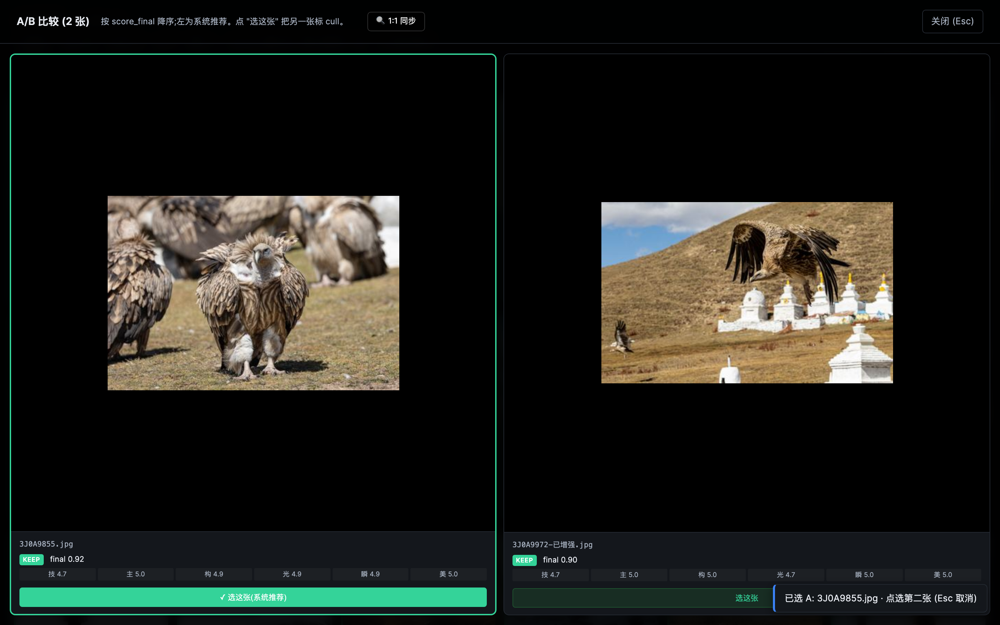

Pin any two photos via the `⇆` button (or Shift-click a thumb) and
they open side-by-side. Click either image to 1:1 zoom on both
simultaneously, drag to pan in lockstep, mouse-wheel to fine-tune.
Built for "which one of these two near-dupes do I keep?".

### Drag-drop upload


Two modes: drop a copy into `/tmp` (default, non-destructive) or scan
an existing folder in place (zero-copy, RAW + DNG friendly).

### Cmd+K command palette (v0.9-P0-4)


Linear/Raycast pattern.  ⌘K opens the palette anywhere; fuzzy match
across 27 actions surfaced in < 50 ms.  Recent-used at top.

### Client-facing portfolio share (v0.9-P0-5)


`/share/<run>/<token>` reads as the photographer's portfolio, not a
software dashboard.  Brand-mark bar + serif gradient hero title +
3 keynum tiles (n_total / n_keeps / ratio%) + chapter-grouped grid
of cards.  Adaptive layout from iPhone portrait to iPad landscape.

### History timeline (v0.7-P2-4)


Every past run is one card.  Decision distribution bar + thumbnail
of the highest-scoring keep.  Click → back into the grid where you
left off.

### Tethered live (v0.7-P2-2)


Watch a Lightroom / Capture One tether folder; new RAW lands on disk
→ analysed within ~2 s → result card appears.  Wedding shoot
in-camera workflow.

### Admin perf data table (v0.9-P2-2)


`/admin/perf` is a first-class data table (clickable sort, draggable
columns, toggle visibility, sticky header, zebra rows, size-class
chips on the cache column).  Layout preferences persist in
localStorage.

### Light theme V2 (v0.9-P2-1)


Sand-cream palette + warm burnt-sienna shadows + display-weight
bumps (700/600/450).  Light isn't an "invert the dark theme"
afterthought — it's editorial-paper feel.

### iPad lightbox + gestures (v0.9-P1-5)


Apple Photos-style gesture suite: horizontal swipe for prev/next,
vertical swipe-down to dismiss, two-finger pinch to zoom, tap to
toggle fit ↔ 1:1.  Vanilla TouchEvent, no third-party gesture lib.

### Empty-state illustrations (v0.9-P2-3)


10 illustrations across the v0.4 + v0.9 + v0.10 empty surfaces.
Consistent editorial-line treatment with one brand-gradient
accent area per illustration.  Phase B Brief 02 will replace
these with hand-drawn versions.

### Mobile grid (v0.6, P-UX-17 responsive)


390-wide viewport with the Inspector pulling up as a bottom-sheet,
LR Mobile-Library style.

### Marquee select + bulk toolbar (v0.11-P1-2)


Drag a rectangle in the grid's empty space → every intersected card
is added to the selection.  Bottom toolbar surfaces keep/maybe/cull/
bucket bulk actions.  `⌘A` selects all visible, `Esc` clears.
Lightroom-Library parity.

### Bias audit dashboard (v0.13-P0-4)


`/admin/bias` aggregates every annotation across every run + buckets
by scene / time-of-day / aperture.  Red callouts when a bucket
deviates > 1.5σ from the family mean ("rescorer 在 *夜景人像* 上 cull
rate 38% (全局 22%) — 模型可能过严").  24h cache; `?force=1` to rebuild;
`/admin/bias.md` for markdown export.  Shown empty because the
real demo run hasn't accumulated annotations yet.

### Confidence-weighted modal (v0.13-P0-3)


Cards in the maybe-band (`0.45 ≤ score_final ≤ 0.55`) hover-surface
a small popover explaining "62% sure · top reason: 同组邻居高 0.04 ·
最弱轴 · light 2.5★".  Dismissable per-run via "不再显示".

### Per-axis attribution heatmap (v0.13-P0-1)


Press `A` in the lightbox → 6-axis chip strip (技术/主体/构图/光线/
时刻/美感) appears, click any axis → that axis's Integrated-Gradients
heatmap (over the timm `mobilenetv3_small_100` backbone) overlays
the photo at 0.5 alpha.  Espresso→brass warm colorize matches the
editorial brand.  Per-axis cache at `output/attribution/<axis>/<sha>.png`.

### Every surface at a glance

| Surface | What it does | Shipped |
|---|---|---|
| `/` upload page | Drag-drop a folder; live progress as scoring runs. Vertical chooser + active user switcher. Brand-gradient hero. | v0.1 + v0.9-P0-3 |
| `/results/<run>` | The main culling surface. LR Library left sidebar (8 collapsible filter groups) + 3-col grid + LR Develop right Inspector (9 collapsible sections). Hero reveal on open. | v0.6 + v0.9-P0-2 |
| `/results/<run>` lightbox | Rubric stars + V20 advice + GPS map + face clusters + similar photos + sticky decision toolbar. RGB readout in 1:1 mode. | v0.1 + v0.7-P1-1 |
| `/results/<run>` Inspector mobile | At ≤640px the Inspector becomes a pull-up bottom sheet (LR Mobile-Library style). | v0.7-P1-2 |
| `/results/<run>` 1:1 zoom | Click any photo to zoom to 100%; drag to pan; wheel to fine-tune. Loupe RGB readout follows the cursor. | v0.7-P1-1 |
| `/results/<run>` A/B compare | Pin any 2 photos via ⇆ button; synced 1:1 zoom + pixel readout across both cells. | v0.7-P0-1 |
| `/results/<run>` ⌘K command palette | Linear/Raycast-style keyboard-first action entry. 27 actions across 7 groups, fuzzy match, recent-used. | **v0.9-P0-4** |
| `/results/<run>` hold-Space | Press & hold Space for ~350ms surfaces a context-aware shortcut cheat-sheet (macOS Finder pattern). | v0.6 (5/5) |
| `/results/<run>?event=<token>` | LAN collaboration: second-shooter / editor opens this URL, polls host every 5s for annotation changes, shows conflict markers. | v0.8-P0-2 |
| `/share/<run>/<token>` | Token-gated client delivery page; only keeps surfaced; photographer brand + client watermark; share-URL modal with QR. | v0.7-P1-4 + v0.8-P1-3 |
| `/tether` | Watch a Lr/C1 tether folder; new RAWs analyze on landing; live status cards. | v0.7-P2-2 |
| `/history` | Date-sorted timeline of every past run; decision distribution chips; one-click jump back. | v0.7-P2-4 |
| `/s/<6-char>` | Short-link issuer + inline SVG QR (pure-Python QR encoder, no JS bundle). | v0.8-P1-3 |
| `/admin` | Storage info; run management; license token; sync configuration. | v0.1 |
| `/verticals` | Per-genre policy editor; promote a sample to the team bank. | v0.4 |
| iOS companion | SwiftUI grid + per-photo swipe annotator + rich lightbox. | v0.5 |

### What sets PixCull apart

If you've seen Aftershoot, FilterPixel, Narrative, or any other "AI photo
culling" SaaS, the things you'll notice immediately on PixCull:

1. **Photos never leave your disk.** RAW decode, scoring, faces, GPS,
   CLIP embeddings — every byte stays on your machine. There's an
   optional DeepSeek meta-judge that calls *your* API token, and even
   that just sends the rubric numbers (not the image).
2. **Style clone learns YOU, not the average photographer.** Give
   PixCull 5-20 of your past keepers, it learns a personal style
   centroid (V1 axis-MAD + V2 CLIP embedding). Next event, it
   re-ranks by "would the user keep this?" — not a hardcoded
   notion of "good".
3. **LAN multi-shooter sync.** Main shooter on Mac, second shooter on
   iPad, editor on a laptop. One token; all three see annotations
   merge in real-time. No cloud round-trip. v0.8-P0-2.
4. **Lightroom round-trip both ways.** XMP sidecars Lightroom writes
   pulled BACK into PixCull annotations — your manual Lr edits
   feed the next training cycle. Not just "export to XMP", actual
   bidirectional integration.
5. **A real keyboard product.** Photo Mechanic-grade hotkeys (1/2/3 +
   Shift-modified rhythm + `[` / `]` for verdict tweaks + `c` for
   compare + ⌘K command palette + hold-Space cheat sheet + `?` full
   shortcut overlay).
6. **Open source, MIT.** Bring your own training data. Bring your
   own scene model. The pipeline.py is 600 lines of Python you can
   actually read.

## Quick start

```bash
# 1. Clone
git clone https://github.com/ChrisChen667788/pixcull.git
cd pixcull

# 2. Python 3.11 or 3.12 (mediapipe pins numpy<2 which forces 3.12-max)
python3.12 -m venv .venv
source .venv/bin/activate

# 3. Install (this pulls torch CPU + InsightFace ONNX + MediaPipe)
pip install -e ".[dev]"

# 4. Run the demo server
python scripts/serve_demo.py
# → open http://127.0.0.1:8770
```

Drop a folder of JPG / RAW / HEIC into the upload page; first run
warms the models (~30 s on Apple Silicon), subsequent batches score
at roughly 1 s / photo on M2 Pro.

### Tether mode (Lr / Capture One)

```bash
python scripts/pixcull_tether.py \
    --vertical wedding \
    ~/Pictures/Lightroom-Tether/2026-05-16-wedding
```

PixCull watches the folder, scores each frame within ~2 s of the
shutter click, and writes a live `scores.csv`. Ctrl-C to stop;
partial results are preserved.

### Standalone macOS app

A signed + notarized `.app` bundle (PyInstaller + Apple Developer
ID) lives at `app/`. See `app/RELEASE.md` for the build / notarize /
Sparkle-update pipeline.

## Configuration

| What | Where | Default |
|---|---|---|
| Server port | `--port` flag on `scripts/serve_demo.py` | `8770` |
| API key (for LAN deploy) | `PIXCULL_API_KEY` env / `X-PixCull-API-Key` header | unset |
| CORS allowlist | `PIXCULL_API_CORS_ORIGINS` env (comma-sep) | `*` if unset |
| Active user | `PIXCULL_USER` env / `X-PixCull-User` header / cookie | none |
| App data dir | `~/Library/Application Support/PixCull` (macOS) | per-platform |
| DeepSeek API key (optional) | `DEEPSEEK_API_KEY` env / `config.json` in app data | unset |
| Sync target (optional) | `pixcull/sync.py` `configure_sync_for_user(path)` | none |

## Architecture at a glance

Three editorial-warm diagrams, **animated on GitHub** — data flows along
the connectors and each stage pulses as it activates (reduced-motion
users get a clean static frame). Editable draw.io sources sit beside
them in [`docs/diagrams/`](docs/diagrams/).

<div align="center">
  <br/>
  <sub><b>System architecture</b> · input → CLI → <code>run_pipeline</code> → on-device scoring engine → outputs → web report, over an IO / formats foundation</sub>
  <br/><br/>
  <br/>
  <sub><b>Video culling sequence</b> · <code>pixcull video</code> → extract frames → score → temporal / reel select → assemble reel + open report</sub>
  <br/><br/>
  <br/>
  <sub><b>Data flow</b> · pixels → <code>rubric.jsonl</code> → <code>scores.csv</code> → <code>manifest.json</code> → report, plus the video-reel branch</sub>
</div>

For the full engineering-grade architecture (C4 system context +
container diagram + photo-pipeline sequence + LAN sync sequence +
**16-row ML model card** + storage layout + tech-decision table),
see **[docs/ARCHITECTURE.md](docs/ARCHITECTURE.md)** — all
diagrams are Mermaid, rendered inline on GitHub + ModelScope.

The 10-second version, showing how PixCull is positioned in the
team workflow:

```mermaid
%%{init: {'theme':'base','themeVariables':{'primaryColor':'#241d12','primaryTextColor':'#f3ede1','lineColor':'#c4b9a9','primaryBorderColor':'#3a3122','tertiaryColor':'#161310'}}}%%
flowchart LR
    P[("📷 Head shooter")]
    S[("📷 Second shooter")]
    E[("✎ Editor")]
    C[("👤 Client")]
    PIX{{"<b>PixCull</b><br/>local-first<br/>AI photo culling"}}
    DS["DeepSeek API<br/>(opt-in)"]

    P -->|"upload RAW/JPEG"| PIX
    S -->|"join LAN event"| PIX
    E -->|"label + push edits"| PIX
    PIX -->|"portfolio share link<br/>/share/&lt;token&gt;"| C
    PIX -.->|"opt-in · text only"| DS

    style PIX fill:#241d12,color:#f3ede1,stroke:#c4b9a9
    style DS  fill:#1b1712,stroke:#6a6052
```

The architecture has a few non-obvious commitments worth calling
out:

- **Zero external web framework** — Python's built-in `http.server`,
  15k LOC in `scripts/serve_demo.py`, deliberately flat for easy
  audit. No Flask / Django / FastAPI.
- **No database** — `scores.csv` + append-only `annotations.jsonl`
  + per-event JSON files. Recovery is `cat | tail`; cross-machine
  migration is `rsync`.
- **Multi-model fusion** — 8 ONNX models (U²-Net / ArcFace /
  scene CNN / wedding-moment CNN / CLIP ViT-L/14 / rubric V2 / …)
  pulled together by a fusion layer + an optional VLM and DeepSeek
  meta-judge. Any external source missing → pipeline gracefully
  degrades. See [the model card](docs/ARCHITECTURE.md#4--ml-model-card--大模型设计表)
  for per-model latency + size.
- **Local-first sync over LAN** — token + 5 s HTTP polling +
  mDNS auto-discovery. No WebSocket, no cloud signalling server,
  no NAT traversal — runs entirely inside the same WiFi.

> **Design quality, honest:** the engineering layer is mature
> (614 tests passing, 7 charters shipped, 57 slices); the visual
> design layer is still "developer + AI" rather than
> "designer-curated".  We name this gap openly and have drafted a
> concrete uplift plan in
> **[docs/DESIGN-SYSTEM-ROADMAP.md](docs/DESIGN-SYSTEM-ROADMAP.md)**
> covering tool selection (Figma + Penpot + Tokens Studio + Rive),
> commissioned-illustration brief, and three phases over the next
> six months — the goal is to move from "iconic functionality" to
> "iconic-craft visual product" before v1.0.

## Repository structure

```
pixcull/
├── pixcull/                    # the actual Python package
│   ├── scoring/                # 6-axis rubric, scene templates, style modes
│   ├── pipeline/               # orchestrator, worker, face / GPS clustering, advice
│   ├── detectors/              # blur, eye-state, exposure, composition, etc.
│   ├── io/                     # RAW loader, XMP / IPTC writers, EXIF
│   ├── db/                     # annotations.jsonl + scores.csv schema helpers
│   ├── report/templates/       # the results.html web UI (zero-build, vanilla JS)
│   ├── license/                # local license-token state machine
│   ├── verticals.py            # per-genre scoring policy
│   ├── sync.py                 # INFRA-2 multi-machine folder mirror
│   └── tether.py               # P2.2 Lr/C1 tether watcher
├── scripts/                    # runnable entry points
│   ├── serve_demo.py           # the HTTP server + web UI host (10k lines)
│   ├── pixcull_tether.py       # the tether CLI
│   ├── train_rescorer.py       # per-axis rescorer training
│   └── ...                     # ~30 maintenance + analysis scripts
├── mobile/PixCullCompanion/    # SwiftUI iOS app (Swift Package)
├── lr_plugin/PixCull.lrplugin/ # Lightroom plugin (Lua)
├── app/                        # PyInstaller spec for the .app bundle
├── tests/                      # pytest suite (1,200+ tests across 88 files)
├── training.csv                # sanitized rubric ground truth (130 rows)
├── training_axis.csv           # sanitized per-axis ground truth (3,000 rows)
├── ROADMAP.md                  # the next ~12 months of work
└── pyproject.toml              # MIT, Python 3.11–3.12
```

## Roadmap

The full [ROADMAP.md](ROADMAP.md) has the running plan with rough
sizing. The current focus areas:

- **Photo evaluation intelligence.** Reject-reason taxonomy →
  rubric model retraining (so your `cull because eyes_closed`
  becomes a real signal); per-axis confidence intervals; meta-judge
  inconsistency detection.
- **Pro-grade workflows.** Tighter Lr / Capture One round-trip;
  Photo Mechanic-equivalent culling hotkeys; auto-IPTC keywords
  from face labels + locations + advice.
- **Mobile companion V0.4+.** Pull-to-refresh, swipe-down dismiss,
  haptic feedback on quick-label, photo-library import in addition
  to server-side runs.

## Security and privacy

PixCull is local-first by design. The default `serve_demo.py` binds
to `127.0.0.1` only; the optional LAN deploy is gated by an
`X-PixCull-API-Key` header you set via `PIXCULL_API_KEY`.

See [SECURITY.md](SECURITY.md) for the full threat model and
disclosure policy. TL;DR: trusted local user, untrusted image input
(Pillow is pinned ≥ 10.2), no telemetry, optional DeepSeek calls go
straight to DeepSeek with *your* token (we never proxy).

## Contributing

See [CONTRIBUTING.md](CONTRIBUTING.md). PRs welcome; bug reports
welcome (use the issue template); the highest-leverage first PRs
are listed in the contributing doc.

## License

[MIT](LICENSE). Use it commercially, fork it freely, send a
pull request.

## About

PixCull started as a single-developer project to stop personally
spending an evening per shoot in Lightroom's catalog. Eighteen
months and a lot of small commits later, it's the AI culling tool
I wish had existed when I picked up my first camera. Open-sourcing
it under MIT so the next photographer doesn't have to rebuild it
from scratch.

— [@ChrisChen667788](https://github.com/ChrisChen667788)

---

<a id="中文"></a>

<div align="center">
  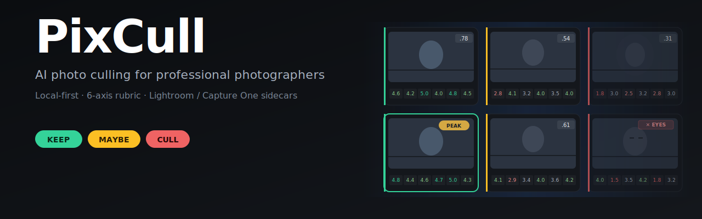
</div>

<p align="center">
  <a href="#pixcull-ai-photo-culling-for-professional-photographers">English</a> ·
  <b>简体中文</b> ·
  <a href="https://www.modelscope.cn/profile/haozi667788">ModelScope</a>
</p>

<p align="center">
  <i>专业摄影师的本地优先 AI 选片工具。<br/>
  6 维评分,XMP / IPTC / 相册一键导出,Lightroom &amp; Capture One 直通,照片永远不出本机。</i>
</p>

## 为什么有这个项目

一场 1,500 张的婚礼,人工选片平均要花一个晚上。市面上的 AI 选片工具
存在,但主流方案都让职业摄影师作出三个不该接受的妥协:

- **它们会把你的照片上传。** 婚礼合同和新闻摄影的 NDA 都明令禁止把
  客户照片送到第三方云上。绝大多数 "AI 选片" SaaS 不上传就跑不起来。
- **它们只给一个分数,没有理由。** 0..1 的总分告诉不了你为什么这张
  入选。给客户解释、或者从自己的选择中学习,都需要审计轨迹。
- **它们活在你工作流之外。** Lightroom、Capture One、Photo Mechanic、
  tether 拍摄 —— 真正的工作发生在这些地方。封闭的 Web App 每批都
  逼你切换上下文。

PixCull 把这三件事全部翻过来:

- **本地优先。** RAW 解码、评分、人脸、GPS —— 全在你电脑上跑。
  可选的 DeepSeek meta-judge 走的是 *你的* API token;不论哪种情况
  照片都在你的硬盘上。
- **6 维评分细则。** 每张照片在 技术 / 主体 / 构图 / 光线 / 瞬间 / 美感
  六个维度上都打 1-5 星,每个维度都有简短的理由 (V5.2+ 还附带摄影
  正典引用 —— Adams 的 Zone System、Cartier-Bresson 的决定性瞬间等等)。
- **Sidecar 原生。** 评分以 XMP 文件输出,Lightroom 和 Capture One
  直接识别。IPTC 标题、独立 HTML 相册、Lr 插件、iOS 滑动伴侣 App —— 都内置。

## 适合谁

- **婚礼 / 活动摄影师** —— 每天 1,000+ 张,明早就要交,而且要在
  不破坏 NDA 的前提下能给客户解释为什么这张入选。
- **体育 / 动作摄影师** —— tether 接 Lightroom,PixCull 监控
  tether 目录,每张快门 ~2 s 给出 keep/maybe/cull 实时判断。
- **新闻摄影师** —— 在 embargo 或 IP 合同下根本不能上传到 SaaS。
- **多人摄影工作室** —— 多个二摄拍同一时刻,需要跨相机合并覆盖、
  跨卡同步人脸 ID。
- **野生 / 风光摄影师** —— 同场景连拍一组,需要自动选峰值帧而又不
  丢失起跑那几张。
- **自学摄影爱好者** —— 想要工具 *解释* 评判 —— 优点、缺点、改进
  建议 —— 而不是只给排序。

## 现在就能用的能力

1. **6 维评分细则。** 技术 / 主体 / 构图 / 光线 / 瞬间 / 美感,每维 1-5
   星,带理由。用数千条人工标注校准,每维都有独立的 rescorer 模型。
2. **9 种细分领域 (verticals)。** 婚礼 · 野生 · 体育 · 风光 · 人像 ·
   活动 · 新闻 · 商业 · 静物。每种领域调整 keep/maybe 阈值并按品味重
   加权 (比如野生奖励瞬间维度的清晰度,即使构图不那么稳;婚礼奖励表
   情,即使光线一般)。
3. **V20 建议信封。** 每张照片附带:简短 verdict、引用摄影正典的
   strengths 列表 (Adams Zone System、决定性瞬间、三分法 等等)、
   weaknesses 列表、具体可执行的 suggestions 列表。
4. **本地人脸聚类。** InsightFace ArcFace embedding → DBSCAN →
   跨 run 的人脸库,识别同一个新娘 / 孩子 / 宠物 跨越所有拍摄。
5. **GPS 位置聚类。** Haversine DBSCAN 按拍摄地点 (~100 m 半径) 分组。
   "每个地点选一张" 凸显每个地点的最佳。
6. **连拍峰值排序。** 亚秒级的连拍组自动选峰值帧 (最佳对焦、表情、
   动作瞬间)。
7. **Cull 原因分类。** Cull 时可选标 *为什么*:`focus_miss` (焦点不准)、
   `eyes_closed` (闭眼)、`motion_blur` (模糊抖动)、`framing` (构图差)、
   `duplicate` (与更佳重复)、`exposure` (曝光问题)、`other`。驱动一个
   筛选条目,并建立更丰富的训练信号。
8. **类似照片查找。** 复合特征 (连拍组 + 场景 + 人脸重叠 + GPS + 评分
   邻近) 排序前 5 张视觉相似帧;点击跳转,Shift+ 点击 加入 A/B 对比。
9. **自选 A/B 对比。** 在任意两张照片上点 ⇆ 按钮 →
   并排比较,两张图同步 1:1 缩放、平移、滚轮缩放。专为
   "这两张相似的我到底留哪个" 设计。
10. **1:1 焦点检查。** 大图窗中点任意位置 1:1 放大,拖动平移,滚轮细
    调。首次缩放时自动加载高分辨率原图。
11. **XMP / IPTC / 相册 导出。** XMP sidecar 进 Lr/C1,IPTC Caption-
    Abstract 由 场景+人物+地点+建议 自动合成 (免费) 或 DeepSeek 润色
    (INFRA-4 budget 内),独立 HTML 相册打包成 zip 直接发客户。
12. **iOS 滑动伴侣 App。** SwiftUI 写的手机端滑动选片 App,后台跑笔记
    本上的重活。走 `/api/v1/` 接口。
13. **Lr / C1 Tether 模式。** 指向 tether 目录;PixCull 监控,每个快门
    ~2 s 内给出实时 verdict,partial scores.csv 在 Ctrl-C 后保留。
14. **跨机同步 (INFRA-2)。** 基于符号链接的目录镜像,走 iCloud / Dropbox /
    NAS —— 人脸库 + 细分领域 + LLM 花费账本跟着你在工作室 ↔ 笔记本之间
    切换。
15. **主动学习队列 (P2.4)。** 按 rescorer 分歧度 + 不确定度 + 阈值附
    近度 排序的 "下一张最值得标的照片"。你的个性化模型在你标注的过程
    中静默改进。
16. **多用户 profile (V28)。** 工作室里两个二摄?各有自己的 vertical +
    人脸库;共享 team vertical 用于工作室主基调。

## 和其他 AI 选片工具的对比

| | PixCull | 主流 SaaS 选片 | Lightroom AI Select |
|---|---|---|---|
| 照片要不要离开本机 | **不需要** | 必须上传 | 不离开但厂商锁定 |
| 评分理由 | **6 维 + 正典引用** | 单一 0..1 分 | "这组的最佳" |
| 工作流融入度 | **XMP + Lr 插件 + iOS + tether** | 仅 Web App | 仅 Lightroom |
| 按拍摄类型调权 | **9 种 vertical + 可扩展** | 单一模型 | 不透明 |
| 开源 | **MIT** | 闭源 | 闭源、订阅制 |
| 主动学习 | **内置** | 闭源再训练循环 | 不可见 |
| 跨 run 人脸库 | **支持 (V22.2)** | 每批独立 | 每个 catalog 独立 |
| 连拍峰值选择 | **支持** | 支持 | 支持 (Stack) |
| Cull 原因分类 | **支持 (分类 + 筛选)** | 不支持 | 不支持 |
| 1:1 焦点检查 + 同步 | **大图窗 + 比较窗** | 有限 | 支持 |
| 可定制 | **纯 Python + 纯 JS** | 不可定制 | 不可定制 |

## 截图

UI 是一个零构建的 HTML 模板 (`pixcull/report/templates/results.html`)
加一个 SwiftUI App (`mobile/PixCullCompanion/`)。两者都是黑色主题、
键鼠优先、无 webpack / 无 Xcode workspace。

**真机数据来源**:Canon EOS 卡 `100CANON/3J0A8133.JPG`–`3J0A8332.JPG`
连续 200 张(海岸 / 风光 / 建筑 / 纪实混合)。完整 pipeline 跑完:
keep 104 · maybe 1 · cull 95 · 178 个连拍组。所有截图都是这一个
真机 run(`/tmp/pixcull_demo/realdemo01/`)的实时页面,不是 mockup。

**新手 0→1 操作指南**: 见 [`docs/USER-GUIDE.md`](docs/USER-GUIDE.md)
——20 分钟跟着步骤跑完第一批照片,每个功能都配真机截图。

以下截图全部用 Playwright headless 抓取的真实运行界面(运行
`bash scripts/brand/capture_real_screenshots.sh realdemo01` 自动
再生成,前提是先 `pixcull/.venv/bin/python -m pixcull run <photos>
-o /tmp/pixcull_demo/realdemo01/output` 跑出 run 数据):

### 选片主界面 · v0.9 reveal + brand gradient


### 大图窗 · V20 advice + AI 视觉化(v0.9-P1-4)


### Cmd+K 命令面板(v0.9-P0-4)


### 客户分享作品集(v0.9-P0-5)


### 历史时间线(v0.7-P2-4)


### Tethered Live(v0.7-P2-2)


### 管理 perf 数据表(v0.9-P2-2)


### Light theme V2 · 暖色 sand-cream 调色板(v0.9-P2-1)


### iPad 大图窗 · Apple Photos 手势(v0.9-P1-5)


### 10 个 empty-state SVG(v0.9-P2-3,Phase B brief 02 将由真人插画师重画)


### 响应式移动端(v0.6,P-UX-17)


### 上传页 · brand gradient hero


### A/B 比较窗(v0.7-P0-1)


### Marquee 框选 + 批量工具栏(v0.11-P1-2)


网格空白处按住鼠标拖矩形,松手所有框中的卡进入"已选"状态。
底部出现 Keep/Maybe/Cull/入桶 工具栏。`⌘A` 全选当前可见,
`Esc` 取消。Lightroom Library 标杆体验。

### 偏差审计 dashboard(v0.13-P0-4)


`/admin/bias` 汇总所有 run 的标注,按 scene / time-of-day /
aperture 分桶,红色高亮偏离均值 > 1.5σ 的桶("rescorer 在 *夜景人像*
上 cull rate 38% (全局 22%) — 模型可能过严")。24h 缓存;
`?force=1` 强制刷新;`/admin/bias.md` 导出 markdown 给客户。
真机 demo run 还没积累标注,因此显示 empty-state。

### 置信度弹窗(v0.13-P0-3)


`score_final ∈ [0.45, 0.55]` 的临界 maybe 卡,鼠标悬停弹出小 popover:
"62% sure · 同组邻居高 0.04 · 最弱轴 · light 2.5★"。可"不再显示"
per-run 关闭(v0.13-P0-3)。

### 像素级 attribution heatmap(v0.13-P0-1)


Lightbox 按 `A` 弹出 6 轴选择条(技术 / 主体 / 构图 / 光线 / 时刻
/ 美感),点任意轴 → 该轴的 Integrated Gradients 显著度图叠加在
原图上(0.5 alpha),espresso→brass 暖色渐变配色。Heatmap 缓存到
`output/attribution/<axis>/<sha>.png`,后续打开秒级出图。

### 🎬 视频审片 · 时间线 scrubber V2(v2.0-P0-4)

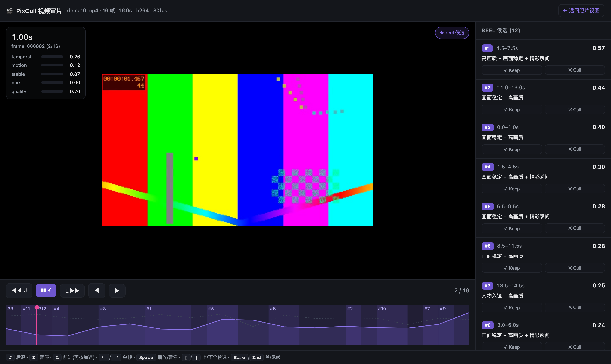

`pixcull video <片子.mp4>` 会抽关键帧 → 跑现有 6 轴评分 → 加时间维
评分(`score_temporal` = 动作连续性 + 时间稳定性 + 突发峰值)→ 找
出 reel 候选,然后在 `/video/<run_id>` 用视频原生 lightbox 审片:
时间轴画每帧 `score_temporal` 山峰 + 候选片段暖色带,拖动播放头实
时切帧,`J/K/L` 倒退/暂停/前进(DaVinci 式,再按加速),右栏候选像
照片一样 Keep / Cull。**上图是真机跑一段 99s 实拍样片渲染的实页
(聚焦 lightbox + 时间轴)。**

头部 🎨 调色下拉(v2.0-P2-2)一键套用胶片预置(Fuji Eterna /
Kodak Vision3 / Arri 709A / Teal-Orange / B&W),主画面 + 每个 reel
候选缩略图实时套用 ASC-CDL 参数化预览(仅预览,不改原片)。

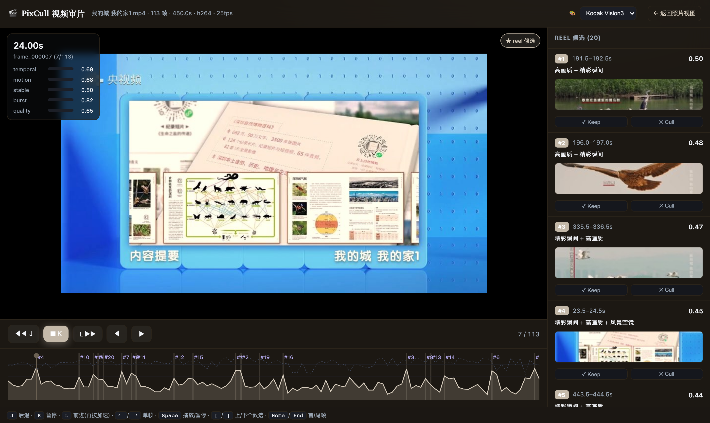

### v2.9 · 智能透明 + 内容优先观看

**🎬 Scenes 时序叙事导航(v2.9-P1-1) — 按拍摄时间自适应切段,点场景跳到那一段。**

`scoring/scenes.py` 用 median+MAD 自适应间隙阈值把一次拍摄切成时序场景,导航条
显示每段时间范围 · 张数 · keep 数;点 chip 即把网格筛到那一段(叙事流,而非一格
格扁平网格)。

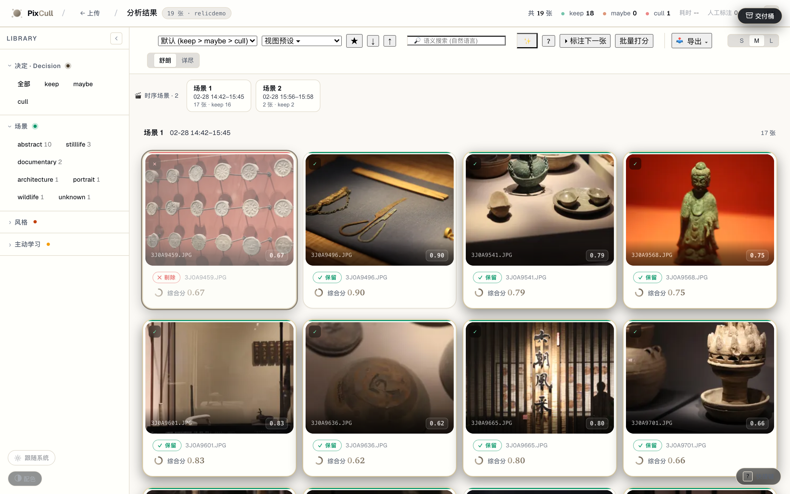

**🔍 判定 glass box(v2.9-P1-2) — 默认一行「为什么是这个判定」,展开看逐轴。**

lightbox inspector 顶部的玻璃箱:默认只显判定徽标 + 一句话理由(渐进披露,取代
过去默认 6 个展开区);展开才看逐轴评分 + 最强信号(✓优点 / →改进)+ AI 判读。

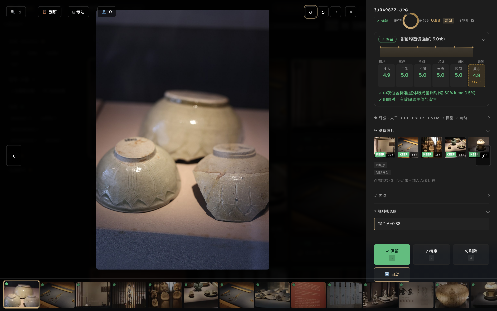

> 另两个 v2.9 切片——**相似度滑块**(Peakto 式可调近重复阈值)与 **人脸 Close-ups
> 轨**(Narrative 式 lightbox 人脸特写)——见
> [`docs/ROADMAP-v2.9-charter.md`](docs/ROADMAP-v2.9-charter.md)。

### v2.11 · 透明度的可发现性

**整理 · 折叠 组 + 首次 coachmark — 透明度工具不再藏起来,每个 run 都看得到入口。**

近重复折叠(+ 相似度滑块)和 🎬 时序场景 从默认隐藏的「连拍」组迁到常显的
**「整理 · 折叠」** 侧栏组;首次进入用一次性 coachmark 把透明度三件套指出来。

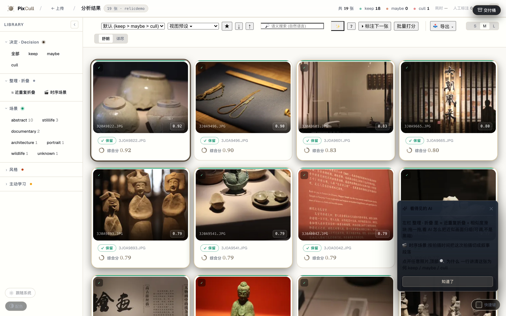

## 快速开始

```bash
# 1. 克隆
git clone https://github.com/ChrisChen667788/pixcull.git
cd pixcull

# 2. Python 3.11 或 3.12 (mediapipe 把 numpy 钉死在 <2,所以 3.12 是上限)
python3.12 -m venv .venv
source .venv/bin/activate

# 3. 安装 (会拉 torch CPU + InsightFace ONNX + MediaPipe)
pip install -e ".[dev]"

# 4. 跑起来
python scripts/serve_demo.py
# → 浏览器开 http://127.0.0.1:8770
```

把一个 JPG / RAW / HEIC 的文件夹拖到上传页;首次约 30 秒预热模型
(Apple Silicon),之后每张 ~1 秒 (M2 Pro 实测)。

### Tether 实时选片 (Lr / Capture One)

```bash
python scripts/pixcull_tether.py \
    --vertical wedding \
    ~/Pictures/Lightroom-Tether/2026-05-16-wedding
```

PixCull 监控目录,每张快门 ~2 秒内出 verdict,实时写 `scores.csv`。
Ctrl-C 退出,部分结果保留。

### macOS 独立 App

`app/` 下有签名 + 公证过的 `.app` 打包配置 (PyInstaller + Apple
Developer ID)。`app/RELEASE.md` 里有完整的构建 / 公证 / Sparkle 更
新 pipeline。

## 配置项

| 内容 | 位置 | 默认值 |
|---|---|---|
| 端口 | `scripts/serve_demo.py --port` | `8770` |
| API key (LAN 部署) | `PIXCULL_API_KEY` 环境变量 / `X-PixCull-API-Key` 头 | 未设置 |
| CORS 白名单 | `PIXCULL_API_CORS_ORIGINS` (逗号分隔) | 未设置时 `*` |
| 当前用户 | `PIXCULL_USER` env / `X-PixCull-User` 头 / cookie | 无 |
| App 数据目录 | `~/Library/Application Support/PixCull` (macOS) | 因平台而异 |
| DeepSeek API key (可选) | `DEEPSEEK_API_KEY` env / app-data 下 `config.json` | 未设置 |
| 同步目标 (可选) | `pixcull/sync.py::configure_sync_for_user(path)` | 无 |

## 架构速览

完整工程架构(C4 系统上下文 + 容器图 + 拍摄 pipeline 时序 + LAN 同步
时序 + **16 行 ML 模型表** + 存储布局 + 技术决策表)见
**[docs/ARCHITECTURE.md](docs/ARCHITECTURE.md)** —— 全部用 Mermaid
绘制,GitHub + ModelScope 均原生渲染。

10 秒版,PixCull 在团队工作流中的位置:

```mermaid
%%{init: {'theme':'base','themeVariables':{'primaryColor':'#241d12','primaryTextColor':'#f3ede1','lineColor':'#c4b9a9','primaryBorderColor':'#3a3122','tertiaryColor':'#161310'}}}%%
flowchart LR
    P[("📷 主摄")]
    S[("📷 二摄")]
    E[("✎ 编辑")]
    C[("👤 客户")]
    PIX{{"<b>PixCull</b><br/>本地优先<br/>AI 选片"}}
    DS["DeepSeek API<br/>(可选)"]

    P -->|"上传 RAW/JPEG"| PIX
    S -->|"加入 LAN event"| PIX
    E -->|"标注 + 推决定"| PIX
    PIX -->|"作品集分享链接<br/>/share/&lt;token&gt;"| C
    PIX -.->|"opt-in · 仅文本"| DS

    style PIX fill:#241d12,color:#f3ede1,stroke:#c4b9a9
    style DS  fill:#1b1712,stroke:#6a6052
```

几个不太显眼但值得点出的工程承诺:

- **无 Web 框架依赖** —— Python 内置 `http.server`,15k 行单文件
  `scripts/serve_demo.py`,故意保持平铺以便审计。无 Flask / Django /
  FastAPI
- **无数据库** —— `scores.csv` + append-only `annotations.jsonl` +
  按事件的 JSON 文件。崩溃恢复就是 `cat | tail`;跨机迁移就是 `rsync`
- **多模型融合** —— 8 个 ONNX 模型(U²-Net / ArcFace / scene CNN /
  wedding-moment CNN / CLIP ViT-L/14 / 评分 V2 / …)由 fusion 层
  + 可选 VLM + DeepSeek 元判断综合;任一外部源缺失时 pipeline
  **降级跑通**。每模型推理延迟 + 大小见
  [模型表](docs/ARCHITECTURE.md#4--ml-model-card--大模型设计表)
- **LAN 同步本地优先** —— token + 5 秒 HTTP polling + mDNS 自动发现。
  无 WebSocket,无云端 signalling,无 NAT 穿透 —— 全在同一个 WiFi 内

> **设计质感坦白:** 工程层已经成熟(614 个测试通过、7 个 charter
> 落地、57 个 slice),但**视觉设计层仍是"开发者 + AI"而非"设计师
> 介入"**。这是我们公开承认的差距。详见
> **[docs/DESIGN-SYSTEM-ROADMAP.md](docs/DESIGN-SYSTEM-ROADMAP.md)** ——
> 包含工具链选型(Figma + Penpot + Tokens Studio + Rive)、自定义插
> 画委托清单、未来 6 个月分三阶段的升级计划。目标:**v1.0 前从
> "功能 iconic"升级到"工艺 iconic"**。

## 仓库结构

```
pixcull/
├── pixcull/                    # Python 包本体
│   ├── scoring/                # 6 维评分 + 场景模板 + 风格模式
│   ├── pipeline/               # 编排器 + worker + 人脸/GPS 聚类 + 建议
│   ├── detectors/              # 模糊 / 闭眼 / 曝光 / 构图 / ... 检测器
│   ├── io/                     # RAW 加载 + XMP / IPTC 写 + EXIF
│   ├── db/                     # annotations.jsonl + scores.csv schema
│   ├── report/templates/       # results.html 主 UI (零构建,vanilla JS)
│   ├── license/                # 本地 license token 状态机
│   ├── verticals.py            # 按拍摄类型的评分策略
│   ├── sync.py                 # 多机同步 (folder mirror)
│   └── tether.py               # Lr/C1 tether 监控
├── scripts/                    # CLI 入口
│   ├── serve_demo.py           # HTTP 服务 + Web UI 主程序 (10k 行)
│   ├── pixcull_tether.py       # Tether CLI
│   ├── train_rescorer.py       # rescorer 训练脚本
│   └── ...                     # ~30 个维护 + 分析脚本
├── mobile/PixCullCompanion/    # SwiftUI iOS App (Swift Package)
├── lr_plugin/PixCull.lrplugin/ # Lightroom 插件 (Lua)
├── app/                        # PyInstaller 打包配置
├── tests/                      # pytest 测试套 (240+ 用例)
├── training.csv                # 脱敏后的 rubric ground truth (130 行)
├── training_axis.csv           # 脱敏后的 per-axis ground truth (3,000 行)
├── ROADMAP.md                  # 未来 12 个月规划
└── pyproject.toml              # MIT,Python 3.11–3.12
```

## 路线图

完整 [ROADMAP.md](ROADMAP.md) 在仓库根。当前重点:

- **照片评价智能化。** Cull 原因 → rubric 模型再训练 (让你的
  "因为闭眼 cull" 变成真实信号);各维度的置信区间;meta-judge 矛
  盾检测。
- **专业工作流。** 更紧的 Lr / C1 round-trip;Photo Mechanic 级别
  的选片快捷键;从 人脸标签 + 地点 + 建议 自动生成 IPTC 关键字。
- **iOS 伴侣 V0.4+。** 下拉刷新、下滑关闭、快速标注的触感反馈、
  本地相册导入 (除了从服务器同步)。

## 安全与隐私

PixCull 默认本地优先。`serve_demo.py` 只绑定 `127.0.0.1`;LAN 部
署由 `PIXCULL_API_KEY` 环境变量设置 `X-PixCull-API-Key` 头进行
控制。

完整威胁模型和漏洞披露政策见 [SECURITY.md](SECURITY.md)。
TL;DR:可信本地用户,不可信图像输入 (Pillow 钉在 ≥ 10.2);无遥
测;可选的 DeepSeek 调用走的是 *你的* token,我们绝不代理转发。

## 参与贡献

详见 [CONTRIBUTING.md](CONTRIBUTING.md)。欢迎 PR;欢迎报 bug
(用 issue 模板);最容易上手的几个 PR 类型在贡献指南里。

## 协议

[MIT](LICENSE)。可商用、自由 fork、欢迎 PR。

## 作者

PixCull 始于一个简单想法:不要再花一个晚上在 Lightroom catalog
里挑片。十八个月、无数个小 commit 之后,它变成了我刚摸相机时就
希望存在的 AI 选片工具。MIT 开源,让下一个摄影师不用再从头造一遍。

— [@ChrisChen667788](https://github.com/ChrisChen667788) · [ModelScope @haozi667788](https://www.modelscope.cn/profile/haozi667788)
