<!-- Banner from scripts/brand/gen_brand_svg.py. The mark is the frame
     you marked: crop brackets around one frame with the rest of the take
     dimmed behind it. See docs/BRAND.md. Regenerate with:
       python scripts/brand/gen_brand_svg.py -->
<div align="center">
  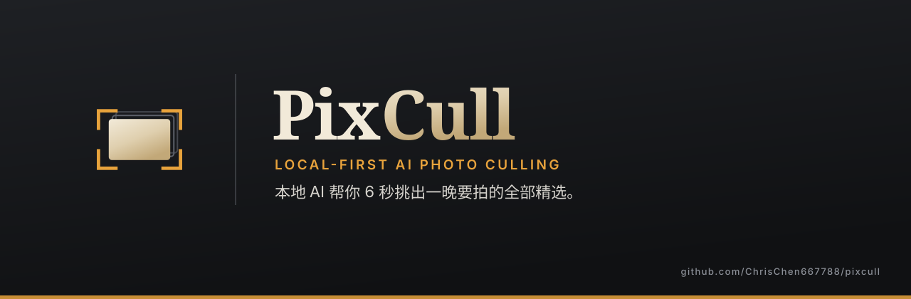
</div>

<!-- Animated hero-reveal demo: SVG SMIL keyframes mirroring the
     v0.9-P0-2 in-product opening sequence (workspace bar slide-in,
     sidebar slide-in, 24 cards stagger fade-up). The static frame is
     the finished screen, so this stays legible wherever SMIL does not
     run — v3.45, after it shipped as a black rectangle.
     Regenerate via: python scripts/brand/gen_animated_demo.py -->
<div align="center">
  
</div>

<p align="center">
  <a href="https://github.com/ChrisChen667788/pixcull/actions/workflows/tests.yml"></a>
  <a href="./LICENSE"></a>
  
  
  
  <a href="https://github.com/ChrisChen667788/pixcull/stargazers"></a>
  <a href="https://github.com/ChrisChen667788/pixcull/releases/latest"></a>
</p>

<p align="center">
  <b>English</b> ·
  <a href="#中文">简体中文</a> ·
  日本語 (in-app) ·
  <a href="https://www.modelscope.cn/profile/haozi667788">ModelScope</a> ·
  <a href="https://github.com/ChrisChen667788/pixcull/releases">Releases</a>
</p>

<p align="center">
  A culling tool for photographers who have to explain the cull.<br/>
  PixCull sorts a shoot into keep, maybe and cull, scores every frame on six
  axes, and writes the reason in a sentence you could read out to a client.<br/>
  It runs on your machine. The RAW files do not have to go anywhere.
</p>

---

## What's new

**v2.99** — `pixcull deliver` writes the folder you actually hand over. Export
could produce XMP sidecars or a ratings CSV — useful to Lightroom, useless to a
person with a client waiting — so the studio path went back through another
application, or copied files by hand.

Copying by hand destroys the two things PixCull knows that nothing else does, at
the moment they matter most: which stretch of the shoot a frame belongs to, and
which frames are the same moment with one of them best. The second is the whole
conversation beside the client. The folder keeps both.

**v2.98** — Over WeChat, the only identifier that survives is the pixels. A
filename in a caption is gone the moment the album reorders, the client
screenshots a subset, or two of the sends fail; position is not an identifier,
it is the thing that changes.

So the number is burned into the frame — top left, about 9% of the image height,
white on an opaque plate. Measured through WeChat's usual treatment (long edge to
1080, re-encoded at q=50, shown as a ~220 px thumbnail) it is still readable, and
a test asserts the plate is still solid after exactly that round trip.

**v2.97** — 客户在场模式. Measured on one screen of a 5,069-photo run, before
building anything: 539 pieces of judgement text, every card reading 保留 and a
score, and a count along the top of how many were marked for deletion.

The studio workflow this is for has the client sitting beside the photographer,
looking at the same screen. So the client was reading the machine's verdict on
their own wedding, with a number attached to each frame. That turns choosing
pictures into defending them. Shift+C hides all of it and leaves the filenames,
so the person driving can still work.

**v2.96** — The open item left by the previous block turned out not to be a
regression. Two machine loads had been compared as though they were one, and the
difference was the machine, not the code.

**v2.95** — The run summary reported decisions the judge had already overturned.
`Keep=6 Maybe=0 Cull=0` printed directly under `6 decision(s) changed by the
judge`, and every row in the CSV said `cull`.

Two sources, one stale: decisions are appended per row while scoring, and with
VLM authority set to primary the judge rewrites them in place afterwards. The
summary was reading the list, the CSV was written from the frame. A photographer
read that everything was kept and opened the results to find nothing was.

**v2.94** — The only tool that produces genuinely blind labels wrote them in the
one shape the provenance guard rejects. `pixcull m3 label` shows a photograph, a
serial number and two buttons; the guard needs a `source` field and one record
per photograph, and the sheet wrote a single record with a verdict map.

Neither knew about the other, so the labelling that unblocks three measurements
produced a file read as `unknown` and refused — advertised and unreachable, in
the exact place the project's next real number was supposed to come from.

Earlier releases are in [`CHANGELOG.md`](CHANGELOG.md).

## Why PixCull

A 1,500-frame wedding takes a human ~6 hours to cull. AI-assist tools
exist, but the popular ones make three trade-offs working photographers
shouldn't have to swallow:

- **They upload your photos.** Wedding contracts and journalism NDAs
  routinely forbid third-party cloud processing of client images.
  Most "AI culling" SaaS apps need an upload to even start.
- **They give you a score, not a reason.** A single 0..1 number tells
  you nothing about *why* a frame got picked. Defending a culling
  decision to a client — or learning from your own taste — needs an
  audit trail.
- **They live outside your tooling.** Lightroom, Capture One, Photo
  Mechanic, your tethered shoot — that's where the work happens. A
  walled-garden web app forces a context switch on every batch.

PixCull is the alternative that flips all three:

- **Local-first.** RAW decode, scoring, faces, GPS — everything runs
  on your machine. The optional DeepSeek meta-judge runs against
  *your* API token; the photos stay on disk either way.
- **6-axis rubric.** Every frame gets stars on technical, subject,
  composition, light, moment, and aesthetic — each with a short
  rationale and (for V5.2+ advice) a canon citation (Adams' Zone
  System, Cartier-Bresson decisive-moment, etc).
- **Sidecar-native.** Verdicts ship as XMP files Lightroom and
  Capture One pick up natively. IPTC captions, standalone HTML
  galleries, Lr plugin, iOS swipe companion — all included.

## Who it helps

- **Wedding &amp; event photographers** shooting 1,000+ frames a day who
  need to triage by tomorrow morning and defend the pick to the
  client without breaking NDA.
- **Sports / action shooters** running tethered to Lightroom — PixCull
  watches the tether folder and emits a live keep/maybe/cull verdict
  per shutter click.
- **Photojournalists** under embargo or IP contract who literally
  cannot upload to a SaaS culling service.
- **Studios with second shooters** who need to merge coverage of the
  same moment from multiple cameras and reconcile face IDs across
  cards.
- **Wildlife / landscape photographers** who shoot bursts of the same
  scene and want the burst-peak picked automatically without
  losing the run-up frames.
- **Self-taught photographers** who want the tool to *explain*
  decisions — strengths, weaknesses, suggestions — not just rank.

## What you get today

1. **6-axis rubric scoring.** Technical, subject, composition, light,
   moment, aesthetic. Each axis: 1–5 stars with rationale.
   Calibrated against thousands of human labels; per-axis rescorer
   trained on the same data.
2. **Per-genre verticals.** Wedding, wildlife, sports, landscape,
   portrait, event, journalism, commercial, still-life. Naming a
   vertical shifts the keep/maybe thresholds and tolerates the flags
   that genre forgives — wildlife stops culling a tiny subject,
   landscape stops culling a long exposure for softness.

   Axis *weighting* is a separate thing and it comes from your own
   corrections, not from the genre: once you have corrected enough
   frames, the axes you demonstrably care about are weighted higher.
   Each vertical also ships a curated starting point for those weights
   (`PIXCULL_VERTICAL_AXIS_PRIOR=1`), which your corrections replace as
   soon as there are enough of them to learn from.
3. **V20 advice envelope.** Every photo carries a short verdict, a
   list of strengths cited to canon (Adams Zone System, Cartier-
   Bresson decisive moment, Rule of Thirds, etc.), a list of
   weaknesses, and a list of concrete suggestions. Pros use it to
   defend picks to clients; learners use it as a teacher.
4. **Local face clustering.** InsightFace ArcFace embeddings →
   DBSCAN clustering → cross-run face library that recognizes the
   same bride / kid / pet across all your shoots. Avatars + inline
   renaming in the UI.
5. **GPS location clustering.** Haversine DBSCAN groups photos by
   capture spot (~100 m radius). "Pick one per location" surfaces
   the best frame from each.
6. **Burst-peak ranking.** Sub-second bursts get a calibrated peak
   pick (best focus, expression, action moment).
7. **Cull-reason taxonomy.** When you cull, optionally tag *why* —
   `focus_miss`, `eyes_closed`, `motion_blur`, `framing`,
   `duplicate`, `exposure`, `other`. Powers a filter pill and
   builds a richer training signal.
8. **Similar-photos lookup.** Composite signature (burst-cluster +
   scene + face overlap + GPS + rubric proximity) ranks the top-5
   visually similar frames; one click jumps to them, Shift+click
   pins for compare.
9. **Free-pick A/B compare.** Click ⇆ on any two photos →
   side-by-side with synced 1:1 zoom across both cells. Built for
   "which one of these two near-dupes do I keep?".
10. **1:1 focus check.** Click any photo in the lightbox to pixel-
    peep at 100%, drag to pan, mouse-wheel to fine-tune. Auto-loads
    hi-res when zoom activates.
11. **XMP / IPTC / gallery export.** XMP sidecars for Lightroom &amp;
    Capture One, IPTC Caption-Abstract auto-composed from
    scene + faces + location + advice (free) or LLM-polished
    (DeepSeek, INFRA-4 budgeted), standalone HTML gallery as a zip
    you can email to a client.
12. **iOS swipe companion.** SwiftUI app for swipe-style triage on
    your phone while the laptop runs the heavy work. Talks to the
    `/api/v1/` namespace. It ships as source — `mobile/PixCullCompanion`,
    a Swift package you build in Xcode. It is not on the App Store and
    `pip install` does not give it to you.
13. **Lr / Capture One tether mode.** Point it at the tether
    destination folder; PixCull watches and emits live verdicts as
    the camera shoots. Partial `scores.csv` survives Ctrl-C.
14. **Multi-machine sync.** Symlink-based folder mirror over
    iCloud / Dropbox / NAS — your face library + verticals +
    LLM-spend ledger follow you between studio &amp; laptop.
15. **Active-learning queue.** The next photos most worth labeling,
    ranked by rescorer disagreement + uncertainty + threshold-
    proximity. Your personalized model improves silently as you
    label.
16. **Multi-user profiles.** Studio with two shooters? Each user has
    their own verticals + face library; shared team verticals for
    house style.
17. **Video culling.** `pixcull video` scores a clip on the same
    6 axes plus a temporal pass, finds reel candidates, and splits
    them on real shot boundaries (`pixcull[shots]`) so a candidate
    never spans a hard cut.
18. **Transcription and edit-by-text.** `pixcull transcribe` writes
    `transcript.json` + an SRT sidecar (Paraformer or Whisper, both
    optional extras). Strike a line — or select words inside one —
    and the video goes with the text; export an EDL for Premiere /
    Resolve or render the cut directly. Mandarin ships with an
    88-term shoot lexicon, and `--speakers` labels who is talking.

## Why it's different from a generic AI culling app

| | PixCull | typical SaaS culling | Lightroom AI Select |
|---|---|---|---|
| Photos leave your disk | **No** | Yes (upload required) | No, but vendor-locked |
| Scoring rationale | **6-axis stars + canon citations** | Single 0..1 score | "Best of this group" |
| Workflow integration | **XMP sidecars + Lr plugin + iOS + tether** | Web app only | Lightroom only |
| Per-genre tuning | **9 verticals + extensible** | One model | Hidden |
| Open source | **MIT** | Closed | Closed, subscription |
| Active learning | **Built-in** | Closed re-train cycle | None visible |
| Face library across runs | **Yes (V22.2)** | Per-batch | Per-catalog |
| Burst peak picker | **Yes** | Yes | Yes (Stack) |
| Cull-reason taxonomy | **Yes (taxonomy + filter)** | No | No |
| 1:1 focus check + sync | **Lightbox + compare** | Limited | Yes |
| Hackable | **Plain Python + plain JS** | No | No |

## Disagreement review — how you find out whether the model is right

A model that disagrees with your rules is either smarter than them or
worse than them, and **nothing in a test suite can tell you which.** Only
you can, by looking at the frames.

`pixcull m3 review` builds a page of exactly the frames where that
question is live, and it exists because the alternative failed. This
project had a 608-row label set that had been reviewed and endorsed —
and was therefore *byte-identical to the rule stack's own output*. The
rule scored a perfect 1.000 against its own answers, any model that
differed was guaranteed to look worse, and the comparison was worthless.
Ten minutes on 18 photographs produced the first labels that could
separate the two systems.

```bash
# 1. score a labelled set with the cloud judge
pixcull m3 eval --labels labels.csv --scores run/scores.csv

# 2. build a review page from the disagreements (free — cache only) and
#    serve it at http://127.0.0.1:8731/ — judge each frame, 保存结果
pixcull m3 review --labels labels.csv --scores run/scores.csv \
                  --out ~/review.html

# 3. re-open a page you built earlier
pixcull m3 open ~/review.html

# 4. feed your verdicts back; they override the label sheet.
#    Repeatable — pass one --review per review pass and they merge.
pixcull m3 eval --labels labels.csv --scores run/scores.csv \
                --review ~/pass-1.json --review ~/pass-2.json
```

The page is **served over loopback rather than opened as a file**. On a
`file://` origin a browser blocks the blob download the save button
uses and restricts `localStorage` — silently, both of them, so the
sheet looks alive while recording nothing. The port is fixed because
`localStorage` is keyed by origin: an ephemeral one would show an empty
sheet to a reviewer who had already judged half of it.

Each card shows the photograph, what each system decided, **which
hard-cull flag was overturned**, the model's own reasoning, and its six
axis scores. Two buttons. No scale to calibrate — a reviewer thinking
about a 1–5 rubric has stopped looking at the picture.

Three properties that are not incidental:

- **The photos never leave your machine.** Thumbnails are embedded in a
  local HTML file. Reviewing your own client work must not require
  uploading it anywhere, including to us.
- **Your verdicts are written to disk**, and mirrored to `localStorage`
  on every click. A closed tab does not cost you the pass you already
  did. (The first version only offered "copy to clipboard". That was
  wrong: ten minutes of a photographer's judgement is the scarcest input
  this system has.)
- **Building the page never spends money.** It reads cached verdicts
  only; a frame the model has not judged is skipped rather than billed.

The same page shape works for any A-vs-B question over images — it takes
a list of `{photo, what A said, what B said, why}` — so a future
comparison between rule versions, or between two models, reuses it
rather than reinventing it.


### What it found

Three passes, and the third one is the only one that can be trusted.

**Passes 1–2 (51 frames) sampled where the two systems disagreed.** That
measures the rule stack only on rows it is already arguing about, so it
flatters whichever side you point it at. It did establish one thing by
direction: M3 was right on 7 of 7 frames it promoted out of a cull, and
on 8 of 19 it wanted to cull from a keep — reliable at rescuing,
unreliable at condemning.

**Pass 3 was blind.** 150 frames from an untouched card, labelled with
the photograph, a serial number and two buttons on screen and nothing
else — then scored, in that order, so the labels cannot echo any system.
The photographer marked 10 for deletion:

| on the 10 frames the photographer would delete | found |
|---|---|
| the rule stack | **2** |
| `vlm_authority=primary` | 1 |
| `vlm_authority=rescue` | 0 |

Both authority modes' macro-F1 deltas have 95% confidence intervals
spanning zero. The rule stack also culls **53 of 150 while the
photographer culls 10** — over-culling by 5.3x.

**Update (v2.64, 394 blind frames).** The 150-frame version of this
section said the job was not solved by anyone. At 2.6x the sample, with
what `maybe` means finally measured rather than assumed, the picture
changed:

| on 493 blind frames | destroys keepers | finds your culls |
|---|---|---|
| rule stack | **157 / 450** | 7 / 43 |
| `rescue` | 26 / 450 | 3 / 43 |
| `primary` | **20 / 450** | **11 / 43** |

`primary` destroys 87% fewer keepers AND finds 57% more of the frames
the photographer wanted deleted. On the first 394 it was a trade — one
cull given up for 111 photographs saved. Adding 100 stratified frames
reversed even that: it now wins on both axes.

macro-F1 +28.9 points, 95% CI [+14.7, +41.9].

The second batch is 100 frames rather than 1000. Stratifying on the
local `score_final` (its low band carries 2.4x the cull rate) and
weighting each row by stratum population / stratum sampled yields
roughly twice the information per frame labelled, at a fifth of the
scoring cost. 400 simulations confirm the weighting recovers the true
rate.

The rule stack auto-deletes 131 frames of which 126 are keepers — a 96%
error rate on the one action that cannot be undone. `primary` cuts that
to 15, finds one fewer cull, and asks for 195 second looks. Macro-F1
+14.6 points, 95% CI [+6.8, +23.1].

**`vlm_authority` now ships `primary`.** The judge itself is still off
until you enable it; what changed is what it may do once on.

Two blind passes established what `maybe` means, because the metric had
been guessing: on frames the photographer kept, 58 of 60 `maybe`s were
"worth another look after a crop" (97%); on frames they culled, 13 of
16 were genuine misses (81%). The old scoring counted every `maybe` as
a miss and, on these 394 frames, that penalised `primary` for 179
correct answers — enough to rank it LAST of three modes.

**The trade is real and it is yours to accept**: 111 photographs saved
from deletion, one cull missed, 164 more frames to glance at. If you
would rather the tool delete confidently and lose keepers, `--vlm-mode
off` restores the rule stack alone.

**Update (v2.67): what the evidence block is worth.** Before the judge
looks at the photograph it is handed a block of local detector numbers.
That design shipped in v2.48 and had never once been tested. Four arms
over the same 493 blind frames, identical but for the evidence sent:

| evidence sent with the image | macro-F1 | destroys keepers | finds culls |
|---|---|---|---|
| technical — sharpness, clipping, faces, burst (ships) | **0.695** | **21** | **28** |
| composition — thirds, lead room, figure/ground, balance, … | 0.666 | 40 | 29 |
| both | 0.525 | 34 | 7 |
| nothing at all — the control nobody had run | 0.544 | 12 | 7 |

Paired bootstrap against the shipped arm: `both` −17.0 [−30.8, −1.5] and
sending nothing −15.1 [−28.9, −0.4] are significantly worse.
`composition` −2.9 [−9.3, +3.3] is not separable on macro-F1 — and is
refused anyway, because it destroys 40 keepers against 21 to find one
more cull. macro-F1 is symmetric; a photographer is not.

Three things follow. **The evidence block earns its place** — sending
nothing costs 15.1 points with the interval clear of zero, which is the
first evidence that v2.48's design does anything at all. **More evidence
is not better evidence** — `both` is worse than either half and worse
than sending nothing, and not by going timid: it still culls 5.5% of
frames and tracks the shipped arm 69% of the time, but its cull
precision collapses from 0.58 to 0.17. Twelve numeric fields make a
confidently wrong judge, not a better-informed one. And **a
population-level discriminator is not a per-frame signal** — composition
separates this photographer's culls by −0.82σ, yet handing the judge
those same numbers makes every individual call worse.

Nothing shipped differently. What changed is that the default is no
longer a guess, and a test now fails if the shipped arm and the recorded
winner drift apart. Full result, and the two harness mistakes that
nearly buried it: [docs/EVIDENCE-AB-RESULT.md](docs/EVIDENCE-AB-RESULT.md).

---

**Original (150 frames):** the headline job is not solved, by the rules
or by the model.
### What a default run actually does

Stated precisely, because two earlier versions of this paragraph were
wrong in the direction that matters. `pixcull run` resolves the judge
from your machine, not from a fixed default:

| your machine | a bare `pixcull run` |
|---|---|
| no MiniMax key | **on-device only, nothing is sent** |
| key, consent never given | prompts once; declining, or any non-interactive run, stays on-device |
| key **and** consent recorded | **uploads** — the run prints that it is doing so |

> **Unsetting `MINIMAX_API_KEY` is not enough to force a local run.** On
> macOS the key is also looked up in the keychain, because that is where
> the app stores it so a GUI launch with no shell environment can still
> find it. `env -u MINIMAX_API_KEY pixcull run …` will still go to the
> cloud if a keychain entry exists and consent was given once before.
> **`--vlm-mode off` is the switch that holds.** The line the run prints
> before it starts — "Judging with MiniMax M3 — photos are uploaded" —
> is the thing to read.


So a key plus one recorded consent is enough for photos to leave the
machine on every subsequent run. `pixcull m3 consent --revoke` undoes
it; `--vlm-mode off` overrides per run.

**Authority is a separate switch, and it ships `off`.** Even when the
judge runs, it scores and explains while decisions stay with the rule
stack. Letting it act takes a second, explicit flag:

```bash
pixcull run shoot/ --vlm-mode minimax --vlm-authority rescue   # may overturn a hard cull
pixcull run shoot/ --vlm-mode minimax --vlm-authority primary  # may overrule either way
```

`primary` was the shipped default until v2.58. The blind pass is why it
is not: 1 of 10, interval spanning zero. Turning a model on should not
silently hand it authority the measurement does not support.

Two things that fall out of the same data, both uncomfortable:

* **The detector flags do not predict this photographer's culls.**
  Against a 6.7% baseline: `no_clear_subject` 6.0% (0.9x — worse than
  chance), `severely_underexposed` 0%, `severely_blurry` 0%. Frames
  carrying **no flag at all** are the most-culled group, at 8.3%.
* **The culled frames are not defective.** They are sharper than
  average, pass technical checks more often, and none are in a burst.
  The one discriminator is composition. This photographer deletes
  editorially weak pictures — which is what a detector cannot see and
  what the model was supposed to be for.

### Fit the boundary to your eye — `pixcull calibrate`

The rule stack ships one keep/cull threshold for everybody. On the
blind pass it culled 53 of 150 frames where the photographer culled 10.

```bash
pixcull m3 label --folder shoot/ --limit 150        # blind, free
pixcull run shoot/ --output run/ --vlm-mode off
pixcull calibrate --labels ~/Downloads/blind-review.json \
                  --scores run/scores.csv            # reports; --write saves
```

It reports before it writes, because a profile changes every future
run. On the first real calibration the report was **negative and
useful**: a -0.080 shift moved 26 decisions and changed neither the
over-culling nor the recall, because every one of those 53 culls fires
on a hard flag and a score shift cannot reach a flag.

So it names the lever instead of stopping there:

```
The threshold cannot help here. All 53 of the rule's culls fire on hard flags.
flags that fire often and predict your culls poorly (baseline 6.7%):
    no_clear_subject   fired 84, of those you culled 5  (6.0%, 0.9x)
```

Where the evidence supports it, the command proposes per-scene
exemptions — `(flag, scene)`, because `no_clear_subject` is meaningless
for a landscape and load-bearing for a portrait. Proposals need at
least 8 firings in that scene: one shoot is a fact about one shoot.
Accepted exemptions live in your profile, never in the shipped
defaults, and can only ever widen tolerance — the worst a wrong profile
can do is keep a frame, never destroy one.

Labelling is keyboard-driven: <kbd>K</kbd> keeps, <kbd>X</kbd> culls,
<kbd>U</kbd> undoes the last one, <kbd>S</kbd> saves. It resumes where
you left off, because a properly powered pass is ~1250 frames.

### The dataset, by provenance

1102 photographs from the owner's own library have entered this
measurement. They are not equally useful, and the difference is the
whole story of this repository:

| provenance | frames | usable as ground truth |
|---|---|---|
| **blind** — judged before anything was scored | **494** | **yes** |
| review — judged with a system verdict on screen | 103 | direction only (selection bias) |
| circular — label *is* the rule stack's decision | 305 | no |
| circular — label *is* the pipeline's output | 200 | no |

Half of it is unusable, and every one of those 505 frames looked like a
dataset until someone checked. The blind pass is the only tier that can
rank two systems, and the photographer re-judged 150 of its frames a
second time with **zero disagreements**, so its label noise is close to
nil.

Machine side: 408 frames scored by MiniMax M3, 1002 through the local
pipeline (72 detector columns each).

### How to reproduce this on your own library

```bash
pixcull m3 label --folder /path/to/shoot --limit 150   # blind, free
pixcull run /path/to/shoot --output run/ --vlm-mode off
pixcull m3 eval --labels ~/Downloads/blind-review.json --scores run/scores.csv
```

The eval refuses to rank a sample that cannot support a ranking: labels
copied from the rule stack, a sample with no `cull` ground truth, an
authority mode that never fired, or an interval that spans zero each
produce a named refusal instead of a number.


## Acknowledgements

**[MiniMax M3](https://www.minimaxi.com/)** is the vision judge behind
every cloud measurement in this repository. The evaluation here is
often unflattering to it — that is the point of an evaluation — and it
is worth being explicit that the model made the measurement possible at
all: 800+ scored frames, a reasoning model whose
`<think>` output is what let the six-axis rubric be checked rather than
trusted, and an API that never once returned a malformed verdict in the
whole campaign.

Where the numbers say the rule stack wins, they say so about a
photographer with a 7% cull rate on coastal and documentary work. They
are not a verdict on the model in general, and this README will keep
saying whatever the next blind pass says.

Also gratefully used: OpenAI CLIP, U²-Net (rembg), InsightFace,
MediaPipe, pyiqa, FunASR/Paraformer, and PySceneDetect.

## Screenshots

> **Real product UI captured against a 200-photo Canon EOS card from
> 2022(`/100CANON/3J0A8133.JPG`–`3J0A8332.JPG`),mostly coastal /
> landscape / architecture frames.** Pipeline ran end-to-end:
> 200 张 → keep 104, maybe 1, cull 95, 178 burst clusters.  Every
> screenshot below is the live page rendered from that real run
> (`/tmp/pixcull_demo/realdemo01/`)—not a mockup or template-skeleton.
>
> **新手指南**: 完整的"从安装到选完 200 张照片"操作流程见
> [`docs/USER-GUIDE.md`](docs/USER-GUIDE.md)。

### The culling surface

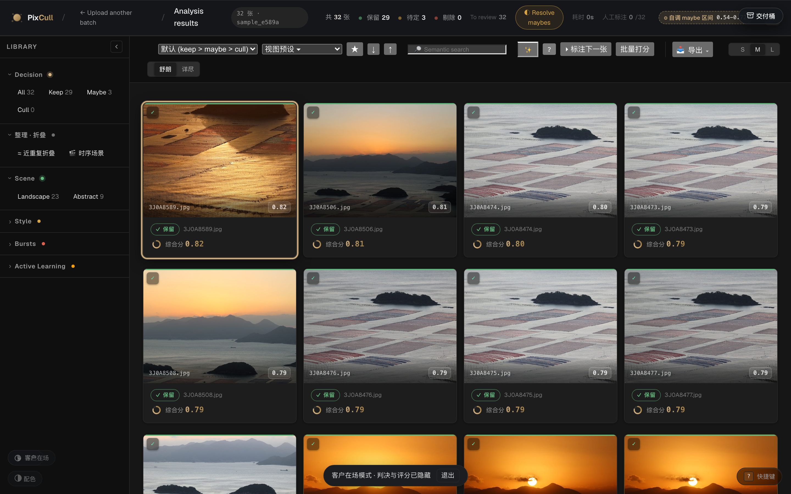

Drag a folder of JPG / RAW / HEIC into the upload page, pick a vertical,
and you get this back. Each card carries a decision badge (keep /
maybe / cull), a final composite score, the 6-axis rubric stars, the
detected scene + style chips, and the V20 advice one-liner. The colored
left edge is a glanceable decision indicator.

### Transcript + edit by text (v2.43 – v2.44.2)

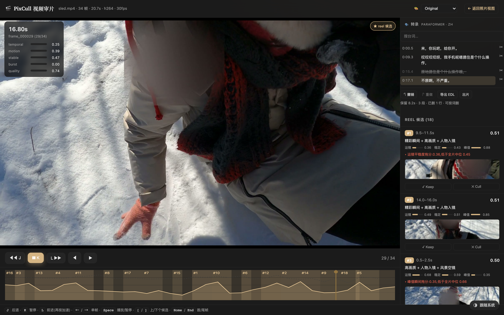

`pixcull transcribe` writes `transcript.json` and an SRT sidecar; the review
page puts the lines beside the video. Click a line to seek to it. Strike a
line with ✂, or select words inside one and delete just those — the video goes
with the text, and the readout tells you what is left (`保留 11.8s · 3 段`).
Undo and redo replay an operation log, so the transcript and the timeline
cannot drift apart. Export a CMX-3600 EDL for Premiere or Resolve, or press
出片 and get the cut mp4.

Word-level selection appears only when the engine reported a real time span per
character — Paraformer does, Whisper does not — because interpolating inside a
segment invents precision the model never gave and lands cuts on the wrong
frames. The panel says which mode it is in.

> This capture is synthetic end to end: an ffmpeg test pattern with macOS TTS
> speaking four on-set directions. Re-take it with
> `scripts/brand/capture_transcript_edit.py`.

### Lightbox with V20 advice + sticky decision toolbar

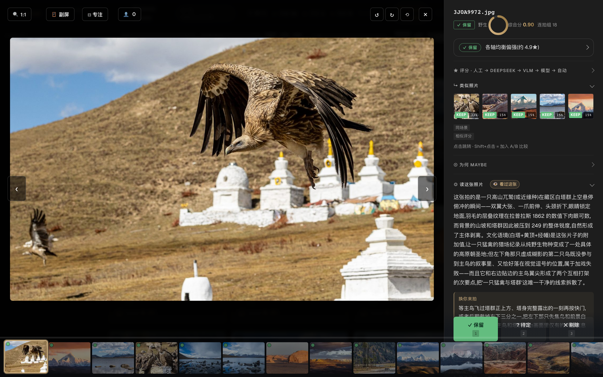

Click any thumbnail and the lightbox opens with the full rubric on the
right: 6-axis stars + 4-source breakdown (auto / model / VLM / human),
DeepSeek meta-judge reasoning, V5.2 advice with canon citations (Adams'
Zone System, Rule of Space, etc), a top-5 similar-photo strip, and
sticky keep / maybe / cull decision buttons. Click the image to 1:1
focus-check; mouse-wheel to fine-tune zoom.

### A/B compare with synced 1:1 zoom

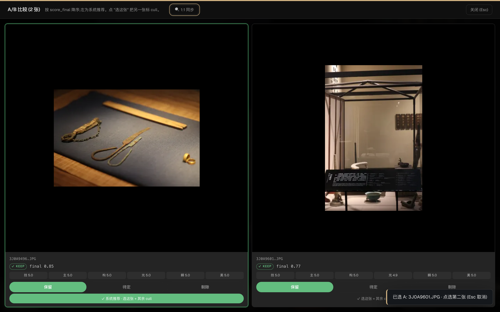

Pin any two photos via the `⇆` button (or Shift-click a thumb) and
they open side-by-side. Click either image to 1:1 zoom on both
simultaneously, drag to pan in lockstep, mouse-wheel to fine-tune.
Built for "which one of these two near-dupes do I keep?".

### Drag-drop upload

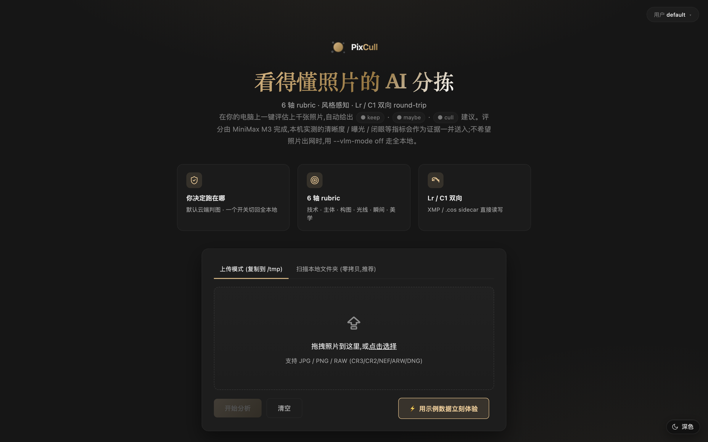

Two modes: drop a copy into `/tmp` (default, non-destructive) or scan
an existing folder in place (zero-copy, RAW + DNG friendly).

### Cmd+K command palette (v0.9-P0-4)

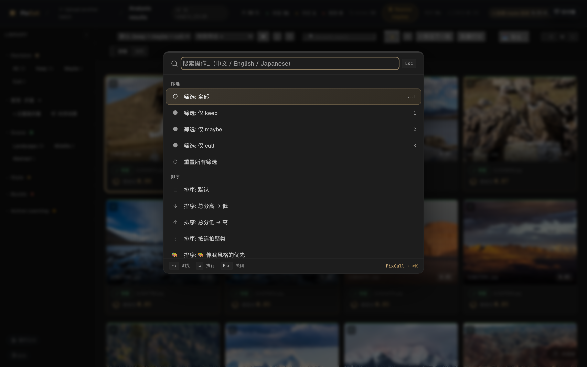

Linear/Raycast pattern.  ⌘K opens the palette anywhere; fuzzy match
across 27 actions surfaced in < 50 ms.  Recent-used at top.

### Client-facing portfolio share (v0.9-P0-5)

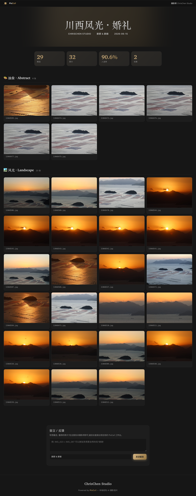

`/share/<run>/<token>` reads as the photographer's portfolio, not a
software dashboard.  Brand-mark bar + serif gradient hero title +
3 keynum tiles (n_total / n_keeps / ratio%) + chapter-grouped grid
of cards.  Adaptive layout from iPhone portrait to iPad landscape.

### History timeline (v0.7-P2-4)

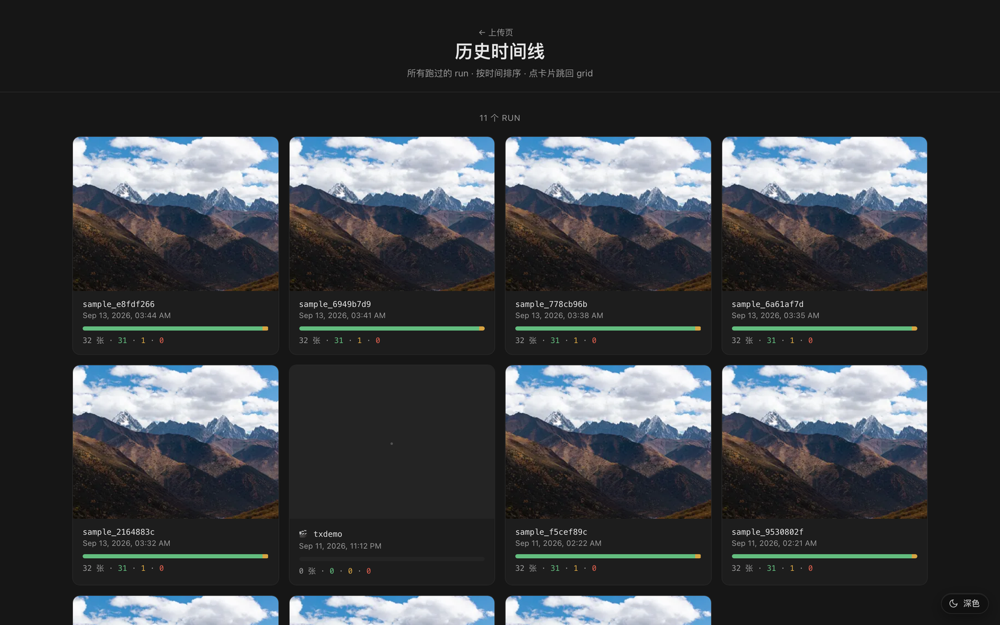

Every past run is one card.  Decision distribution bar + thumbnail
of the highest-scoring keep.  Click → back into the grid where you
left off.

### Tethered live (v0.7-P2-2)

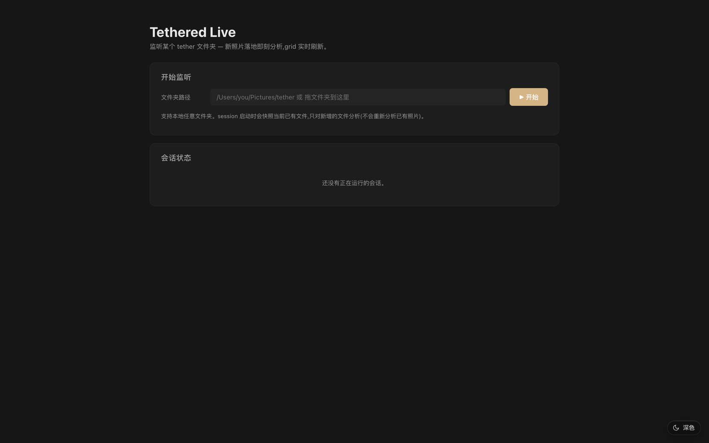

Watch a Lightroom / Capture One tether folder; new RAW lands on disk
→ analysed within ~2 s → result card appears.  Wedding shoot
in-camera workflow.

### Admin perf data table (v0.9-P2-2)

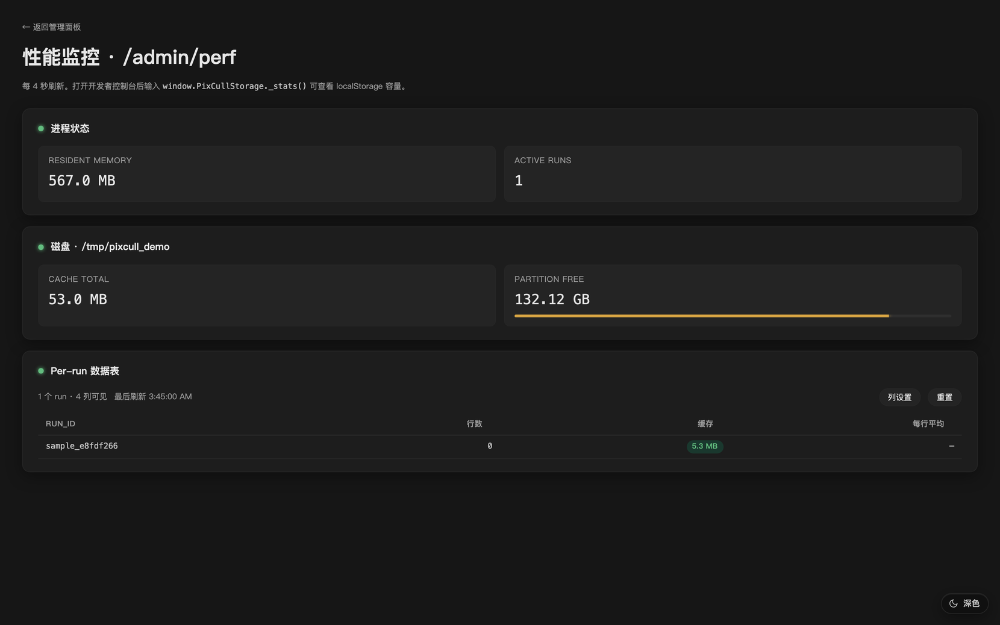

`/admin/perf` is a first-class data table (clickable sort, draggable
columns, toggle visibility, sticky header, zebra rows, size-class
chips on the cache column).  Layout preferences persist in
localStorage.

### Light theme V2 (v0.9-P2-1)

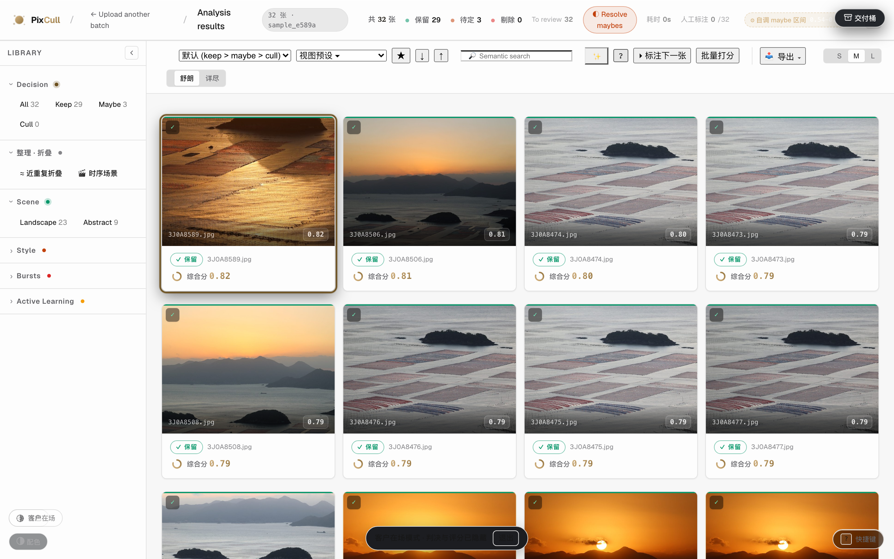

Sand-cream palette + warm burnt-sienna shadows + display-weight
bumps (700/600/450).  Light isn't an "invert the dark theme"
afterthought — it's editorial-paper feel.

### iPad lightbox + gestures (v0.9-P1-5)

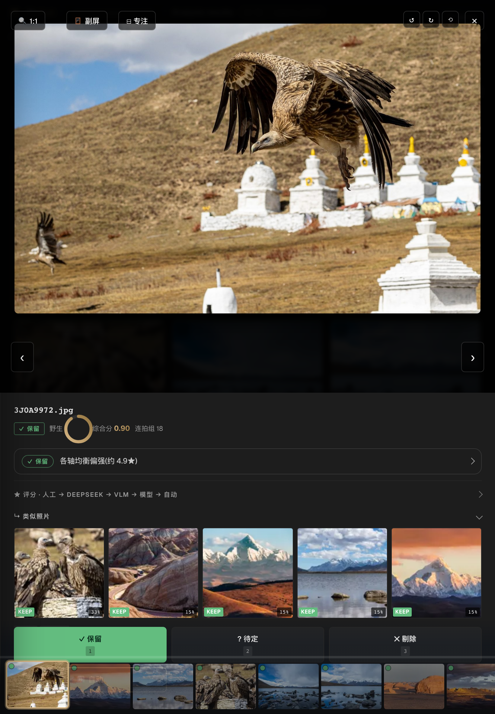

Apple Photos-style gesture suite: horizontal swipe for prev/next,
vertical swipe-down to dismiss, two-finger pinch to zoom, tap to
toggle fit ↔ 1:1.  Vanilla TouchEvent, no third-party gesture lib.

### Empty-state illustrations (v0.9-P2-3)

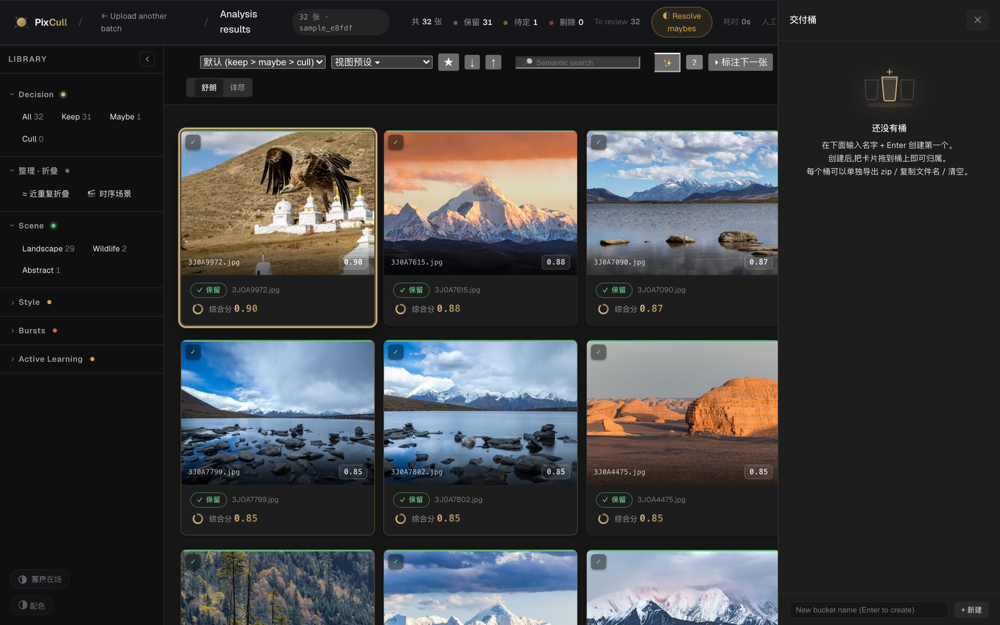

10 illustrations across the v0.4 + v0.9 + v0.10 empty surfaces.
Consistent editorial-line treatment with one brand-gradient
accent area per illustration.  Phase B Brief 02 will replace
these with hand-drawn versions.

### Mobile grid (v0.6, P-UX-17 responsive)

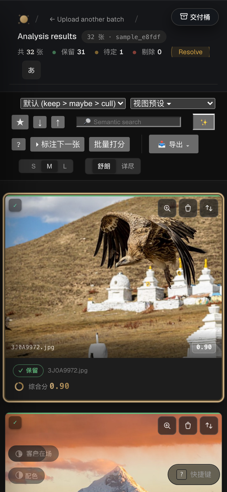

390-wide viewport with the Inspector pulling up as a bottom-sheet,
LR Mobile-Library style.

### Marquee select + bulk toolbar (v0.11-P1-2)

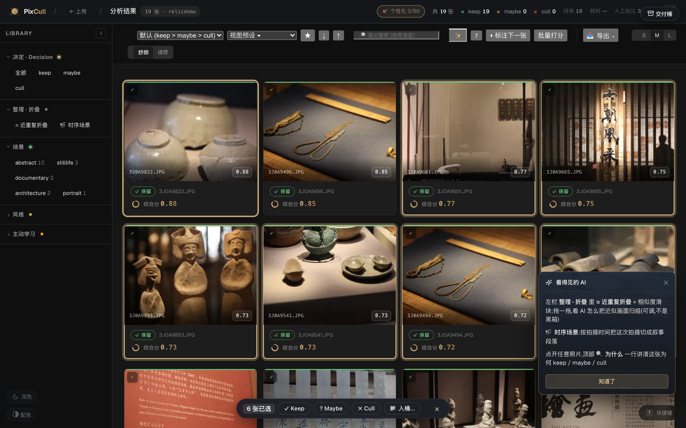

Drag a rectangle in the grid's empty space → every intersected card
is added to the selection.  Bottom toolbar surfaces keep/maybe/cull/
bucket bulk actions.  `⌘A` selects all visible, `Esc` clears.
Lightroom-Library parity.

### Bias audit dashboard (v0.13-P0-4)

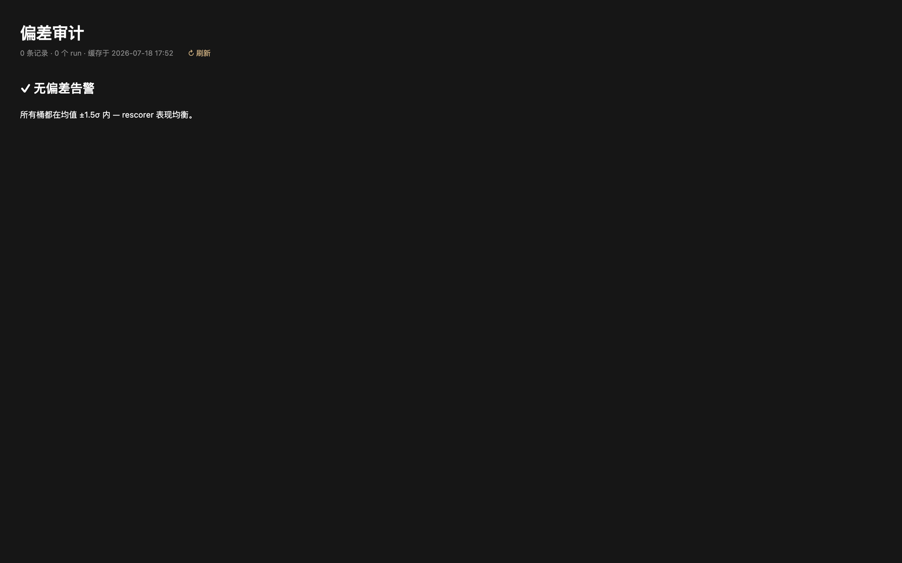

`/admin/bias` aggregates every annotation across every run + buckets
by scene / time-of-day / aperture.  Red callouts when a bucket
deviates > 1.5σ from the family mean ("rescorer 在 *夜景人像* 上 cull
rate 38% (全局 22%) — 模型可能过严").  24h cache; `?force=1` to rebuild;
`/admin/bias.md` for markdown export.  Shown empty because the
real demo run hasn't accumulated annotations yet.

### Confidence-weighted modal (v0.13-P0-3)

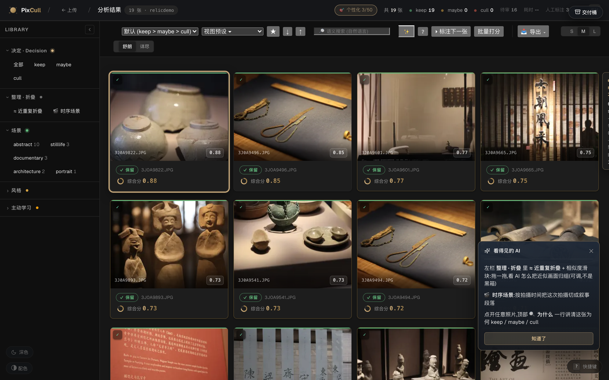

Cards in the maybe-band (`0.45 ≤ score_final ≤ 0.55`) hover-surface
a small popover explaining "62% sure · top reason: 同组邻居高 0.04 ·
最弱轴 · light 2.5★".  Dismissable per-run via "不再显示".

### Per-axis attribution heatmap (v0.13-P0-1)

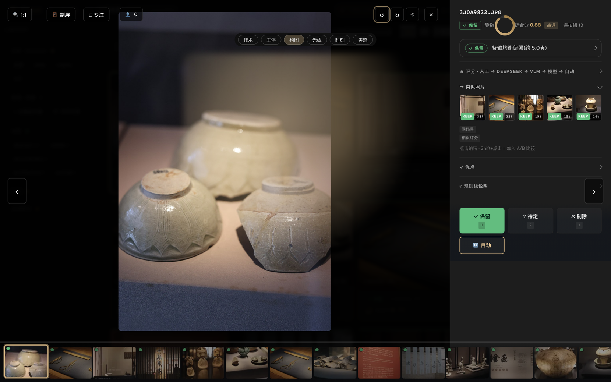

Press `A` in the lightbox → 6-axis chip strip (技术/主体/构图/光线/
时刻/美感) appears, click any axis → that axis's Integrated-Gradients
heatmap (over the timm `mobilenetv3_small_100` backbone) overlays
the photo at 0.5 alpha.  Espresso→brass warm colorize matches the
editorial brand.  Per-axis cache at `output/attribution/<axis>/<sha>.png`.

### Every surface at a glance

| Surface | What it does | Shipped |
|---|---|---|
| `/` upload page | Drag-drop a folder; live progress as scoring runs. Vertical chooser + active user switcher. Brand-gradient hero. | v0.1 + v0.9-P0-3 |
| `/results/<run>` | The main culling surface. LR Library left sidebar (8 collapsible filter groups) + 3-col grid + LR Develop right Inspector (9 collapsible sections). Hero reveal on open. | v0.6 + v0.9-P0-2 |
| `/results/<run>` lightbox | Rubric stars + V20 advice + GPS map + face clusters + similar photos + sticky decision toolbar. RGB readout in 1:1 mode. | v0.1 + v0.7-P1-1 |
| `/results/<run>` Inspector mobile | At ≤640px the Inspector becomes a pull-up bottom sheet (LR Mobile-Library style). | v0.7-P1-2 |
| `/results/<run>` 1:1 zoom | Click any photo to zoom to 100%; drag to pan; wheel to fine-tune. Loupe RGB readout follows the cursor. | v0.7-P1-1 |
| `/results/<run>` A/B compare | Pin any 2 photos via ⇆ button; synced 1:1 zoom + pixel readout across both cells. | v0.7-P0-1 |
| `/results/<run>` ⌘K command palette | Linear/Raycast-style keyboard-first action entry. 27 actions across 7 groups, fuzzy match, recent-used. | **v0.9-P0-4** |
| `/results/<run>` hold-Space | Press & hold Space for ~350ms surfaces a context-aware shortcut cheat-sheet (macOS Finder pattern). | v0.6 (5/5) |
| `/results/<run>?event=<token>` | LAN collaboration: second-shooter / editor opens this URL, polls host every 5s for annotation changes, shows conflict markers. | v0.8-P0-2 |
| `/share/<run>/<token>` | Token-gated client delivery page; only keeps surfaced; photographer brand + client watermark; share-URL modal with QR. | v0.7-P1-4 + v0.8-P1-3 |
| `/tether` | Watch a Lr/C1 tether folder; new RAWs analyze on landing; live status cards. | v0.7-P2-2 |
| `/history` | Date-sorted timeline of every past run; decision distribution chips; one-click jump back. | v0.7-P2-4 |
| `/s/<6-char>` | Short-link issuer + inline SVG QR (pure-Python QR encoder, no JS bundle). | v0.8-P1-3 |
| `/admin` | Storage info; run management; license token; sync configuration. | v0.1 |
| `/verticals` | Per-genre policy editor; promote a sample to the team bank. | v0.4 |
| iOS companion | SwiftUI grid + per-photo swipe annotator + rich lightbox. | v0.5 |

### What sets PixCull apart

If you've seen Aftershoot, FilterPixel, Narrative, or any other "AI photo
culling" SaaS, the things you'll notice immediately on PixCull:

1. **A judge that reads the measurements as well as the picture.**
   Sharpness, clipped highlights, blink detection and near-duplicate
   grouping are computed on your machine — a vision model guesses at
   all four — and those numbers are handed to MiniMax M3 *as evidence*
   alongside the photo. So when it keeps a frame flagged `closed_eyes`,
   it is not ignorant of the closed eyes; it is overruling them, and it
   tells you it did. Photos are uploaded for that judgement.
   `--vlm-mode off` keeps every byte on your machine, for shoots under
   an NDA that forbids third-party cloud processing.
2. **Style clone learns YOU, not the average photographer.** Give
   PixCull 5-20 of your past keepers, it learns a personal style
   centroid (V1 axis-MAD + V2 CLIP embedding). Next event, it
   re-ranks by "would the user keep this?" — not a hardcoded
   notion of "good".
3. **LAN multi-shooter sync.** Main shooter on Mac, second shooter on
   iPad, editor on a laptop. One token; all three see annotations
   merge in real-time. No cloud round-trip. v0.8-P0-2.
4. **Lightroom round-trip both ways.** XMP sidecars Lightroom writes
   pulled BACK into PixCull annotations — your manual Lr edits
   feed the next training cycle. Not just "export to XMP", actual
   bidirectional integration.
5. **A real keyboard product.** Photo Mechanic-grade hotkeys (1/2/3 +
   Shift-modified rhythm + `[` / `]` for verdict tweaks + `c` for
   compare + ⌘K command palette + hold-Space cheat sheet + `?` full
   shortcut overlay).
6. **Open source, MIT.** Bring your own training data. Bring your
   own scene model. The pipeline.py is 600 lines of Python you can
   actually read.

## Quick start

```bash
# 1. Clone
git clone https://github.com/ChrisChen667788/pixcull.git
cd pixcull

# 2. Python 3.11 or 3.12 (mediapipe pins numpy<2 which forces 3.12-max)
python3.12 -m venv .venv
source .venv/bin/activate

# 3. Install (this pulls torch CPU + InsightFace ONNX + MediaPipe)
pip install -e ".[dev]"

# 4. Run the demo server
python scripts/serve_demo.py
# → open http://127.0.0.1:8770
```

Drop a folder of JPG / RAW / HEIC into the upload page; first run
warms the models (~30 s on Apple Silicon), subsequent batches score
at roughly 1 s / photo on M2 Pro.

### Tether mode (Lr / Capture One)

```bash
python scripts/pixcull_tether.py \
    --vertical wedding \
    ~/Pictures/Lightroom-Tether/2026-05-16-wedding
```

PixCull watches the folder, scores each frame within ~2 s of the
shutter click, and writes a live `scores.csv`. Ctrl-C to stop;
partial results are preserved.

### Standalone macOS app

A signed + notarized `.app` bundle (PyInstaller + Apple Developer
ID) lives at `app/`. See `app/RELEASE.md` for the build / notarize /
Sparkle-update pipeline.

## Configuration

| What | Where | Default |
|---|---|---|
| Server port | `--port` flag on `scripts/serve_demo.py` | `8770` |
| API key (for LAN deploy) | `PIXCULL_API_KEY` env / `X-PixCull-API-Key` header | unset |
| CORS allowlist | `PIXCULL_API_CORS_ORIGINS` env (comma-sep) | `*` if unset |
| Active user | `PIXCULL_USER` env / `X-PixCull-User` header / cookie | none |
| App data dir | `~/Library/Application Support/PixCull` (macOS) | per-platform |
| DeepSeek API key (optional) | `DEEPSEEK_API_KEY` env / `config.json` in app data | unset |
| Sync target (optional) | `pixcull/sync.py` `configure_sync_for_user(path)` | none |

## Architecture at a glance

Three editorial-warm diagrams, **animated on GitHub** — data flows along
the connectors and each stage pulses as it activates (reduced-motion
users get a clean static frame). Editable draw.io sources sit beside
them in [`docs/diagrams/`](docs/diagrams/).

<div align="center">
  <br/>
  <sub><b>System architecture</b> · input → CLI → <code>run_pipeline</code> → on-device scoring engine → outputs → web report, over an IO / formats foundation</sub>
  <br/><br/>
  <br/>
  <sub><b>Video culling sequence</b> · <code>pixcull video</code> → extract frames → score → temporal / reel select → assemble reel + open report</sub>
  <br/><br/>
  <br/>
  <sub><b>Data flow</b> · pixels → <code>rubric.jsonl</code> → <code>scores.csv</code> → <code>manifest.json</code> → report, plus the video-reel branch</sub>
</div>

For the full engineering-grade architecture (C4 system context +
container diagram + photo-pipeline sequence + LAN sync sequence +
**16-row ML model card** + storage layout + tech-decision table),
see **[docs/ARCHITECTURE.md](docs/ARCHITECTURE.md)** — all
diagrams are Mermaid, rendered inline on GitHub + ModelScope.

The 10-second version, showing how PixCull is positioned in the
team workflow:


```mermaid
%%{init: {'theme':'base','themeVariables':{'primaryColor':'#241d12','primaryTextColor':'#f3ede1','lineColor':'#c4b9a9','primaryBorderColor':'#3a3122','tertiaryColor':'#161310'}}}%%
flowchart LR
    P[("📷 Head shooter")]
    S[("📷 Second shooter")]
    E[("✎ Editor")]
    C[("👤 Client")]
    PIX{{"<b>PixCull</b><br/>local-first<br/>AI photo culling"}}
    DS["DeepSeek API<br/>(opt-in)"]

    P -->|"upload RAW/JPEG"| PIX
    S -->|"join LAN event"| PIX
    E -->|"label + push edits"| PIX
    PIX -->|"portfolio share link<br/>/share/&lt;token&gt;"| C
    PIX -.->|"opt-in · text only"| DS

    style PIX fill:#241d12,color:#f3ede1,stroke:#c4b9a9
    style DS  fill:#1b1712,stroke:#6a6052
```

The architecture has a few non-obvious commitments worth calling
out:

- **Zero external web framework** — Python's built-in `http.server`,
  15k LOC in `scripts/serve_demo.py`, deliberately flat for easy
  audit. No Flask / Django / FastAPI.
- **No database** — `scores.csv` + append-only `annotations.jsonl`
  + per-event JSON files. Recovery is `cat | tail`; cross-machine
  migration is `rsync`.
- **Multi-model fusion** — 8 ONNX models (U²-Net / ArcFace /
  scene CNN / wedding-moment CNN / CLIP ViT-L/14 / rubric V2 / …)
  pulled together by a fusion layer + an optional VLM and DeepSeek
  meta-judge. Any external source missing → pipeline gracefully
  degrades. See [the model card](docs/ARCHITECTURE.md#4--ml-model-card--大模型设计表)
  for per-model latency + size.
- **Local-first sync over LAN** — token + 5 s HTTP polling +
  mDNS auto-discovery. No WebSocket, no cloud signalling server,
  no NAT traversal — runs entirely inside the same WiFi.

> **Design quality, honest:** the engineering layer is mature
> (614 tests passing, 7 charters shipped, 57 slices); the visual
> design layer is still "developer + AI" rather than
> "designer-curated".  We name this gap openly and have drafted a
> concrete uplift plan in
> **[docs/DESIGN-SYSTEM-ROADMAP.md](docs/DESIGN-SYSTEM-ROADMAP.md)**
> covering tool selection (Figma + Penpot + Tokens Studio + Rive),
> commissioned-illustration brief, and three phases over the next
> six months — the goal is to move from "iconic functionality" to
> "iconic-craft visual product" before v1.0.

## Repository structure

```
pixcull/
├── pixcull/                    # the actual Python package
│   ├── scoring/                # 6-axis rubric, scene templates, style modes
│   ├── pipeline/               # orchestrator, worker, face / GPS clustering, advice
│   ├── detectors/              # blur, eye-state, exposure, composition, etc.
│   ├── io/                     # RAW loader, XMP / IPTC writers, EXIF
│   ├── db/                     # annotations.jsonl + scores.csv schema helpers
│   ├── report/templates/       # the results.html web UI (zero-build, vanilla JS)
│   ├── license/                # local license-token state machine
│   ├── models/                 # the trained rescorer that ships with the package
│   ├── verticals.py            # per-genre scoring policy
│   ├── sync.py                 # INFRA-2 multi-machine folder mirror
│   └── tether.py               # P2.2 Lr/C1 tether watcher
├── scripts/                    # runnable entry points
│   ├── serve_demo.py           # the HTTP server + web UI host (10k lines)
│   ├── pixcull_tether.py       # the tether CLI
│   ├── train_rescorer.py       # per-axis rescorer training
│   └── ...                     # ~30 maintenance + analysis scripts
├── mobile/PixCullCompanion/    # SwiftUI iOS app (Swift Package)
├── lr_plugin/PixCull.lrplugin/ # Lightroom plugin (Lua)
├── app/                        # PyInstaller spec for the .app bundle
├── tests/                      # pytest suite (1,200+ tests across 88 files)
├── models/                     # where `scripts/train_*.py` writes; shadows the packaged copy
├── training.csv                # sanitized rubric ground truth (130 rows)
├── training_axis.csv           # sanitized per-axis ground truth (3,000 rows)
├── ROADMAP.md                  # the next ~12 months of work
└── pyproject.toml              # MIT, Python 3.11–3.12
```

## Roadmap

The full [ROADMAP.md](ROADMAP.md) has the running plan with rough
sizing. The current focus areas:

- **Photo evaluation intelligence.** Reject-reason taxonomy →
  rubric model retraining (so your `cull because eyes_closed`
  becomes a real signal); per-axis confidence intervals; meta-judge
  inconsistency detection.
- **Pro-grade workflows.** Tighter Lr / Capture One round-trip;
  Photo Mechanic-equivalent culling hotkeys; auto-IPTC keywords
  from face labels + locations + advice.
- **Mobile companion V0.4+.** Pull-to-refresh, swipe-down dismiss,
  haptic feedback on quick-label, photo-library import in addition
  to server-side runs.

## Security and privacy

PixCull is local-first by design. The default `serve_demo.py` binds
to `127.0.0.1` only; the optional LAN deploy is gated by an
`X-PixCull-API-Key` header you set via `PIXCULL_API_KEY`.

See [SECURITY.md](SECURITY.md) for the full threat model and
disclosure policy. TL;DR: trusted local user, untrusted image input
(Pillow is pinned ≥ 10.2), no telemetry, optional DeepSeek calls go
straight to DeepSeek with *your* token (we never proxy).

## Contributing

See [CONTRIBUTING.md](CONTRIBUTING.md). PRs welcome; bug reports
welcome (use the issue template); the highest-leverage first PRs
are listed in the contributing doc.

## License

[MIT](LICENSE). Use it commercially, fork it freely, send a
pull request.

## About

PixCull started as a single-developer project to stop personally
spending an evening per shoot in Lightroom's catalog. Eighteen
months and a lot of small commits later, it's the AI culling tool
I wish had existed when I picked up my first camera. Open-sourcing
it under MIT so the next photographer doesn't have to rebuild it
from scratch.

— [@ChrisChen667788](https://github.com/ChrisChen667788)

---

<a id="中文"></a>

<div align="center">
  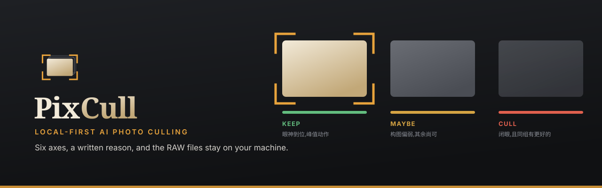
</div>

<p align="center">
  <a href="#pixcull-ai-photo-culling-for-professional-photographers">English</a> ·
  <b>简体中文</b> ·
  <a href="https://www.modelscope.cn/profile/haozi667788">ModelScope</a>
</p>

<p align="center">
  <i>专业摄影师的 AI 选片工具。<br/>
  6 维评分,XMP / IPTC / 相册一键导出,Lightroom &amp; Capture One 直通,MiniMax M3 云端判图(可切纯本地)。</i>
</p>

## 为什么有这个项目

一场 1,500 张的婚礼,人工选片平均要花一个晚上。市面上的 AI 选片工具
存在,但主流方案都让职业摄影师作出三个不该接受的妥协:

- **它们会把你的照片上传。** 婚礼合同和新闻摄影的 NDA 都明令禁止把
  客户照片送到第三方云上。绝大多数 "AI 选片" SaaS 不上传就跑不起来。
- **它们只给一个分数,没有理由。** 0..1 的总分告诉不了你为什么这张
  入选。给客户解释、或者从自己的选择中学习,都需要审计轨迹。
- **它们活在你工作流之外。** Lightroom、Capture One、Photo Mechanic、
  tether 拍摄 —— 真正的工作发生在这些地方。封闭的 Web App 每批都
  逼你切换上下文。

PixCull 把这三件事全部翻过来:

- **本地优先。** RAW 解码、评分、人脸、GPS —— 全在你电脑上跑。
  可选的 DeepSeek meta-judge 走的是 *你的* API token;不论哪种情况
  照片都在你的硬盘上。
- **6 维评分细则。** 每张照片在 技术 / 主体 / 构图 / 光线 / 瞬间 / 美感
  六个维度上都打 1-5 星,每个维度都有简短的理由 (V5.2+ 还附带摄影
  正典引用 —— Adams 的 Zone System、Cartier-Bresson 的决定性瞬间等等)。
- **Sidecar 原生。** 评分以 XMP 文件输出,Lightroom 和 Capture One
  直接识别。IPTC 标题、独立 HTML 相册、Lr 插件、iOS 滑动伴侣 App —— 都内置。

## 适合谁

- **婚礼 / 活动摄影师** —— 每天 1,000+ 张,明早就要交,而且要在
  不破坏 NDA 的前提下能给客户解释为什么这张入选。
- **体育 / 动作摄影师** —— tether 接 Lightroom,PixCull 监控
  tether 目录,每张快门 ~2 s 给出 keep/maybe/cull 实时判断。
- **新闻摄影师** —— 在 embargo 或 IP 合同下根本不能上传到 SaaS。
- **多人摄影工作室** —— 多个二摄拍同一时刻,需要跨相机合并覆盖、
  跨卡同步人脸 ID。
- **野生 / 风光摄影师** —— 同场景连拍一组,需要自动选峰值帧而又不
  丢失起跑那几张。
- **自学摄影爱好者** —— 想要工具 *解释* 评判 —— 优点、缺点、改进
  建议 —— 而不是只给排序。

## 现在就能用的能力

1. **6 维评分细则。** 技术 / 主体 / 构图 / 光线 / 瞬间 / 美感,每维 1-5
   星,带理由。用数千条人工标注校准,每维都有独立的 rescorer 模型。
2. **9 种细分领域 (verticals)。** 婚礼 · 野生 · 体育 · 风光 · 人像 ·
   活动 · 新闻 · 商业 · 静物。每种领域调整 keep/maybe 阈值并按品味重
   加权 (比如野生奖励瞬间维度的清晰度,即使构图不那么稳;婚礼奖励表
   情,即使光线一般)。
3. **V20 建议信封。** 每张照片附带:简短 verdict、引用摄影正典的
   strengths 列表 (Adams Zone System、决定性瞬间、三分法 等等)、
   weaknesses 列表、具体可执行的 suggestions 列表。
4. **本地人脸聚类。** InsightFace ArcFace embedding → DBSCAN →
   跨 run 的人脸库,识别同一个新娘 / 孩子 / 宠物 跨越所有拍摄。
5. **GPS 位置聚类。** Haversine DBSCAN 按拍摄地点 (~100 m 半径) 分组。
   "每个地点选一张" 凸显每个地点的最佳。
6. **连拍峰值排序。** 亚秒级的连拍组自动选峰值帧 (最佳对焦、表情、
   动作瞬间)。
7. **Cull 原因分类。** Cull 时可选标 *为什么*:`focus_miss` (焦点不准)、
   `eyes_closed` (闭眼)、`motion_blur` (模糊抖动)、`framing` (构图差)、
   `duplicate` (与更佳重复)、`exposure` (曝光问题)、`other`。驱动一个
   筛选条目,并建立更丰富的训练信号。
8. **类似照片查找。** 复合特征 (连拍组 + 场景 + 人脸重叠 + GPS + 评分
   邻近) 排序前 5 张视觉相似帧;点击跳转,Shift+ 点击 加入 A/B 对比。
9. **自选 A/B 对比。** 在任意两张照片上点 ⇆ 按钮 →
   并排比较,两张图同步 1:1 缩放、平移、滚轮缩放。专为
   "这两张相似的我到底留哪个" 设计。
10. **1:1 焦点检查。** 大图窗中点任意位置 1:1 放大,拖动平移,滚轮细
    调。首次缩放时自动加载高分辨率原图。
11. **XMP / IPTC / 相册 导出。** XMP sidecar 进 Lr/C1,IPTC Caption-
    Abstract 由 场景+人物+地点+建议 自动合成 (免费) 或 DeepSeek 润色
    (INFRA-4 budget 内),独立 HTML 相册打包成 zip 直接发客户。
12. **iOS 滑动伴侣 App。** SwiftUI 写的手机端滑动选片 App,后台跑笔记
    本上的重活。走 `/api/v1/` 接口。以源码形式提供 ——
    `mobile/PixCullCompanion`,一个要你自己在 Xcode 里编译的 Swift
    package;没上 App Store,`pip install` 也不会给你。
13. **Lr / C1 Tether 模式。** 指向 tether 目录;PixCull 监控,每个快门
    ~2 s 内给出实时 verdict,partial scores.csv 在 Ctrl-C 后保留。
14. **跨机同步 (INFRA-2)。** 基于符号链接的目录镜像,走 iCloud / Dropbox /
    NAS —— 人脸库 + 细分领域 + LLM 花费账本跟着你在工作室 ↔ 笔记本之间
    切换。
15. **主动学习队列 (P2.4)。** 按 rescorer 分歧度 + 不确定度 + 阈值附
    近度 排序的 "下一张最值得标的照片"。你的个性化模型在你标注的过程
    中静默改进。
16. **多用户 profile (V28)。** 工作室里两个二摄?各有自己的 vertical +
    人脸库;共享 team vertical 用于工作室主基调。

## 和其他 AI 选片工具的对比

> **这张表只对 PixCull 这一列打包票。** v3.25 之前它对同行写的是「必须上传」
> 「不支持」「不可定制」这类绝对断言,没有一条带来源。2026-09 的事实核查恰好
> 推翻了本项目另一处同型断言 —— 说某家竞品必须上传照片,而所有能查到的报道
> 都与本地处理一致。既然本项目拒绝在没有出处的情况下公布自己的准确率,对别人
> 也该用同一条标准。
>
> 逐家的、带出处的对比在 [`docs/COMPETITIVE-2026Q3.md`](docs/COMPETITIVE-2026Q3.md),
> 每一行都有 Source 列;下面这张只说 PixCull 自己做了什么。

| | PixCull(可在本仓库核验) | 同类工具的常见做法 |
|---|---|---|
| 照片要不要离开本机 | **可以完全不离开**:`--vlm-mode off` 全程不出网;默认送 MiniMax M3 判图,不进训练池 | 多为云端处理;各家的留存与训练策略以其自身条款为准 |
| 评分理由 | **6 维评分 + 摄影正典引用 + 逐张文字点评** | 各家不同,对外多为一个总分或一个分级 |
| 工作流融入度 | **XMP sidecar + Lr 插件 + iOS App + tether 模式** | 多数以自己的 Web App 为主入口;宿主插件请查各家文档 |
| 按拍摄类型调权 | **9 种 vertical,可扩展** | 是否分垂类、如何分,各家未必公开 |
| 授权 | **MIT,代码全部可读** | 商业产品为主,授权条款以各家为准 |
| 从纠正中学习 | **本机档案 + 出处门槛(见 `personalized.py`)** | 多数有个性化功能,训练细节通常不公开 |
| 跨 run 人脸库 | **支持(V22.2)** | 是否跨批次,请查各家文档 |
| 连拍峰值选择 | **支持** | 常见能力 |
| Cull 原因分类 | **支持(分类 + 筛选)** | 各家不同 |
| 1:1 焦点检查 + 同步 | **大图窗 + 比较窗** | 各家不同 |
| 可定制 | **纯 Python + 纯 JS,无编译步骤** | 闭源产品通常不提供 |

## 截图

UI 是一个零构建的 HTML 模板 (`pixcull/report/templates/results.html`)
加一个 SwiftUI App (`mobile/PixCullCompanion/`)。两者都是黑色主题、
键鼠优先、无 webpack / 无 Xcode workspace。

**真机数据来源**:Canon EOS 卡 `100CANON/3J0A8133.JPG`–`3J0A8332.JPG`
连续 200 张(海岸 / 风光 / 建筑 / 纪实混合)。完整 pipeline 跑完:
keep 104 · maybe 1 · cull 95 · 178 个连拍组。所有截图都是这一个
真机 run(`/tmp/pixcull_demo/realdemo01/`)的实时页面,不是 mockup。

**新手 0→1 操作指南**: 见 [`docs/USER-GUIDE.md`](docs/USER-GUIDE.md)
——20 分钟跟着步骤跑完第一批照片,每个功能都配真机截图。

以下截图全部用 Playwright headless 抓取的真实运行界面(运行
`bash scripts/brand/capture_real_screenshots.sh realdemo01` 自动
再生成,前提是先 `pixcull/.venv/bin/python -m pixcull run <photos>
-o /tmp/pixcull_demo/realdemo01/output` 跑出 run 数据):

### 选片主界面 · v0.9 reveal + brand gradient


### 大图窗 · V20 advice + AI 视觉化(v0.9-P1-4)


### Cmd+K 命令面板(v0.9-P0-4)


### 客户分享作品集(v0.9-P0-5)


### 历史时间线(v0.7-P2-4)


### Tethered Live(v0.7-P2-2)


### 管理 perf 数据表(v0.9-P2-2)


### Light theme V2 · 暖色 sand-cream 调色板(v0.9-P2-1)


### iPad 大图窗 · Apple Photos 手势(v0.9-P1-5)


### 10 个 empty-state SVG(v0.9-P2-3,Phase B brief 02 将由真人插画师重画)


### 响应式移动端(v0.6,P-UX-17)


### 上传页 · brand gradient hero


### A/B 比较窗(v0.7-P0-1)


### Marquee 框选 + 批量工具栏(v0.11-P1-2)


网格空白处按住鼠标拖矩形,松手所有框中的卡进入"已选"状态。
底部出现 Keep/Maybe/Cull/入桶 工具栏。`⌘A` 全选当前可见,
`Esc` 取消。Lightroom Library 标杆体验。

### 偏差审计 dashboard(v0.13-P0-4)


`/admin/bias` 汇总所有 run 的标注,按 scene / time-of-day /
aperture 分桶,红色高亮偏离均值 > 1.5σ 的桶("rescorer 在 *夜景人像*
上 cull rate 38% (全局 22%) — 模型可能过严")。24h 缓存;
`?force=1` 强制刷新;`/admin/bias.md` 导出 markdown 给客户。
真机 demo run 还没积累标注,因此显示 empty-state。

### 置信度弹窗(v0.13-P0-3)


`score_final ∈ [0.45, 0.55]` 的临界 maybe 卡,鼠标悬停弹出小 popover:
"62% sure · 同组邻居高 0.04 · 最弱轴 · light 2.5★"。可"不再显示"
per-run 关闭(v0.13-P0-3)。

### 像素级 attribution heatmap(v0.13-P0-1)


Lightbox 按 `A` 弹出 6 轴选择条(技术 / 主体 / 构图 / 光线 / 时刻
/ 美感),点任意轴 → 该轴的 Integrated Gradients 显著度图叠加在
原图上(0.5 alpha),espresso→brass 暖色渐变配色。Heatmap 缓存到
`output/attribution/<axis>/<sha>.png`,后续打开秒级出图。

### 🎬 视频审片 · 时间线 scrubber V2(v2.0-P0-4)

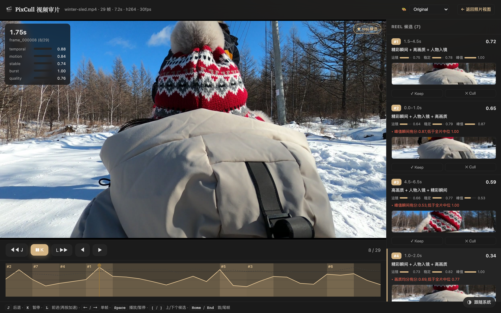

`pixcull video <片子.mp4>` 会抽关键帧 → 跑现有 6 轴评分 → 加时间维
评分(`score_temporal` = 动作连续性 + 时间稳定性 + 突发峰值)→ 找
出 reel 候选,然后在 `/video/<run_id>` 用视频原生 lightbox 审片:
时间轴画每帧 `score_temporal` 山峰 + 候选片段暖色带,拖动播放头实
时切帧,`J/K/L` 倒退/暂停/前进(DaVinci 式,再按加速),右栏候选像
照片一样 Keep / Cull。**上图是真机跑一段 99s 实拍样片渲染的实页
(聚焦 lightbox + 时间轴)。**

头部 🎨 调色下拉(v2.0-P2-2)一键套用胶片预置(Fuji Eterna /
Kodak Vision3 / Arri 709A / Teal-Orange / B&W),主画面 + 每个 reel
候选缩略图实时套用 ASC-CDL 参数化预览(仅预览,不改原片)。

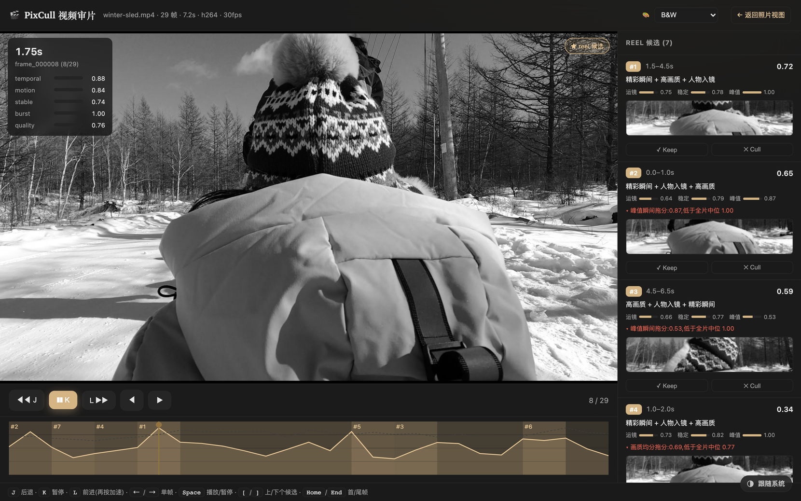
**照片 + 视频同一条时间线(`/timeline/<run_id>`)** —— 一次拍摄里的照片与视频片段
按拍摄时间排在一起,视频卡片显示时长 · 帧数 · 候选数 · 卖点标签,一键跳进审片台。

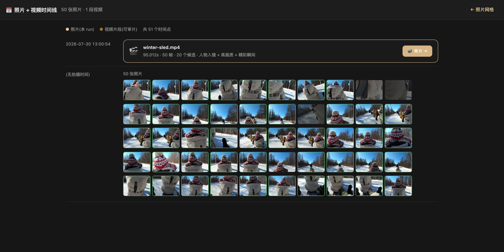


### 🗣 转录 + 按文字剪(v2.43 – v2.44.2)


`pixcull transcribe <片子.mp4>` 产出 `transcript.json` + SRT,审片页把台词
排在画面旁边。**点一行跳到那一秒**;点 ✂ 划掉整行,或**选中行内几个字只删
这几个字** —— 画面跟着文字一起没,读数实时告诉你还剩多少(`保留 11.8s ·
3 段`)。撤销/重做重放操作日志,所以文字和时间轴不可能对不上。导出
CMX-3600 EDL 进 Premiere / Resolve,或者按**出片**直接得到剪好的 mp4。

**按词选只在引擎给了每字真实时间时才出现** —— Paraformer 有,Whisper 没有。
在段内线性插值是在伪造模型没给过的精度,会把切点放到错误的帧上,所以宁可
不提供;面板会显示当前是哪种模式。

中文识别带一份 **88 条领域词表**(机位 / 曝光 / 备选 / 长焦 / 接亲 / 证婚人
…):通用模型会把「长焦」听成「掌交」、「备选」听成「被选」,一个字错整条
字幕就废。词表按领域知识先验写死,在**从未见过的 10 句留出集**上把 CER 从
2.59% 降到 1.11%(错误数 −57%)。`--hotword` 还能加场地名、新人姓名。

`--speakers` 可标注谁在说话(需片子够长:FunASR 的聚类器在少于 20 个语音
片段时直接返回"只有一个人"),**分不出时明说分不出**,不会伪造一个 0 号
说话人。

> 上图全程为合成素材:ffmpeg 测试图 + macOS TTS 念四句现场指令,不涉及任何
> 真实拍摄素材。重拍用 `scripts/brand/capture_transcript_edit.py`。

### v2.9 · 智能透明 + 内容优先观看

**🎬 Scenes 时序叙事导航(v2.9-P1-1) — 按拍摄时间自适应切段,点场景跳到那一段。**

`scoring/scenes.py` 用 median+MAD 自适应间隙阈值把一次拍摄切成时序场景,导航条
显示每段时间范围 · 张数 · keep 数;点 chip 即把网格筛到那一段(叙事流,而非一格
格扁平网格)。

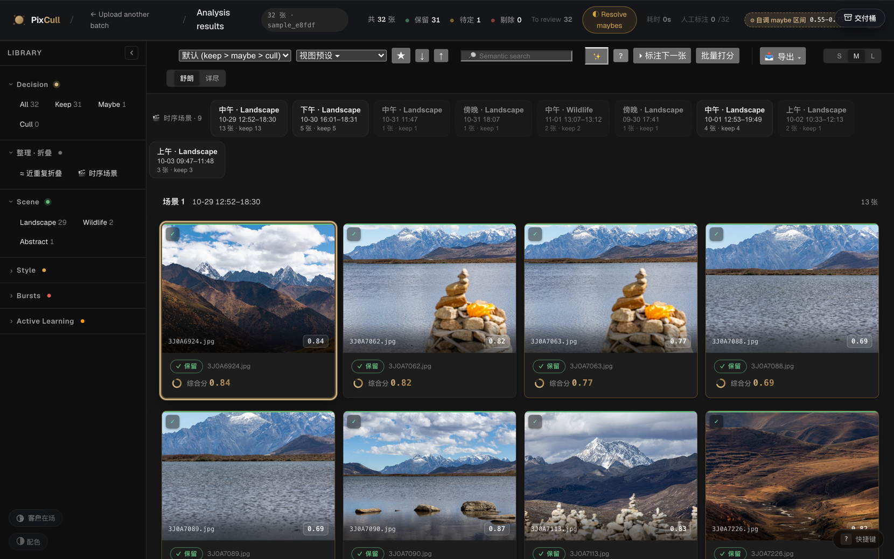

**🔍 判定 glass box(v2.9-P1-2) — 默认一行「为什么是这个判定」,展开看逐轴。**

lightbox inspector 顶部的玻璃箱:默认只显判定徽标 + 一句话理由(渐进披露,取代
过去默认 6 个展开区);展开才看逐轴评分 + 最强信号(✓优点 / →改进)+ AI 判读。

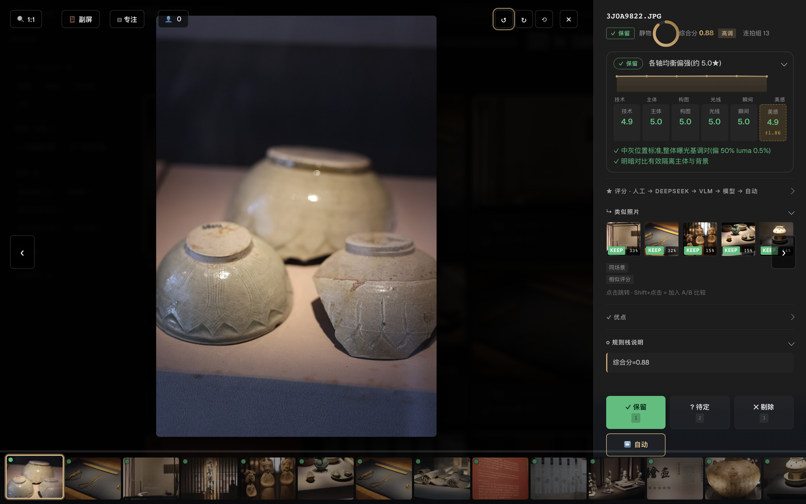

> 另两个 v2.9 切片——**相似度滑块**(Peakto 式可调近重复阈值)与 **人脸 Close-ups
> 轨**(Narrative 式 lightbox 人脸特写)——见
> [`docs/ROADMAP-v2.9-charter.md`](docs/ROADMAP-v2.9-charter.md)。

### v2.11 · 透明度的可发现性

**整理 · 折叠 组 + 首次 coachmark — 透明度工具不再藏起来,每个 run 都看得到入口。**

近重复折叠(+ 相似度滑块)和 🎬 时序场景 从默认隐藏的「连拍」组迁到常显的
**「整理 · 折叠」** 侧栏组;首次进入用一次性 coachmark 把透明度三件套指出来。

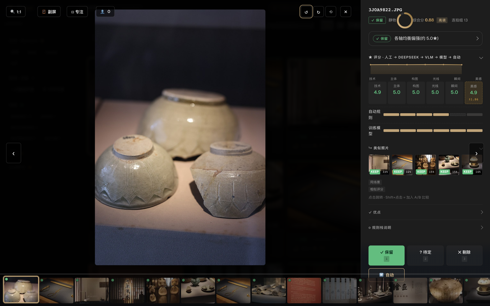

## 客户看片页 · v2.87

中国影楼工作流里,摄影师选完之后还有一步:**客户自己选**。PixCull 以前完全
没有这一步。

```bash
pixcull proof-sheet <run>/output --out ~/proof --title "张先生婚礼" \
        --contact "微信 photographer"
```

写出一个文件夹:降到 1024px 的**加水印**派生图,加一个 `index.html`。
没有服务器、没有数据库、没有账号、没有托管。摄影师用现有的任何方式把文件夹
发出去,客户打开 HTML、点选、拿到一份可以直接回传的清单。

实测:300 张 11.3 秒、8.7 MB,页面**零外部请求** —— 客户在火车上用 U 盘也能打开。

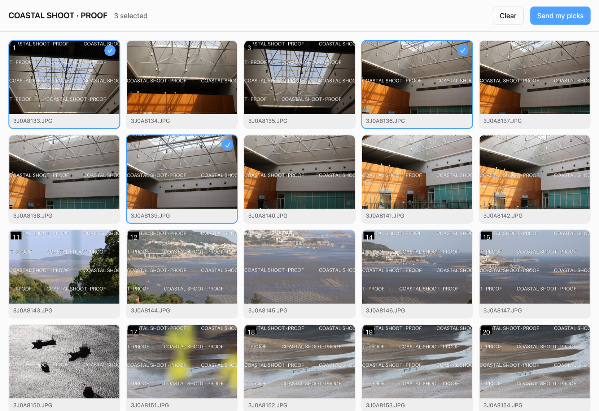

**刻意不做的**:小程序、支付、改片轮次追踪。那是影楼管理 SaaS,对手在那条
路上已经跑了很多年。已经在用第三方交付平台的摄影师不会搬家,也不该搬。这个
功能是给还没有的人。

原图永远不会进产物 —— 测试会逐位比对派生图与原图,并断言宽度恰好是 1024。

## 盲标 · v2.94

```bash
pixcull m3 label --folder <photos> --limit 150
```

卡片上只有照片、一个编号、两个按钮。**没有任何系统的判决、理由或评分** ——
看到答案的人就不再是独立的答案来源。

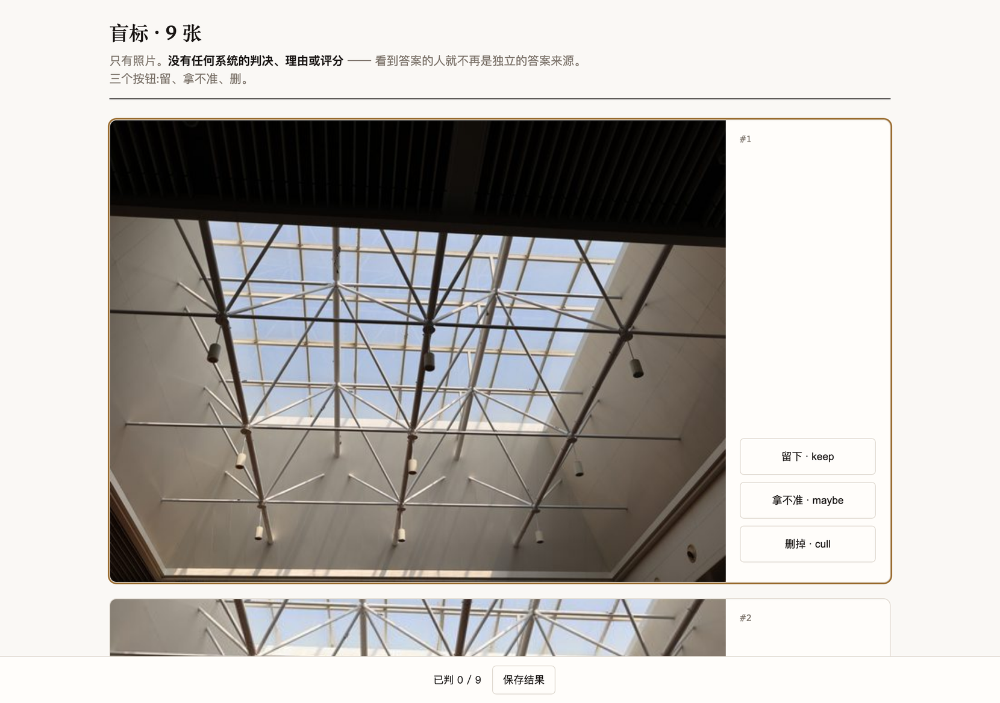

这不是可有可无的洁癖。本项目产生过的每一份循环标注集,都来自一个人看着判决
点了"同意",**四次,四种伪装**,每次都是被为上一次写的守卫事后抓到的。

存下来的 JSON 带 `source: "human"`,`pixcull/scoring/ground_truth.py` 只接受
有溯源的标注 —— 拿模型自己的输出当真值,算出来的一致率是 100%,而那个数字
本身就是循环的证据。

## 快速开始

```bash
# 1. 克隆
git clone https://github.com/ChrisChen667788/pixcull.git
cd pixcull

# 2. Python 3.11 或 3.12 (mediapipe 把 numpy 钉死在 <2,所以 3.12 是上限)
python3.12 -m venv .venv
source .venv/bin/activate

# 3. 安装 (会拉 torch CPU + InsightFace ONNX + MediaPipe)
pip install -e ".[dev]"

# 4. 跑起来
python scripts/serve_demo.py
# → 浏览器开 http://127.0.0.1:8770
```

把一个 JPG / RAW / HEIC 的文件夹拖到上传页;首次约 30 秒预热模型
(Apple Silicon),之后每张 ~1 秒 (M2 Pro 实测)。

### Tether 实时选片 (Lr / Capture One)

```bash
python scripts/pixcull_tether.py \
    --vertical wedding \
    ~/Pictures/Lightroom-Tether/2026-05-16-wedding
```

PixCull 监控目录,每张快门 ~2 秒内出 verdict,实时写 `scores.csv`。
Ctrl-C 退出,部分结果保留。

### macOS 独立 App

`app/` 下有签名 + 公证过的 `.app` 打包配置 (PyInstaller + Apple
Developer ID)。`app/RELEASE.md` 里有完整的构建 / 公证 / Sparkle 更
新 pipeline。

## 配置项

| 内容 | 位置 | 默认值 |
|---|---|---|
| 端口 | `scripts/serve_demo.py --port` | `8770` |
| API key (LAN 部署) | `PIXCULL_API_KEY` 环境变量 / `X-PixCull-API-Key` 头 | 未设置 |
| CORS 白名单 | `PIXCULL_API_CORS_ORIGINS` (逗号分隔) | 未设置时 `*` |
| 当前用户 | `PIXCULL_USER` env / `X-PixCull-User` 头 / cookie | 无 |
| App 数据目录 | `~/Library/Application Support/PixCull` (macOS) | 因平台而异 |
| DeepSeek API key (可选) | `DEEPSEEK_API_KEY` env / app-data 下 `config.json` | 未设置 |
| 同步目标 (可选) | `pixcull/sync.py::configure_sync_for_user(path)` | 无 |

## 架构速览

完整工程架构(C4 系统上下文 + 容器图 + 拍摄 pipeline 时序 + LAN 同步
时序 + **16 行 ML 模型表** + 存储布局 + 技术决策表)见
**[docs/ARCHITECTURE.md](docs/ARCHITECTURE.md)** —— 全部用 Mermaid
绘制,GitHub + ModelScope 均原生渲染。

10 秒版,PixCull 在团队工作流中的位置:


```mermaid
%%{init: {'theme':'base','themeVariables':{'primaryColor':'#241d12','primaryTextColor':'#f3ede1','lineColor':'#c4b9a9','primaryBorderColor':'#3a3122','tertiaryColor':'#161310'}}}%%
flowchart LR
    P[("📷 主摄")]
    S[("📷 二摄")]
    E[("✎ 编辑")]
    C[("👤 客户")]
    PIX{{"<b>PixCull</b><br/>本地优先<br/>AI 选片"}}
    DS["DeepSeek API<br/>(可选)"]

    P -->|"上传 RAW/JPEG"| PIX
    S -->|"加入 LAN event"| PIX
    E -->|"标注 + 推决定"| PIX
    PIX -->|"作品集分享链接<br/>/share/&lt;token&gt;"| C
    PIX -.->|"opt-in · 仅文本"| DS

    style PIX fill:#241d12,color:#f3ede1,stroke:#c4b9a9
    style DS  fill:#1b1712,stroke:#6a6052
```

几个不太显眼但值得点出的工程承诺:

- **无 Web 框架依赖** —— Python 内置 `http.server`,15k 行单文件
  `scripts/serve_demo.py`,故意保持平铺以便审计。无 Flask / Django /
  FastAPI
- **无数据库** —— `scores.csv` + append-only `annotations.jsonl` +
  按事件的 JSON 文件。崩溃恢复就是 `cat | tail`;跨机迁移就是 `rsync`
- **多模型融合** —— 8 个 ONNX 模型(U²-Net / ArcFace / scene CNN /
  wedding-moment CNN / CLIP ViT-L/14 / 评分 V2 / …)由 fusion 层
  + 可选 VLM + DeepSeek 元判断综合;任一外部源缺失时 pipeline
  **降级跑通**。每模型推理延迟 + 大小见
  [模型表](docs/ARCHITECTURE.md#4--ml-model-card--大模型设计表)
- **LAN 同步本地优先** —— token + 5 秒 HTTP polling + mDNS 自动发现。
  无 WebSocket,无云端 signalling,无 NAT 穿透 —— 全在同一个 WiFi 内

> **设计质感坦白:** 工程层已经成熟(614 个测试通过、7 个 charter
> 落地、57 个 slice),但**视觉设计层仍是"开发者 + AI"而非"设计师
> 介入"**。这是我们公开承认的差距。详见
> **[docs/DESIGN-SYSTEM-ROADMAP.md](docs/DESIGN-SYSTEM-ROADMAP.md)** ——
> 包含工具链选型(Figma + Penpot + Tokens Studio + Rive)、自定义插
> 画委托清单、未来 6 个月分三阶段的升级计划。目标:**v1.0 前从
> "功能 iconic"升级到"工艺 iconic"**。

## 仓库结构

```
pixcull/
├── pixcull/                    # Python 包本体
│   ├── scoring/                # 6 维评分 + 场景模板 + 风格模式
│   ├── pipeline/               # 编排器 + worker + 人脸/GPS 聚类 + 建议
│   ├── detectors/              # 模糊 / 闭眼 / 曝光 / 构图 / ... 检测器
│   ├── io/                     # RAW 加载 + XMP / IPTC 写 + EXIF
│   ├── db/                     # annotations.jsonl + scores.csv schema
│   ├── report/templates/       # results.html 主 UI (零构建,vanilla JS)
│   ├── license/                # 本地 license token 状态机
│   ├── verticals.py            # 按拍摄类型的评分策略
│   ├── sync.py                 # 多机同步 (folder mirror)
│   └── tether.py               # Lr/C1 tether 监控
├── scripts/                    # CLI 入口
│   ├── serve_demo.py           # HTTP 服务 + Web UI 主程序 (10k 行)
│   ├── pixcull_tether.py       # Tether CLI
│   ├── train_rescorer.py       # rescorer 训练脚本
│   └── ...                     # ~30 个维护 + 分析脚本
├── mobile/PixCullCompanion/    # SwiftUI iOS App (Swift Package)
├── lr_plugin/PixCull.lrplugin/ # Lightroom 插件 (Lua)
├── app/                        # PyInstaller 打包配置
├── tests/                      # pytest 测试套 (240+ 用例)
├── training.csv                # 脱敏后的 rubric ground truth (130 行)
├── training_axis.csv           # 脱敏后的 per-axis ground truth (3,000 行)
├── ROADMAP.md                  # 未来 12 个月规划
└── pyproject.toml              # MIT,Python 3.11–3.12
```

## 路线图

完整 [ROADMAP.md](ROADMAP.md) 在仓库根。当前重点:

- **照片评价智能化。** Cull 原因 → rubric 模型再训练 (让你的
  "因为闭眼 cull" 变成真实信号);各维度的置信区间;meta-judge 矛
  盾检测。
- **专业工作流。** 更紧的 Lr / C1 round-trip;Photo Mechanic 级别
  的选片快捷键;从 人脸标签 + 地点 + 建议 自动生成 IPTC 关键字。
- **iOS 伴侣 V0.4+。** 下拉刷新、下滑关闭、快速标注的触感反馈、
  本地相册导入 (除了从服务器同步)。

## 安全与隐私

PixCull 默认本地优先。`serve_demo.py` 只绑定 `127.0.0.1`;LAN 部
署由 `PIXCULL_API_KEY` 环境变量设置 `X-PixCull-API-Key` 头进行
控制。

完整威胁模型和漏洞披露政策见 [SECURITY.md](SECURITY.md)。
TL;DR:可信本地用户,不可信图像输入 (Pillow 钉在 ≥ 10.2);无遥
测;可选的 DeepSeek 调用走的是 *你的* token,我们绝不代理转发。

## 参与贡献

详见 [CONTRIBUTING.md](CONTRIBUTING.md)。欢迎 PR;欢迎报 bug
(用 issue 模板);最容易上手的几个 PR 类型在贡献指南里。

## 协议

[MIT](LICENSE)。可商用、自由 fork、欢迎 PR。

## 作者

PixCull 始于一个简单想法:不要再花一个晚上在 Lightroom catalog
里挑片。十八个月、无数个小 commit 之后,它变成了我刚摸相机时就
希望存在的 AI 选片工具。MIT 开源,让下一个摄影师不用再从头造一遍。

— [@ChrisChen667788](https://github.com/ChrisChen667788) · [ModelScope @haozi667788](https://www.modelscope.cn/profile/haozi667788)
