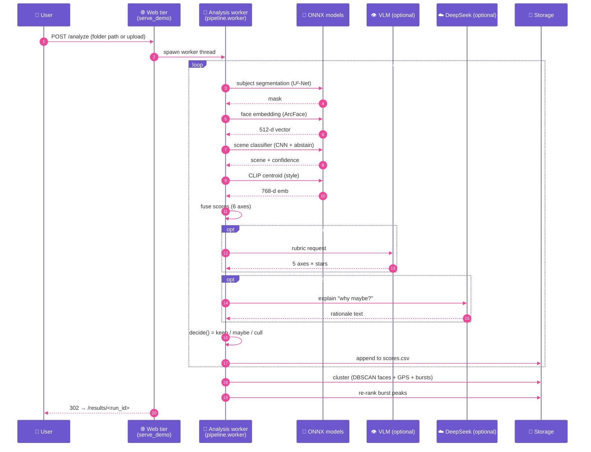
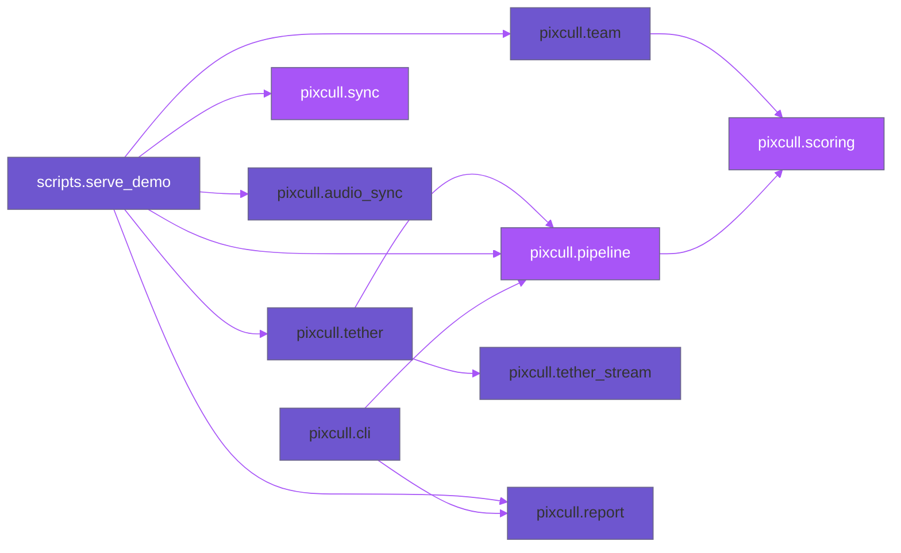

# PixCull · 系统架构 / System architecture

> 本文档面向**严肃的工程审阅者** —— 想看清楚 PixCull 是怎么把"本地优先 + 多模型融合 +
> LAN 多人协作"做出来的人。所有图用 Mermaid 绘制(GitHub 与 ModelScope 均原生渲染),
> 以保证文档随代码一同进版本控制。
>
> *English engineering reviewers — every diagram below is renderable on GitHub +
> ModelScope; sections are bilingual to match the rest of the repo.*

---

## 1 · System context — C4 Level 1

谁在用 PixCull,它和外部世界的交界面是什么。

```mermaid
%%{init: {'theme':'base','themeVariables':{
   'primaryColor':'#6E56CF','primaryTextColor':'#fff',
   'lineColor':'#A855F7','primaryBorderColor':'#EC4899',
   'tertiaryColor':'#1a1d24'}}}%%
flowchart LR
    subgraph Actors["参与者 · Actors"]
        P[("📷 主摄影师<br/>Head shooter")]
        S[("📷 二摄<br/>Second shooter")]
        E[("✎ 编辑 / 助理<br/>Editor")]
        C[("👤 客户<br/>Client")]
    end

    PIX{{"<b>PixCull</b><br/>local-first<br/>AI photo culling"}}

    subgraph External["可选外部服务 · Optional cloud"]
        DS["DeepSeek API<br/>(rubric phrases · opt-in)"]
        SK["Sparkle / brew tap / GitHub release<br/>(自动更新 · auto-update)"]
    end

    P -->|"上传 RAW/JPEG · upload"| PIX
    S -->|"加入 LAN event"| PIX
    E -->|"标注 + 推决定"| PIX
    PIX -->|"作品集分享链接<br/>/share/&lt;token&gt;"| C
    PIX -.->|"opt-in · 仅文本"| DS
    SK -->|"appcast.xml"| PIX

    style P fill:#1a1d24,stroke:#A855F7
    style S fill:#1a1d24,stroke:#A855F7
    style E fill:#1a1d24,stroke:#A855F7
    style C fill:#1a1d24,stroke:#EC4899
    style PIX fill:#6E56CF,stroke:#A855F7,color:#fff
    style DS fill:#2a2e35,stroke:#6E56CF
    style SK fill:#2a2e35,stroke:#6E56CF
```



**关键事实 / Key facts:**

- 主摄 + 二摄 + 编辑均通过同一 LAN event token 协作;无需账号、无云端
- 客户只拿到只读的 `/share/<run>/<token>` 链接,看不到 cull 的照片
- DeepSeek 是**可选项**,无 API key 时全功能可用(只少 LLM 解释文案)
- Sparkle / brew tap 只下载新版本;**任何照片数据从不离机**

---

## 2 · Container diagram — C4 Level 2

PixCull 内部由 7 个进程 / 子系统组成。

```mermaid
%%{init: {'theme':'base','themeVariables':{
   'primaryColor':'#6E56CF','lineColor':'#A855F7',
   'primaryBorderColor':'#EC4899','tertiaryColor':'#1a1d24'}}}%%
flowchart TB
    subgraph LocalMachine["📍 用户机器(本地 · localhost / LAN)"]

        subgraph WebTier["Web tier · Python http.server"]
            SD["<b>serve_demo.py</b><br/>HTTP routes<br/>(15k LOC, single file)"]
        end

        subgraph AnalysisTier["Analysis tier · PyTorch + ONNX"]
            PIPE["<b>pixcull.pipeline.*</b><br/>analyze_one() worker<br/>orchestrator + scoring"]
            ML[("ONNX runtime<br/>(M2 Pro: 8 ops/photo)")]
            VLM["VLM<br/>(local Llava if available,<br/>else skip)"]
            PIPE --- ML
            PIPE --- VLM
        end

        subgraph SyncTier["Sync tier · v0.8 + v0.10"]
            EVT["<b>pixcull.sync.event</b><br/>token issue / revoke"]
            PUSH["<b>pixcull.sync.push</b><br/>2-way edits"]
            PRES["<b>pixcull.sync.presence</b><br/>30s heartbeat"]
            DISC["<b>pixcull.sync.discovery</b><br/>mDNS auto-discovery"]
        end

        subgraph Storage["Storage · single source of truth"]
            CSV[("scores.csv<br/>· per-row analysis")]
            JSONL[("annotations.jsonl<br/>· append-only edit log")]
            EVTS[("events/*.json<br/>· LAN sessions")]
            PREF[("preferences.json<br/>· per-user taste")]
        end

        subgraph Reporting["Reporting"]
            HTML["<b>results.html</b><br/>(15k LOC vanilla JS)"]
            PDF["<b>cli_audit.py</b><br/>+ executive_pdf<br/>(WeasyPrint / wkhtmltopdf)"]
            CSV_EXP["CSV / XMP / DNG<br/>exporters"]
        end

        subgraph TetherTier["Tether tier · v0.7-P2-2"]
            TS["<b>pixcull.tether</b><br/>folder watcher"]
            TSTRM["<b>pixcull.tether_stream</b><br/>live burst-peak re-rank"]
        end

        SD --> HTML
        SD --> PDF
        SD <--> PIPE
        SD --> EVT
        SD --> PUSH
        SD --> PRES
        SD --> DISC
        SD --> TS
        TS --> PIPE
        TS --> CSV
        TSTRM --> CSV
        PIPE --> CSV
        PIPE --> JSONL
        PUSH --> JSONL
        EVT --> EVTS
        SD --> PREF
    end

    subgraph iOS["🌍 iOS Companion · SwiftUI v0.7"]
        IOSAPI["APIClient"]
        IOSPC["PresenceClient<br/>(同协议)"]
        IOSPORT["PortfolioView<br/>+ gestures"]
        IOSAPI --> IOSPC
        IOSAPI --> IOSPORT
    end

    iOS -->|"HTTPS · X-PixCull-API-Key"| SD

    style SD       fill:#6E56CF,color:#fff,stroke:#A855F7
    style HTML     fill:#6E56CF,color:#fff,stroke:#A855F7
    style PDF      fill:#6E56CF,color:#fff,stroke:#A855F7
    style PIPE     fill:#A855F7,color:#fff,stroke:#EC4899
    style EVT      fill:#A855F7,color:#fff,stroke:#EC4899
    style PUSH     fill:#A855F7,color:#fff,stroke:#EC4899
    style PRES     fill:#A855F7,color:#fff,stroke:#EC4899
    style DISC     fill:#A855F7,color:#fff,stroke:#EC4899
    style CSV      fill:#2a2e35,stroke:#EC4899
    style JSONL    fill:#2a2e35,stroke:#EC4899
    style EVTS     fill:#2a2e35,stroke:#EC4899
    style PREF     fill:#2a2e35,stroke:#EC4899
```



**容器分层 / Tier rationale:**

- **Web tier** —— Python 内置 `http.server`,**零外部 web 框架**(无 Flask /
  Django / FastAPI)。15k 行单文件,故意保持平铺以便审阅
- **Analysis tier** —— ONNX runtime 跑 8 个模型(见 §4 model card),
  PyTorch 仅在训练阶段用,推理阶段不依赖
- **Sync tier** —— 4 个子模块,文件系统作为 broker(无消息队列、无 Redis)
- **Storage** —— 全部以 plain-text 文件存储,文本可 grep、git diff、
  人工修复;**没有数据库**(没有 SQLite、没有 PostgreSQL)
- **Reporting** —— HTML 自包含、PDF 通过 Chrome headless 渲染
- **Tether tier** —— folder watcher + 流式 burst peak,**~2 秒每张
  shutter-to-verdict**

---

## 3 · Photo culling pipeline — sequence

一张照片从上传到 verdict 的完整数据流。



**关键设计原则 / Pipeline invariants:**

- 每个评分维度都有 **5 个可能源**:auto rules / model rescorer / VLM / DeepSeek /
  human;Inspector 显示 4 路对比,**meta-judge** 综合给出最终 verdict
- 任意一个外部源(VLM / DeepSeek)缺失时,pipeline **降级跑通** ——
  这是"本地优先"承诺的工程兑现
- 文件写入是**追加-only**(annotations.jsonl 永不重写);崩溃 / 强杀
  不会丢失分析进度

---

## 4 · ML model card · 大模型设计表

| # | 组件 / Component | 算法 / Algorithm | 输入 / Input | 输出 / Output | 运行位置 | 推理延迟<br/>M2 Pro | 模型大小 |
|---|---|---|---|---|---|---|---|
| 1 | **Subject segmentation** | U²-Net (via `rembg`) | RGB image | binary mask | local ONNX | ~80 ms | 176 MB |
| 2 | **Face detection + embedding** | ArcFace via `insightface` (buffalo_l) | image / face crop | 512-d vector + bbox + landmarks | local ONNX | ~30 ms / face | 281 MB |
| 3 | **Face clustering** | DBSCAN (ε=0.50) | per-run embeddings | cluster_id (int) | numpy / pure-Python | <10 ms / run | — |
| 4 | **Cross-run face library** | append-only centroid bank | new run centroids | merged cluster ids | local JSON | <5 ms | — |
| 5 | **Scene classifier** | Custom CNN + abstain head | RGB image | scene label + confidence + `unknown` flag | local ONNX | ~50 ms | 96 MB |
| 6 | **Wedding moment detector** | Per-class CNN heads + heuristic + zh keyword map | RGB image + scene == wedding | moment label (vows / kiss / ring / ...) | local ONNX | ~40 ms | 14 MB |
| 7 | **CLIP style centroid** | ViT-L/14 image encoder | RGB image | 768-d embedding | local ONNX | ~120 ms | 890 MB |
| 8 | **Style clone V1** (v0.7) | per-axis MAD distance | row's 6 axes + reference set's median | scalar distance | pure Python | <2 ms | — |
| 9 | **Style clone V2** (v0.8) | 1 − cosine(image_emb, centroid) | CLIP embedding + reference centroid | scalar distance | numpy | <1 ms | — |
| 10 | **Style blend (v0.10 default)** | λ·V1 + (1−λ)·V2, **λ = 0.3** *(候选 v0.11 调整)* | V1 + V2 distances | blended distance | pure Python | <1 ms | — |
| 11 | **Rubric rescorer V2** | sklearn `GradientBoostingClassifier` | 17-feature vector (rubric stars + scene + face count + …) | keep / maybe boundary score | local joblib | <5 ms / 1000 rows | 240 KB |
| 12 | **Burst peak picker** | Weighted scalar of sharpness + EAR + smile + composite | per-cluster row dicts | `is_burst_peak=True` on winner | pure Python | <2 ms / cluster | — |
| 13 | **VLM rubric (optional)** | Local Llava-1.6 7B via ONNX runtime if available | RGB image + prompt | 6 axes × stars + 1-sentence rationale | local ONNX | ~1.5 s / photo | ~4 GB |
| 14 | **DeepSeek meta-judge (optional)** | API call to deepseek-v3.1 | rubric + 4-source axis comparison | meta verdict + confidence + rationale | cloud (opt-in) | ~3 s | n/a |
| 15 | **WhisperKit STT (iOS optional · v0.10)** | Apple Silicon Whisper Small | mic audio | transcript + timestamps | iOS local | realtime | 466 MB |
| 16 | **Audio-photo keyword match (v0.10)** | 37-phrase vocab → wedding_moment | transcript text | `(filename → moment)` suggestions | pure Python | <1 ms | — |

**Pipeline-level 总和**:M2 Pro 上**每张 ~1 秒**(冷启动后),
其中 60% 时间花在 CLIP + face,15% 在 VLM(若启用),其余 25% 均摊。

> 所有 ONNX 模型在 `~/Library/Application Support/PixCull/models/` 下,
> 首次运行时自动从 HuggingFace / ModelScope 下载,**总下载量 ~2.0 GB**。
> 无外部模型 API 依赖。

---

## 5 · LAN 多人协作 — sequence

主摄、二摄、编辑在同一场地 LAN 上的实时协作流程。

```mermaid
%%{init: {'theme':'base','themeVariables':{
   'primaryColor':'#6E56CF','lineColor':'#A855F7',
   'sequenceNumberColor':'#fff','actorBkg':'#6E56CF',
   'actorTextColor':'#fff','signalColor':'#EC4899'}}}%%
sequenceDiagram
    autonumber
    participant H as 📷 主摄 (host)
    participant Z as 🛰️ mDNS multicast
    participant S as 📷 二摄 (guest)
    participant E as ✎ 编辑 (guest)

    H->>H: POST /sync/event/issue/&lt;run_id&gt;<br/>→ token = abcdef...
    H->>Z: advertise _pixcull-sync._tcp.local.<br/>{event_id, label, token_prefix}

    par 自动发现
        Z-->>S: discover() returns 1 session
        S->>H: GET /api/v1/sync/event/&lt;t&gt;/changes<br/>(start polling every 5s)
        S->>H: POST /sync/event/&lt;t&gt;/presence<br/>{client_id, last_viewed: IMG_001}
    and
        Z-->>E: discover() returns 1 session
        E->>H: GET /api/v1/sync/event/&lt;t&gt;/changes
        E->>H: POST /sync/event/&lt;t&gt;/presence
    end

    loop 实时协作
        S->>S: 标 IMG_077 keep
        S->>H: POST /sync/event/&lt;t&gt;/push<br/>{edits: [{filename, decision:'keep'}]}
        H->>H: append to annotations.jsonl

        Note over E,H: 下一轮 polling
        E->>H: GET /changes?since=&lt;t&gt;
        H-->>E: {annotations: [IMG_077 keep from 二摄]}
        E->>E: _applyRemoteAnnotation()

        Note over H,E: 冲突场景 · conflict
        H->>H: 主摄改 IMG_080 maybe
        E->>H: POST /push<br/>{filename:IMG_080, decision:'keep'}<br/>(local edit time newer)
        E->>E: _syncConflictMap.set(IMG_080)
        E->>E: 弹 #conflictModal · 3-way choice<br/>(local / remote / keep both)
    end
```

**协议特性 / Protocol invariants:**

- **token-only auth**:无密码,token 在 URL 中即视为权限(LAN-only 设计前提)
- **HTTP polling** 而非 WebSocket:简单可调试、防火墙友好,5 秒延迟可接受
- **append-only annotations.jsonl**:任何 edit 都是新一行,**永不修改过去 line** ——
  审计 trail 完整
- **冲突由客户端 UI 解决**:服务端从不"自动选 winner",**最后一行写入即为最终生效**

---

## 6 · 存储布局 · Storage layout

```
~/Library/Application Support/PixCull/        ← macOS · 其他平台 ~/.pixcull/
├── runs/
│   └── <run_id>/
│       ├── input/                            ← user uploads (no rewrite)
│       ├── output/
│       │   ├── scores.csv                    ← per-row analysis
│       │   ├── annotations.jsonl             ← append-only edit log
│       │   ├── manifest.json                 ← run metadata
│       │   ├── thumbs/                       ← derived thumbnails
│       │   ├── events/<event_id>.json        ← LAN sync sessions
│       │   ├── presence/<event_id>.json      ← who's currently viewing what
│       │   └── share_comments.json           ← client feedback
│       └── ...
├── users/<user_id>/
│   ├── preferences.json                      ← per-user taste profile
│   ├── verticals/                            ← per-vertical models
│   └── face_library/                         ← cross-run face centroids
├── models/                                   ← ONNX downloads (~2 GB total)
├── config.json                               ← global PixCull config
└── license.json                              ← (v0.11+) signed license
```

**Storage 设计原则 / Design rationale:**

- **全部是 plain-text 或文件夹**;**没有 SQLite、PostgreSQL、Redis**
- 每个文件都可 `grep`、`git diff`、人工修复;崩溃恢复就是 `cat` + 读最后一行
- 输入照片 **永不被改写**;所有 derived data 在 `output/`
- 跨机迁移就是 `rsync runs/<id>` —— 没有 schema migration、没有 db dump

---

## 7 · 技术决策 · Why these choices

非传统的几个选择,以及背后的理由:

| 决策 | 为什么(短版) | 不选择 ___ 的原因 |
|---|---|---|
| Python 内置 `http.server` | 零依赖,15k 行单文件审阅友好 | Flask / FastAPI 引入路由/中间件 magic,审计成本翻倍 |
| ONNX runtime + 多模型融合 | 每个任务用最优算法;ArcFace ≠ CLIP ≠ U²-Net | 单一 multitask 大模型(LLaVA)推理慢、解释差 |
| Plain CSV / JSONL,无数据库 | 5k 张照片只占 ~3 MB CSV;`grep` 可调试 | SQLite 引入迁移、版本、备份复杂度 |
| Mermaid 文档而非 Figma 导出图 | 随代码进 git,审阅时永不"图过期" | drawio / 截图会和代码漂移 |
| 5 秒 HTTP polling 而非 WebSocket | 防火墙友好,可调试,500ms vs 5s 延迟不影响选片 | WebSocket 连接管理 + 自动重连复杂度 |
| LAN 只支持 token-URL 共享 | 婚礼/活动场地都是 same-LAN 场景 | 完整 SSO / cloud auth 违背本地优先承诺 |
| Vanilla JS,无 build step | 15k 行 results.html 没有打包工具也跑通 | npm + Webpack/Vite 维护成本 ≈ 全代码量 |

---

## 8 · 模块依赖图 · Module dependency



`scripts.serve_demo` 是 HTTP edge;`pixcull.pipeline.*` 是分析核心;
`pixcull.scoring.*` 是模型 + 评分逻辑;其余子包(sync / team / audio /
tether / tether_stream / report)是 v0.7 之后逐步加进来的功能层。

---

## 9 · Performance characteristics

| 场景 | 性能 | 测试环境 |
|---|---|---|
| 1500-张婚礼 batch 全 pipeline | ~25 分钟 | M2 Pro, 16 GB RAM, RAW 24MP |
| 5k+ 张稳定性 audit | 通过 (v0.7-P0-3) | M2 Pro, 32 GB RAM |
| Tether shutter-to-verdict | ~2 秒 / photo | 同上,JPEG full size |
| Burst-peak streaming re-rank | <1 秒(50-row window) | 同上 |
| LAN sync polling | 5 秒/peer | LAN-localhost loopback |
| Presence heartbeat | 30 秒/peer | 同上 |
| 启动冷启 → 首次 reveal | <2 秒(v0.9-P0-2 hero) | macOS Safari + Chrome |
| Cmd+K palette fuzzy match | <50 ms (27 actions) | M2 Pro,full JS |
| Executive PDF (11 页) | ~6 秒 | Chrome headless |

---

## 10 · 仓库与外部资源

- **源码** · https://github.com/ChrisChen667788/pixcull
- **ModelScope** · https://www.modelscope.cn/profile/haozi667788
- **brew tap**(v0.11 release 后)· https://github.com/ChrisChen667788/homebrew-pixcull
- **设计系统路线图** · [docs/DESIGN-SYSTEM-ROADMAP.md](DESIGN-SYSTEM-ROADMAP.md)
- **设计审计 2026 Q3** · [docs/DESIGN-AUDIT-2026Q3.md](DESIGN-AUDIT-2026Q3.md)
- **设计审计 2026 Q4** · [docs/DESIGN-AUDIT-2026Q4.md](DESIGN-AUDIT-2026Q4.md)
- **历代 charter** · `docs/ROADMAP-v0.{4..11}-charter.md`

---

*Document timestamp: 2026 Q4 · 与 v0.10 release 同步*
