# PixCull 新手操作流程指南

> **20 分钟从 0 到选完 200 张照片** —— 不需要 ML 背景,跟着步骤走就好。
> 截图全部来自真机 demo run(`/Volumes/One Touch/100CANON/` 真实 Canon
> 卡数据 200 张照片),不是 mockup。

---

## 1. 安装(一次性,3 分钟)

### macOS

```bash
brew install --cask pixcull   # 当 v0.11-P0-2 发布后
# 或者从 release 页面下载签名 .dmg:
#   https://github.com/ChrisChen667788/pixcull/releases
```

### Windows / Linux

下载对应平台的签名安装包:
- Windows: `PixCull-<version>.msi`(SmartScreen 直接放行)
- Linux: `PixCull-<version>-x86_64.AppImage` + 验证 GPG 签名

### 从源码运行(给开发者)

```bash
git clone https://github.com/ChrisChen667788/pixcull
cd pixcull
python3 -m venv .venv
source .venv/bin/activate
pip install -e .
python scripts/serve_demo.py     # 默认在 http://127.0.0.1:8770
```

---

## 2. 上传第一批照片

打开 PixCull,第一眼看到上传页:

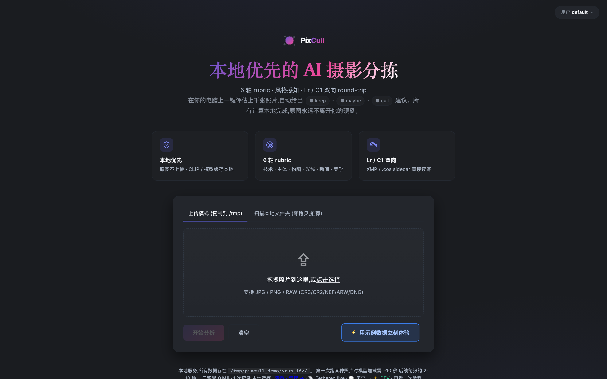

**三种上传方式,任选其一:**

1. **拖文件夹** —— 把整个 `100CANON/` 文件夹拖到中间的虚线框
2. **本地浏览** —— 点 **"📁 浏览本地文件夹"**,选择 SD 卡 / 移动硬盘上的目录
3. **直接路径** —— 命令行 `pixcull run /path/to/photos`

支持格式:JPEG / PNG / TIFF / DNG / RAW(CR2/CR3/NEF/ARW)。

**配额提示:** Free tier 每月 100 张;Studio/Lifetime 不限量。
当前开发模式下闸门已关闭,可自由测试。

---

## 3. 等 30 秒到 2 分钟(取决于照片数)

后台依次跑:

| 阶段 | 做什么 | 单图耗时 |
|---|---|---:|
| 1️⃣ EXIF + ICC | 读元数据 + 色彩空间审计 | ~10ms |
| 2️⃣ 人脸 + 锐度 | InsightFace + Laplacian | ~80ms |
| 3️⃣ 美学评分 | CLIP-IQA + LAION aesthetic | ~120ms |
| 4️⃣ 规则栈 | 决策"keep / maybe / cull" | ~5ms |
| 5️⃣ Rescorer | sklearn GBM 调整边缘案例 | ~3ms |
| 6️⃣ Burst 聚类 | DBSCAN 找连拍组 | ~2ms |
| 7️⃣ 视觉风格 | CLIP embedding(若打开 V2) | ~150ms |

200 张照片 ≈ 5-8 分钟(取决于机器);自动 burst-key 选定连拍代表会显著加速大批量场景。

---

## 4. 主网格 —— 你的"选片工作台"

跑完后自动跳到 `/results/<run_id>`:

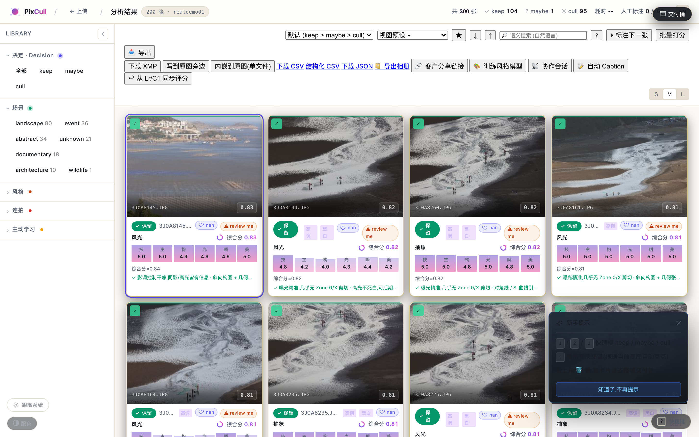

**左上角 stats:** keep / maybe / cull 计数 + 用时
**左侧 Library 侧栏:** 按 decision / scene / style / faces / location /
burst / cull reason / Active Learning 过滤
**中间网格:** 每张照片一张卡,角标小圆点表示决策
**右上角工具栏:** 视图密度 S/M/L · 主题 · 命令面板 ⌘K

### 命令面板(⌘K / Ctrl+K)

需要找某个动作?按 ⌘K 弹出:

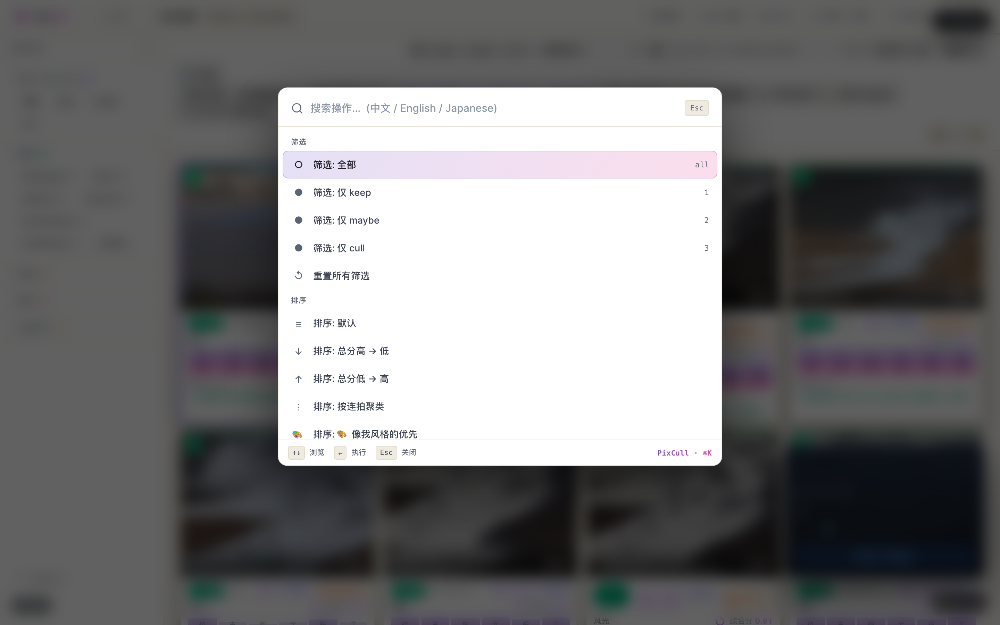

模糊搜索功能名,Enter 直接触发 —— 比鼠标找按钮快 3 倍。

---

## 5. Lightbox —— 单张审查

点任意卡(或聚焦后回车):

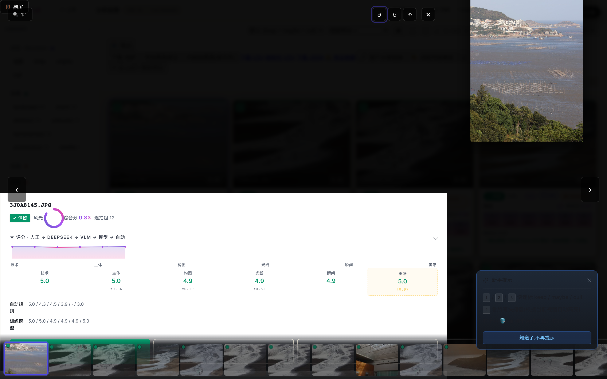

**核心控制:**
| 键 | 动作 |
|---|---|
| `←` / `→` 或 `j` / `k` | 上一张 / 下一张 |
| `1` `2` `3` | 标 keep / maybe / cull |
| `z` | 切换 1:1 焦点检查(查锐度) |
| `\` | 一键对比同 burst 组(v0.12-P1-2) |
| `H` | 切换 EXIF + 直方图 overlay(v0.12-P1-3) |
| `A` | 6 轴 attribution heatmap(v0.13-P0-1) |
| `Esc` | 关闭 |

**底部 1px 时间线:** 按住拖动可以在所有可见照片间无缝 scrub —— 婚礼连拍 200 张的快速预览利器(v0.11-P1-1)。

**Inspector(右侧面板):** 6 轴评分 · DeepSeek 二审 · 视觉相似度 chip 点开查看 V1/V2/blend 细分(v0.13-P1-2)。

### iPad / 平板模式

同 lightbox 在 iPad 宽度上的样子:

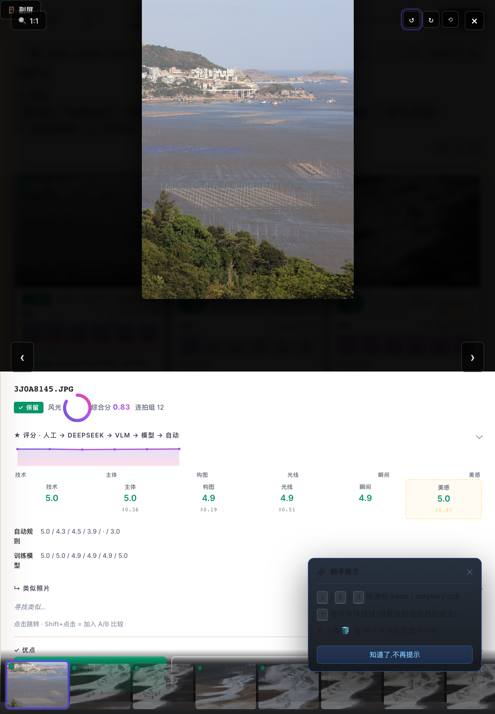

支持双指捏合缩放、单指拖动平移、上下滑关闭 —— 配合 v0.12-P1-4 haptic 反馈,触屏体验贴近 Apple Photos。

---

## 6. 批量选片 —— Marquee Select

在网格空白处按住鼠标拖一个矩形,松开后所有框选的卡进入"已选"状态:

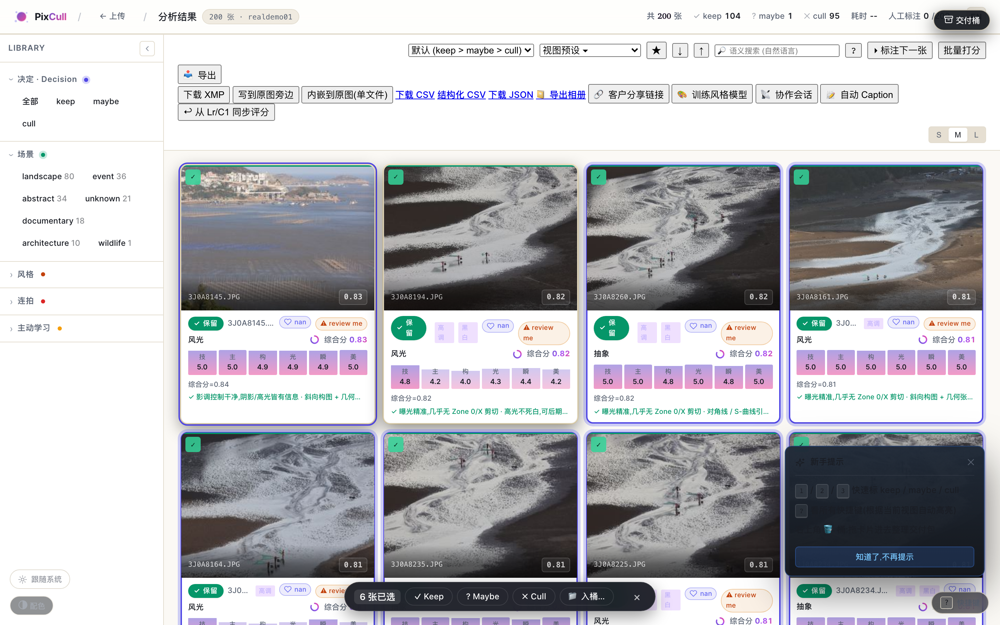

底部弹出工具栏:**Keep · Maybe · Cull · 入桶 · 取消**

`⌘A` 全选当前可见,`Esc` 取消。Lightroom Library 模块的标杆体验(v0.11-P1-2)。

---

## 7. AI 判断为什么 —— Confidence Modal + Attribution

### 鼠标悬停 maybe 边缘卡

`score_final` 在 0.45~0.55 之间的卡(model 不确定区),悬停弹出小 popover:

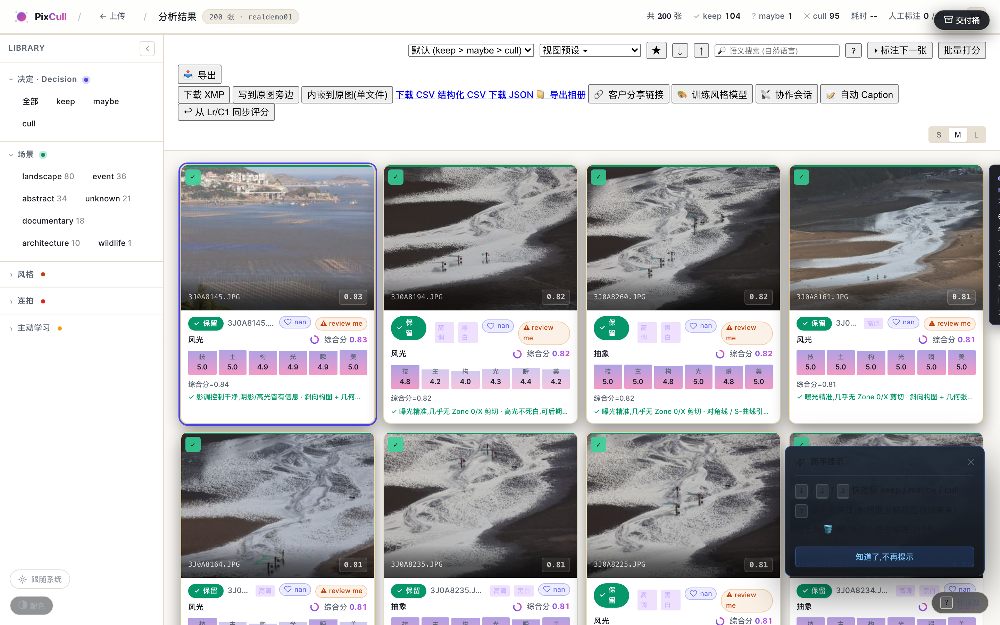

显示**置信度** + **top reasons**(同 burst 组对比、最弱轴等)—— 帮你 1 秒判断"信 model 还是自己再看"。可"不再显示"per-run 关闭(v0.13-P0-3)。

### Attribution Heatmap(轴)

Lightbox 里按 `A`:

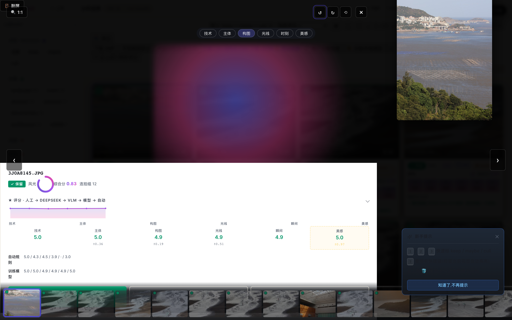

顶部切轴(技术 / 主体 / 构图 / 光线 / 时刻 / 美感),叠加在原图上的指纹图显示**像素级的"为什么"**。Integrated Gradients over timm backbone(v0.13-P0-1)。

---

## 8. 输出 —— Buckets + Share + 导出

### 交付桶(Delivery Buckets)

侧栏点 **🪣 Delivery buckets** 打开桶面板。每个桶可以:
- 拖 keep 卡进来分组(婚礼前 / 仪式 / 接待 / 出场)
- 一键导出 ZIP
- 复制文件名(给后期发指令)
- 拖动重排顺序(v0.12-P1-1)

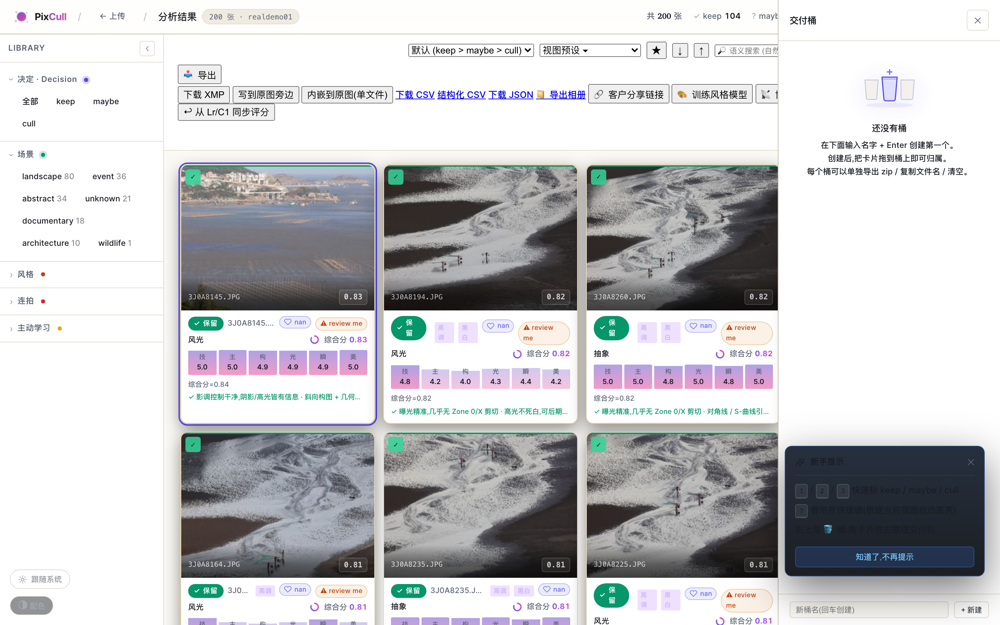

### 客户分享链接

点工具栏 **🔗 客户分享链接**,生成只读 URL + QR:

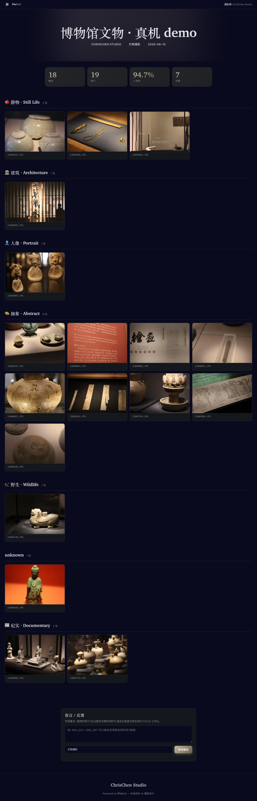

客户用任何设备打开,只看到你 keep 的部分,可点开看大图、留言;无法看到 maybe / cull —— v0.7-P1-4。

### 导出工程文件

工具栏 **📥 导出** 下拉:
- **XMP 写入原图旁**(Lightroom / Capture One 直接读)
- **CSV / JSON**(全字段,做后续分析)
- **Lightroom 目录导入模板**
- **独立 HTML 画册**(嵌入式,无需 PixCull 运行)

---

## 9. 历史 + 偏差审计

### /history 时间线

所有跑过的 run 按时间排序:

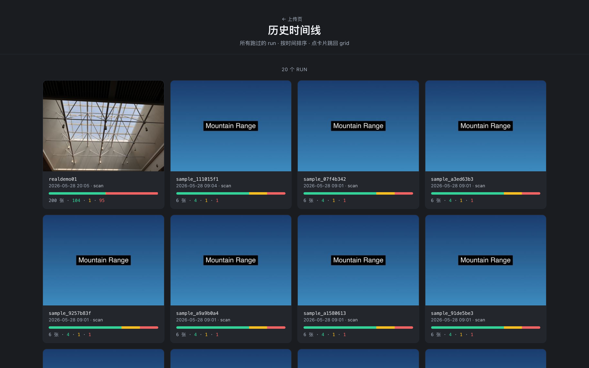

每个 run 卡显示决策分布 + 缩略图 + 跳回 grid 链接(v0.7-P2-4 + v0.11-P1-5 reveal 动效)。

### /admin/bias 偏差审计(v0.13-P0-4)

如果你跑了 ≥ 3 个 run,`/admin/bias` 会聚合所有标注,按 scene / time-of-day / aperture 分桶,红色高亮 > 1.5σ 的异常:


例如发现 "rescorer 在 *夜景人像* 上 cull rate 38% (全局 22%) — 模型可能过严"。可点 ↻ 强制重建缓存,也可 `/admin/bias.md` 导出 markdown 给客户看(v0.13-P2-2)。

---

## 10. 高级 —— 协作 + Tethered Live

### LAN 协作会话

右上角 **📡 协作会话** → 生成会话 URL + QR → 第二摄 / 编辑扫码加入。

工作流:
1. 主摄 PixCull 跑分(host 角色)
2. 编辑师扫码或粘贴 URL → 浏览器自动 join(guest 角色)
3. 两边任意一方改决策 → 100ms 内同步(v0.11-P0-3 WebRTC datachannel)
4. 冲突时弹出解析 UI,可选 "保持我的" / "接受对方"

跨 LAN(主摄在工作室、编辑在家)也 work —— STUN/ICE NAT 穿透 ~80% 成功率。

### Tethered Live

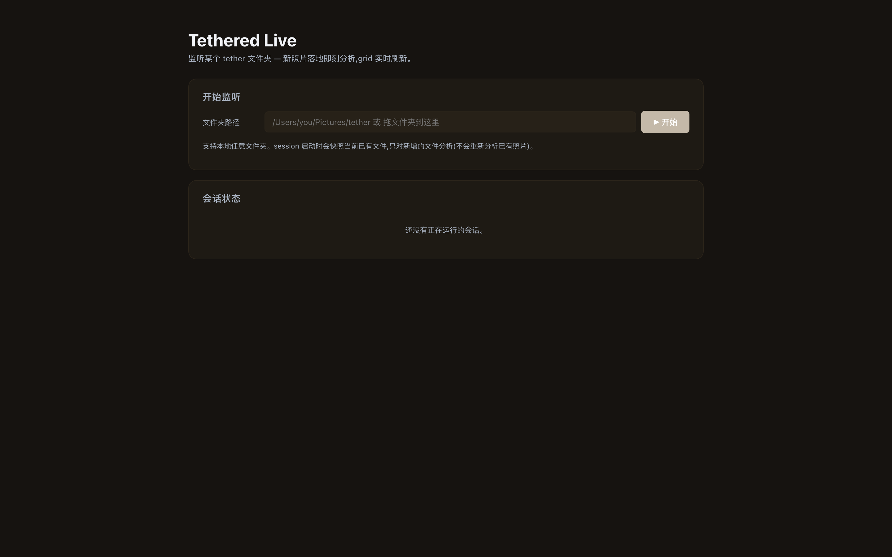

`/tether` 启动后,选一个文件夹监听(通常是 Canon EOS Utility 的实时下载目录)。新照片落地秒级被分析,grid 实时刷新 —— 婚礼仪式现场盯片用(v0.7-P2-2)。

### /admin/perf 性能仪表板

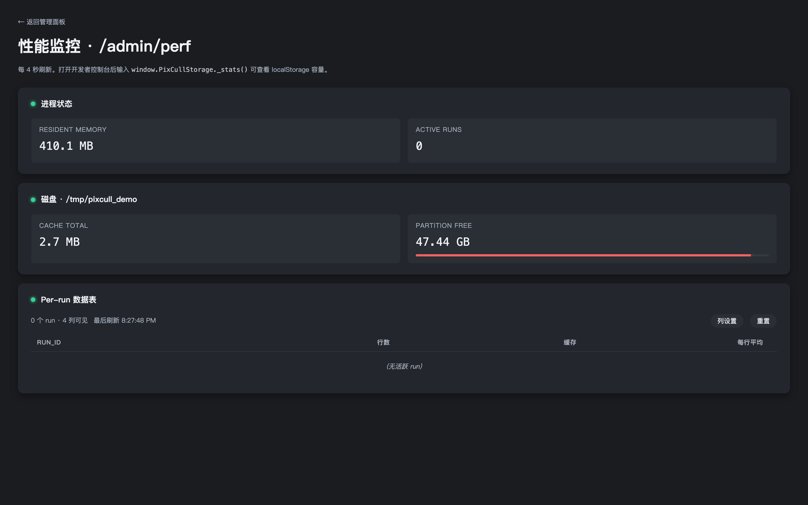

`/admin/perf` 显示 pipeline 每个阶段的实测耗时 + 命中缓存率 + GPU 利用率(若有)—— 给大批量(2000+ 张)排查瓶颈用(v0.9-P2-2)。

---

## 11. 移动 + 主题

### iOS Companion(`mobile/PixCullCompanion/`)

iPhone / iPad 端独立 SwiftUI 应用,通过 mDNS 自动发现同 LAN 的 PixCull 主机:
- 实时浏览主摄的当前 run
- 滑动 / 点按 keep/cull(带 haptic 反馈)
- 同步标注回主端

### 浅色主题

`/results/<id>?theme=light` 或在 ⌘K 里搜 "light":


沙色 + 高对比度配色(v0.9-P2-1),适合 OLED 屏防烧屏 / 白天户外用。

### 手机网格

任何 ≤ 640px 视口自动切换到密集 4 列布局:

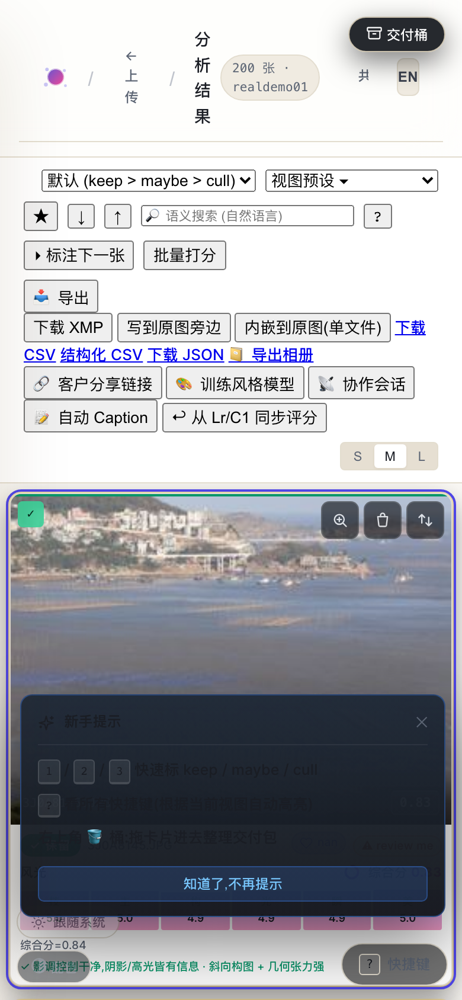

底部弹出式 Inspector 抽屉(LR Mobile Library 风),拇指可触 keep/cull(v0.7-P1-2)。

---

## 12. 13 种语言

`?lang=de` / `?lang=fr` / `?lang=ar` 等(URL 参数)或浏览器 Accept-Language 自动检测:

```
zh_CN  en_US  ja_JP  ko_KR  es_ES        ← v0.10
de_DE  fr_FR  it_IT                       ← v0.11
pt_BR  nl_NL  tr_TR  ru_RU  ar_SA        ← v0.12
```

阿拉伯文 RTL 布局支持(v0.12-P2-2)。

---

## 13. 故障排查

| 症状 | 检查 | 修复 |
|---|---|---|
| `brew install` 报 SHA mismatch | 缓存未刷新 | `brew update && brew install --cask pixcull --force` |
| 上传后页面卡在"正在分析…" | `ps aux \| grep pixcull` | kill 旧进程,重启服务 |
| Lightbox 图模糊 | 没下高分辨率版本 | 鼠标移图上 +1 秒后会自动 swap 到 3600px |
| 协作会话连不上 | 防火墙挡了 8770 端口 | macOS 系统偏好设置 → 隐私 → 防火墙 → 加入 PixCull |
| 标注没保存 | 磁盘满或权限 | `df -h ~` + `ls -la ~/.pixcull/runs/` |
| 模型加载慢 | 第一次启动下载 timm | 等 1-2 分钟,后续启动 < 5 秒 |

---

## 14. 下一步

* **进阶**: 风格 V2 训练 —— 拿你过去 1 年的 keep 当参考,训练个性化模型(`🎨 训练风格模型`)。下次扫照片时,model 用你的偏好打分,而不是通用美学。
* **批量回写**: 用 `pixcull export --xmp ...` 把决策写回原图 XMP sidecar,Lightroom / Capture One 直接读。
* **CI 集成**: `pixcull/.venv/bin/python scripts/ci_rescorer_regression.py` 接进任何 CI 流水线 —— 每次模型重训自动对照 baseline。

---

## 设计思想

PixCull 不是"AI 替你选片",而是 "AI 把不重要的 60% 卡过滤掉,让你把人类时间花在剩下 40% 真正需要判断的临界案例上"。

每张照片的 AI 分数都解释自己 —— heatmap / counterfactual / NL summary 三层透明 —— 你永远知道 model 为什么这么判,从来不需要"trust the black box"。

本地优先:**所有推理 100% 在你机器上跑**,没有云依赖,标注永远归你。

— *陈浩睿 · 2026-2027*
