---
language:
- zh
- en
license: mit
library_name: pixcull
tags:
- photography
- photo-culling
- ai
- computer-vision
- image-classification
- rubric-scoring
- lightroom
- xmp
- local-first
- on-device-ai
- image-quality-assessment
- raw-photography
- wedding-photography
- apple-silicon
domain:
- cv
frameworks:
- pytorch
- onnx
tasks:
- image-classification
- image-quality-assessment
---

<!-- v0.9-MARKETING — brand kit hero from scripts/brand/gen_brand_svg.py.
     Absolute raw.githubusercontent.com URLs so the image still resolves
     once this README is copied into the ModelScope-side repo (which
     doesn't carry docs/brand/). -->


<!-- Animated SVG hero-reveal demo — same source path strategy. -->


[](https://github.com/ChrisChen667788/pixcull)
[](https://github.com/ChrisChen667788/pixcull/blob/main/LICENSE)


[](https://github.com/ChrisChen667788/pixcull/releases/latest)

# PixCull · 摄影师专用的本地 AI 选片工具

> **本地优先 · 6 维评分 · 风格 clone · LAN 协作 · 客户分享 QR · Lr/C1 直通**
>
> 一场 1,500 张的婚礼,人工选片要花一个晚上;PixCull 把它压缩到一杯咖啡的时间,
> 而且 *给你解释每一张为什么入选*。

完整源码 + iOS 伴侣 App + Lightroom 插件,均在 GitHub:
**[github.com/ChrisChen667788/pixcull](https://github.com/ChrisChen667788/pixcull)**

## v0.7 → v0.9 主要更新

- **v0.9**(进行中):全产品 signature soft-bounce 动效 · `/results` 2 秒
  hero reveal · brand identity 重做(渐变 + 新 logo + Charter serif accent)
  · ⌘K 命令面板(27 actions + fuzzy match)
- **v0.8**:i18n 中 / EN / 日 · LAN 协作(token + 5s 增量同步 + 冲突标记)
  · 风格 clone V2(CLIP 嵌入中心)· 短链 + 二维码 · 结构化 CSV/JSON 导出
- **v0.7**:A/B 比较窗 / Annotation modal 重设计 · 5k+ 稳定性
  · Loupe RGB 像素读数 · Inspector mobile bottom-sheet · 视图预设 v2
  · `/share/<run>/<token>` 客户分享页 · 风格 clone V1 · tethered live ·
  `/history` 时间线

## 实机截图(2022 Canon EOS 卡 200 张连续帧)

> **真机数据**: `/Volumes/One Touch/100CANON/3J0A8133.JPG`–`3J0A8332.JPG`
> 连续 200 张(海岸 / 风光 / 建筑 / 纪实混合)。完整 pipeline 跑完:
> keep 104 · maybe 1 · cull 95 · 178 个连拍组。下面所有截图都是
> 这一个真机 run(`/tmp/pixcull_demo/realdemo01/`)的实时页面,
> 不是 mockup 或空模板。
>
> **新手 0→1 操作指南** (20 分钟跟着步骤跑完): 见 GitHub repo 下
> [`docs/USER-GUIDE.md`](https://github.com/ChrisChen667788/pixcull/blob/main/docs/USER-GUIDE.md)
> — 每个核心功能都配真机截图 + 键鼠快捷键。

### 主界面 · 选片网格


每张照片显示决策标签(keep / maybe / cull)、综合分、6 维星级、检测到的场景
+ 风格 chips、AI 建议要点。左侧色条表示决策(绿=keep / 黄=maybe / 红=cull)。
"标注" 按钮悬停可见,直接进入 rubric 详细打分。

### 大图窗 · V20 建议信封 + 1:1 焦点检查


点任意缩略图打开大图窗。右侧信息面板显示:每维星级 + 自动/模型/VLM/人工 4 路对比、
DeepSeek meta-judge 推理、V5.2 摄影正典引用的优点 / 缺点 / 改进建议、类似照片快速跳转、
sticky 决策工具栏(keep / maybe / cull / 撤销)、cull 原因分类选择器。

### A/B 自选对比 · 同步 1:1 缩放


在两张照片上点 ⇆ 按钮(或 Shift+点击 缩略图)进入并排比较;
点任一图同步 1:1 放大,拖动同步平移,滚轮同步细调缩放。
专为 "近似帧二选一" 设计 —— 婚礼连拍、野生动物相邻帧、
风光素材的稳定 vs 动感选择,都是这个场景的高频需求。

### 批量上传 · 30 秒得到全 batch verdict


拖一个文件夹进来 → 选 vertical(婚礼/野生/风光/...)→ AI 自动跑完 →
verdict + XMP sidecar + 独立 HTML 相册 + iOS 同步可选。

### Cmd+K 命令面板 · 27 actions × fuzzy match(v0.9-P0-4)


Linear / Raycast 风格。⌘K 任何地方都能召出;7 个 group / 27 个
action;fuzzy 匹配 < 50ms;最近使用 chunk 置顶。

### 客户作品集分享(v0.9-P0-5)


`/share/<run>/<token>` 不再是"软件交付页",像摄影师的作品集:
brand mark · serif 渐变主标题 · 3 块 keynum(提交/入选/入选率)·
章节式 grid。响应式从 iPhone 竖屏到 iPad 横屏一套布局。

### 历史时间线(v0.7-P2-4)


每场拍摄是一张卡。决策分布条 + 最高分 keep 缩略图。点击 →
回到 grid 接着选片。

### Tether 实时(v0.7-P2-2)


监控 Lr / C1 tether 目录,新 RAW 落盘 → ~2 秒得到 verdict。
婚礼现场 in-camera 工作流。

### 管理面板 perf 数据表(v0.9-P2-2)


`/admin/perf` 是 first-class 数据表:点表头排序 · 拖拽重排列 ·
toggle 可见性 · 粘性表头 · zebra rows · 缓存列按大小着色 chip。
布局偏好 localStorage 持久化。

### Light theme V2 · 暖色 sand-cream 调色板(v0.9-P2-1)


Sand-cream 调色 + 暖 burnt-sienna 阴影 + display weight 加重
(700 / 600 / 450)。Light 不是"反转暗主题"的副产品,而是
editorial-paper 质感。

### iPad 大图窗 · Apple Photos 手势(v0.9-P1-5)


Apple Photos 风格全套手势:1 指水平 swipe 切上一张/下一张,1 指
向下 swipe 关闭,2 指 pinch 缩放,tap 切 fit↔1:1。Vanilla
TouchEvent 实现,无第三方手势库。

### 10 个 empty-state SVG(v0.9-P2-3)


横跨 v0.4 + v0.9 + v0.10 所有空界面统一治理。Editorial line
线稿 + 每张唯一一处 brand-gradient 强调。后续 Phase B 将由真人
插画师重画(详见 design-system/briefs/02-illustration-brief.md)。

### 响应式移动端(v0.6,P-UX-17)


### Marquee 框选 + 批量工具栏(v0.11-P1-2)


网格空白处拖矩形 → 框选所有相交的卡;松手底部弹出
Keep/Maybe/Cull/入桶/取消 工具栏。`⌘A` 全选,`Esc` 取消。
Lightroom Library 标杆体验。

### 偏差审计 dashboard(v0.13-P0-4)


`/admin/bias` 汇总所有 run 的标注,按 scene / time-of-day /
aperture 分桶。红色高亮偏离均值 > 1.5σ 的桶,提示
"rescorer 在 *XXX* 上 cull rate 过严"。24h 缓存;
`/admin/bias.md` 导出 markdown 给客户做透明审计交付。
真机 demo run 还没积累标注,故显示 empty-state。

### 置信度弹窗(v0.13-P0-3)


`score_final ∈ [0.45, 0.55]` 临界卡,鼠标悬停弹出小 popover:
"62% sure · 同组邻居高 0.04 · 最弱轴 · light 2.5★"。
可"不再显示"per-run 关闭。

### 像素级 attribution heatmap(v0.13-P0-1)


Lightbox 按 `A` 弹 6 轴选择条 → 点轴名 → 该轴的 Integrated
Gradients 显著度图叠在原图(0.5 alpha,indigo→pink 渐变)。
Heatmap PNG 缓存到 `output/attribution/<axis>/<sha>.png`。

### 🎬 视频审片 · 时间线 scrubber V2(v2.0-P0-4)


`pixcull video <片子.mp4>` 抽关键帧 → 跑 6 轴评分 → 加时间维评分
(`score_temporal` = 动作连续性 + 时间稳定性 + 突发峰值)→ 找 reel
候选,然后 `/video/<run_id>` 视频原生审片:时间轴画每帧
`score_temporal` 山峰 + 候选暖色带,拖动播放头实时切帧,`J/K/L`
倒退/暂停/前进(DaVinci 式),右栏候选像照片一样 Keep / Cull。
(上图为真机跑一段 99s 实拍样片、聚焦 lightbox + 时间轴的实页。)
头部 🎨 调色下拉(v2.0-P2-2)一键套用胶片预置(Fuji Eterna / Kodak
Vision3 / Arri 709A / Teal-Orange / B&W),主画面 + 每个候选缩略图实时
参数化预览(仅预览,不改原片)。


---

## 为什么是 PixCull

主流的 AI 选片产品对职业摄影师有三个不该接受的妥协:

| 妥协 | 主流 SaaS | PixCull |
|---|---|---|
| 照片必须上传 | 是,且常常进训练池 | **不需要,照片永远不出本机** |
| 只给一个总分 | 0..1 黑盒数字 | **6 维评分 + 摄影正典引用** |
| 工作流割裂 | Web App 独立运行 | **XMP sidecar + Lr 插件 + iOS App + Tether 模式** |

PixCull 把这三件事全翻过来:本地推理、可解释评分、原生融入 Lr / C1 工作流。

## 适合谁

- **婚礼 / 活动摄影师** —— 每场 1,000+ 张明早就要交,而且要能对客户解释
- **体育 / 动作摄影师** —— Tether 模式实时给出 verdict,~2 秒每张快门
- **新闻摄影师** —— NDA / embargo 下根本不能上传到 SaaS
- **摄影工作室** —— 二摄、跨相机、跨卡的覆盖需要合并 + 同步人脸 ID
- **野生 / 风光摄影师** —— 连拍峰值自动选,起跑帧不丢失
- **自学摄影爱好者** —— 想要工具 *解释* 评判,不只是排序

## 能力清单

1. **6 维评分** —— 技术 / 主体 / 构图 / 光线 / 瞬间 / 美感,每维 1-5 星,带理由
2. **9 种细分领域 (verticals)** —— 婚礼 · 野生 · 体育 · 风光 · 人像 · 活动 · 新闻 · 商业 · 静物
3. **V20 建议信封** —— 简短 verdict + 摄影正典引用的优点 + 缺点 + 改进建议
4. **本地人脸聚类** —— InsightFace ArcFace + DBSCAN + 跨 run 人脸库
5. **GPS 位置聚类** —— Haversine DBSCAN,~100 m 半径,"每地点选一张"
6. **连拍峰值排序** —— 亚秒级连拍组自动选峰值帧
7. **Cull 原因分类** —— 焦点不准 / 闭眼 / 模糊抖动 / 构图差 / 重复 / 曝光 / 其他
8. **类似照片查找** —— 复合特征 (连拍组 + 场景 + 人脸 + GPS + 评分) Top-5
9. **自选 A/B 对比** —— 同步 1:1 缩放跨越两图;专为 "近似帧二选一" 设计
10. **1:1 焦点检查** —— 大图窗点任意处放大,拖动平移,滚轮细调
11. **XMP / IPTC / 相册导出** —— XMP 进 Lr/C1;IPTC 自动合成;独立 HTML 相册打包发客户
12. **iOS 滑动伴侣 App** —— SwiftUI 写,后台跑笔记本上的重活
13. **Lr / C1 Tether 模式** —— 实时监控 tether 目录,~2 秒 verdict
14. **跨机同步 (INFRA-2)** —— 符号链接镜像,人脸库 + 细分领域跟着你跨工作室
15. **主动学习队列** —— 下一张最值得标的照片,按 rescorer 分歧度排序
16. **多用户 profile** —— 工作室里多个二摄各有自己的 vertical + 人脸库

## 架构速览

三张 editorial-warm 配色的图,**在页面里会动** —— 数据沿连线流动、各阶段依次点亮
(尊重 reduced-motion,静态也清晰好读)。可编辑的 draw.io 源文件见 GitHub 仓库
[docs/diagrams/](https://github.com/ChrisChen667788/pixcull/tree/main/docs/diagrams)。

**系统架构** · input → CLI → run_pipeline → 端侧评分引擎 → 产物 → Web 审片


**视频审片时序** · `pixcull video` → 抽帧 → 评分 → temporal/reel 选帧 → 装配成片 + 打开审片页


**数据流程** · 像素 → rubric.jsonl → scores.csv → manifest.json → 审片页(含视频成片分支)


10 秒版,PixCull 在团队工作流中的位置:

```mermaid
%%{init: {'theme':'base','themeVariables':{'primaryColor':'#241d12','primaryTextColor':'#f3ede1','lineColor':'#c4b9a9','primaryBorderColor':'#3a3122','tertiaryColor':'#161310'}}}%%
flowchart LR
    P[("📷 主摄")]
    S[("📷 二摄")]
    E[("✎ 编辑")]
    C[("👤 客户")]
    PIX{{"<b>PixCull</b><br/>本地优先<br/>AI 选片"}}
    DS["DeepSeek API<br/>(可选)"]

    P -->|"上传 RAW/JPEG"| PIX
    S -->|"加入 LAN event"| PIX
    E -->|"标注 + 推决定"| PIX
    PIX -->|"作品集分享链接"| C
    PIX -.->|"opt-in · 仅文本"| DS

    style PIX fill:#241d12,color:#f3ede1,stroke:#c4b9a9
    style DS  fill:#1b1712,stroke:#6a6052
```



工程承诺:**无 Web 框架** · **无数据库** · **多模型融合**
(8 个 ONNX:U²-Net / ArcFace / 场景 CNN / 婚礼瞬间 CNN /
CLIP ViT-L/14 / GBM 评分 V2 / Llava VLM / DeepSeek meta-judge) ·
**LAN 同步本地优先**(token + 5s HTTP polling + mDNS auto-discovery)

完整架构图(C4 系统上下文 + 容器图 + 拍摄 pipeline 时序 + LAN 同步
时序 + **16 行 ML 模型表** + 存储布局 + 技术决策表)见 GitHub 仓库
[docs/ARCHITECTURE.md](https://github.com/ChrisChen667788/pixcull/blob/main/docs/ARCHITECTURE.md)

> **设计质感坦白:** 工程层已经成熟,但视觉设计层仍是"开发者 + AI",
> 而不是"设计师介入"。这是我们公开承认的差距。设计系统升级路线图
> 见 GitHub
> [docs/DESIGN-SYSTEM-ROADMAP.md](https://github.com/ChrisChen667788/pixcull/blob/main/docs/DESIGN-SYSTEM-ROADMAP.md) ——
> 工具链选型(Figma + Penpot + Tokens Studio + Rive)、自定义插画委
> 托清单、未来 6 个月分三阶段升级。**v1.0 前从"功能 iconic"升级到
> "工艺 iconic"**。

## 快速开始

```bash
git clone https://github.com/ChrisChen667788/pixcull.git
cd pixcull
python3.12 -m venv .venv
source .venv/bin/activate
pip install -e ".[dev]"
python scripts/serve_demo.py
# 浏览器开 http://127.0.0.1:8770
```

把一个 JPG / RAW / HEIC 的文件夹拖到上传页;
首次约 30 秒预热模型 (Apple Silicon),之后每张 ~1 秒 (M2 Pro 实测)。

## 在线体验

ModelScope Studio 演示版本正在开发中,届时您可以:

- 上传 1 张照片
- 30 秒内得到 6 维评分 + V20 建议
- 体验我们的评分逻辑,不必先安装

完整版本(批量 + Lr 同步 + iOS 伴侣)请到 GitHub 部署。

## 协议

[MIT](https://github.com/ChrisChen667788/pixcull/blob/main/LICENSE)。可商用、自由 fork、欢迎 PR。

## 作者

PixCull 始于一个简单想法:不要再花一个晚上在 Lightroom catalog 里挑片。
MIT 开源,让下一个摄影师不用再从头造一遍。

- GitHub: [@ChrisChen667788](https://github.com/ChrisChen667788)
- ModelScope: [@haozi667788](https://www.modelscope.cn/profile/haozi667788)
- 联系: hello@pixcull.dev

---

> *如果 PixCull 帮到你,在 GitHub 点个 ⭐ —— 它是单人项目持续打磨下去的最大动力*
