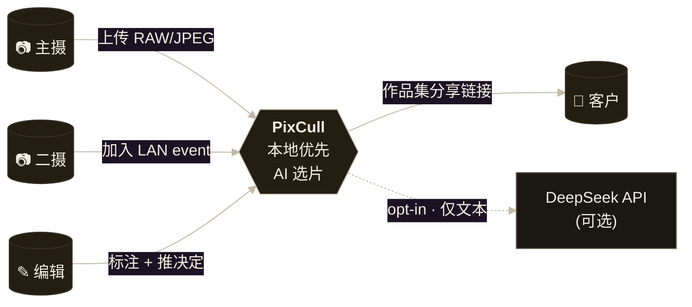

---
language:
- zh
- en
license: mit
library_name: pixcull
tags:
- photography
- photo-culling
- ai
- computer-vision
- image-classification
- rubric-scoring
- lightroom
- xmp
- local-first
- on-device-ai
- image-quality-assessment
- raw-photography
- wedding-photography
- apple-silicon
domain:
- cv
frameworks:
- pytorch
- onnx
tasks:
- image-classification
- image-quality-assessment
---

<!-- v0.9-MARKETING — brand kit hero from scripts/brand/gen_brand_svg.py.
     Absolute raw.githubusercontent.com URLs so the image still resolves
     once this README is copied into the ModelScope-side repo (which
     doesn't carry docs/brand/). -->


<!-- 主视觉。一次真实拍摄里的六帧,五帧被压到后面,被标记的那一帧套着裁切
     框 —— 就是品牌标识本身,放大到能看清它框住的是什么。它右边那张是几秒后
     的同一把剪刀,而"留哪张"正是这个工具存在的理由。照片和分数都是真的。
     ModelScope 不渲染 <picture>,所以这里固定用深色版。 -->


[](https://github.com/ChrisChen667788/pixcull)
[](https://github.com/ChrisChen667788/pixcull/blob/main/LICENSE)


[](https://github.com/ChrisChen667788/pixcull/releases/latest)

# PixCull · 摄影师专用的本地 AI 选片工具

> 给需要向客户解释这次选片的摄影师用。
>
> 它把一场拍摄分成保留 / 待定 / 剔除,每张打六个维度的分,并写清楚为什么 ——
> 一句你能当着客户念出来的话。跑在你自己的机器上,RAW 不必去任何地方。

完整源码 + iOS 伴侣 App + Lightroom 插件,均在 GitHub:
**[github.com/ChrisChen667788/pixcull](https://github.com/ChrisChen667788/pixcull)**

## 最近更新
- **v3.78**:逐轴归因热力图有真实后端、有测试,却没有任何入口能到达。准备接上时先
  做了测量,发现它对六个轴产出**字节完全相同**的图:逐轴模型二十多个版本前就移进了
  包里,这个消费方没跟上,于是每个轴都回落到同一张通用图。

  而且它本来也不可能成立。轴打分器是建立在 29 个具名测量值上的树模型 —— 地平线
  倾斜、人脸数、主体占比 —— 它从不看像素。一张神经网络的显著性图,解释的是另一个
  模型,不是做决定的那个。对一个以「告诉你为什么」立身的工具,一个自信的错误解释
  比没有解释更糟,所以是删掉而不是修好。十个测试覆盖它、全部通过,没有一个比较过
  两个轴的输出。

- **v3.77**:「按文字剪」那张截图原本是 ffmpeg 测试图 + 合成语音,在页面上看起来
  像渲染出错。现在换成真实素材及其原声,人脸做了磨砂 —— 人声几乎铺满整段,裁掉
  正脸那一刻就把声音一起裁掉了。

- **v3.76**:三处展示的东西已经不再为真。给「未决照片」用的弹窗触发于一个写死的
  分数区间,而那个区间整个落在废弃区内 —— 它出现在已判定的照片上,从不出现在未决
  的照片上。在评审页做的改判到不了 XMP 导出:流水线说废弃,摄影师说保留,而
  Lightroom 拿到的是废弃。还有二十七张截图里有十五张没有任何东西会重新生成,现在
  逐张写明了是什么、最后确认于何时。

- **v3.75**:拒绝上传照片没有生效。提示说「本次以及以后每次运行都留在本地」,然后
  什么都没写,下次运行照样问。另外:从别的目录打开一次运行会报告每张照片都丢失,
  以及一个在三处宣传的快捷键根本没有处理函数。

- **v3.74**:那条叫「install + import smoke」的流水线，在排练一场没人会做的安装。
  四条 CI 流水线全都钉着 `torch==2.4.1`（2024 年的版本），而 `pyproject.toml`
  允许 `>=2.2,<3`，而流水线改成按用户的方式解析之后，落到的是 2.14 —— 中间那
  十个小版本，没有任何地方跑过。现在这条流水线按用户的方式解析；另外三条继续钉死，因为在那里红灯
  应该意味着「代码变了」，而不是「源变了」。

  Python 3.11 是更尖锐的那一半。它写在 `requires-python` 里、写在 PyPI 分类器
  里、写在 README 顶部的徽章上、写在 `README-PYPI.md` 和两份快速上手里，而矩阵
  从来只跑过 3.12。五处广告，零处验证。

- **v3.73**:设计系统本来要学会浅色主题。先测量才发现，它十六个角色 token 里有
  十五个连**深色**主题的值都是错的 —— 里面装的还是 v2.21 之前的暖色表面，而产品
  早已换成无彩色。往一个把第一套主题都说错的文件里加第二套，只会把错误翻倍。

更早的版本记录在 [`CHANGELOG.md`](https://github.com/ChrisChen667788/pixcull/blob/main/modelscope/CHANGELOG.md)。

## 实机截图(2022 Canon EOS 卡 200 张连续帧)

> **真机数据**: `/Volumes/<drive>/100CANON/3J0A8133.JPG`–`3J0A8332.JPG`
> 连续 200 张(海岸 / 风光 / 建筑 / 纪实混合)。完整 pipeline 跑完:
> keep 104 · maybe 1 · cull 95 · 178 个连拍组。下面所有截图都是
> 这一个真机 run(`/tmp/pixcull_demo/realdemo01/`)的实时页面,
> 不是 mockup 或空模板。
>
> **新手 0→1 操作指南** (20 分钟跟着步骤跑完): 见 GitHub repo 下
> [`docs/USER-GUIDE.md`](https://github.com/ChrisChen667788/pixcull/blob/main/docs/USER-GUIDE.md)
> — 每个核心功能都配真机截图 + 键鼠快捷键。

### 主界面 · 选片网格


每张照片显示决策标签(keep / maybe / cull)、综合分、6 维星级、检测到的场景
+ 风格 chips、AI 建议要点。左侧色条表示决策(绿=keep / 黄=maybe / 红=cull)。
"标注" 按钮悬停可见,直接进入 rubric 详细打分。

### 🗣 转录 + 按文字剪(v2.43 – v2.44.2)


台词排在画面旁边,**点一行跳到那一秒**;点 ✂ 划掉整行,或选中行内几个字
只删这几个字 —— 画面跟着文字一起没,读数实时显示还剩多少。撤销/重做重放
操作日志,文字与时间轴不可能对不上。可导出 CMX-3600 EDL 进 Premiere /
Resolve,或按**出片**直接得到剪好的 mp4。

中文识别带 88 条领域词表(机位 / 曝光 / 备选 / 长焦 / 接亲 / 证婚人 …),
`--hotword` 还能加场地名、新人姓名;`--speakers` 可标注谁在说话。

> 上图取自真实素材及其原声(v3.77)。此前是 ffmpeg 测试图 + 合成语音,在页面上
> 看起来像渲染出错。人脸是**遮**掉而不是**避**开的:人声几乎铺满整段,裁掉正脸
> 那一段就把声音一起裁掉了。

### 大图窗 · V20 建议信封 + 1:1 焦点检查


点任意缩略图打开大图窗。右侧信息面板显示:每维星级 + 自动/模型/VLM/人工 4 路对比、
DeepSeek meta-judge 推理、V5.2 摄影正典引用的优点 / 缺点 / 改进建议、类似照片快速跳转、
sticky 决策工具栏(keep / maybe / cull / 撤销)、cull 原因分类选择器。

### A/B 自选对比 · 同步 1:1 缩放


在两张照片上点 ⇆ 按钮(或 Shift+点击 缩略图)进入并排比较;
点任一图同步 1:1 放大,拖动同步平移,滚轮同步细调缩放。
专为 "近似帧二选一" 设计 —— 婚礼连拍、野生动物相邻帧、
风光素材的稳定 vs 动感选择,都是这个场景的高频需求。

### 批量上传 · 30 秒得到全 batch verdict


拖一个文件夹进来 → 选 vertical(婚礼/野生/风光/...)→ AI 自动跑完 →
verdict + XMP sidecar + 独立 HTML 相册 + iOS 同步可选。

### Cmd+K 命令面板 · 27 actions × fuzzy match(v0.9-P0-4)


Linear / Raycast 风格。⌘K 任何地方都能召出;7 个 group / 27 个
action;fuzzy 匹配 < 50ms;最近使用 chunk 置顶。

### 客户作品集分享(v0.9-P0-5)


`/share/<run>/<token>` 不再是"软件交付页",像摄影师的作品集:
brand mark · serif 渐变主标题 · 3 块 keynum(提交/入选/入选率)·
章节式 grid。响应式从 iPhone 竖屏到 iPad 横屏一套布局。

### 历史时间线(v0.7-P2-4)


每场拍摄是一张卡。决策分布条 + 最高分 keep 缩略图。点击 →
回到 grid 接着选片。

### Tether 实时(v0.7-P2-2)


监控 Lr / C1 tether 目录,新 RAW 落盘 → ~2 秒得到 verdict。
婚礼现场 in-camera 工作流。

### 管理面板 perf 数据表(v0.9-P2-2)


`/admin/perf` 是 first-class 数据表:点表头排序 · 拖拽重排列 ·
toggle 可见性 · 粘性表头 · zebra rows · 缓存列按大小着色 chip。
布局偏好 localStorage 持久化。

### Light theme V2 · 暖色 sand-cream 调色板(v0.9-P2-1)


Sand-cream 调色 + 暖 burnt-sienna 阴影 + display weight 加重
(700 / 600 / 450)。Light 不是"反转暗主题"的副产品,而是
editorial-paper 质感。

### iPad 大图窗 · Apple Photos 手势(v0.9-P1-5)


Apple Photos 风格全套手势:1 指水平 swipe 切上一张/下一张,1 指
向下 swipe 关闭,2 指 pinch 缩放,tap 切 fit↔1:1。Vanilla
TouchEvent 实现,无第三方手势库。

### 10 个 empty-state SVG(v0.9-P2-3)


横跨 v0.4 + v0.9 + v0.10 所有空界面统一治理。Editorial line
线稿 + 每张唯一一处 brand-gradient 强调。后续 Phase B 将由真人
插画师重画(详见 design-system/briefs/02-illustration-brief.md)。

### 响应式移动端(v0.6,P-UX-17)


### Marquee 框选 + 批量工具栏(v0.11-P1-2)


网格空白处拖矩形 → 框选所有相交的卡;松手底部弹出
Keep/Maybe/Cull/入桶/取消 工具栏。`⌘A` 全选,`Esc` 取消。
Lightroom Library 标杆体验。

### 偏差审计 dashboard(v0.13-P0-4)


`/admin/bias` 汇总所有 run 的标注,按 scene / time-of-day /
aperture 分桶。红色高亮偏离均值 > 1.5σ 的桶,提示
"rescorer 在 *XXX* 上 cull rate 过严"。24h 缓存;
`/admin/bias.md` 导出 markdown 给客户做透明审计交付。
真机 demo run 还没积累标注,故显示 empty-state。

### 置信度弹窗

判决为 `maybe` 的卡,鼠标悬停弹出小 popover:
"62% sure · 同组邻居高 0.04 · 最弱轴 · light 2.5★"。
可"不再显示"per-run 关闭。

它原本触发于写死的 `score_final ∈ [0.45, 0.55]`,而这个区间在 standard
预设下整个落在废弃线以下 —— 出现在已判定的照片上,从不出现在真正未决的
照片上(v3.76 改为直接问判决)。

### 🎬 视频审片 · 时间线 scrubber V2(v2.0-P0-4)


`pixcull video <片子.mp4>` 抽关键帧 → 跑 6 轴评分 → 加时间维评分
(`score_temporal` = 动作连续性 + 时间稳定性 + 突发峰值)→ 找 reel
候选,然后 `/video/<run_id>` 视频原生审片:时间轴画每帧
`score_temporal` 山峰 + 候选暖色带,拖动播放头实时切帧,`J/K/L`
倒退/暂停/前进(DaVinci 式),右栏候选像照片一样 Keep / Cull。
(上图为真机跑一段 99s 实拍样片、聚焦 lightbox + 时间轴的实页。)
头部 🎨 调色下拉(v2.0-P2-2)一键套用胶片预置(Fuji Eterna / Kodak
Vision3 / Arri 709A / Teal-Orange / B&W),主画面 + 每个候选缩略图实时
参数化预览(仅预览,不改原片)。


**照片 + 视频同一条时间线(`/timeline/<run_id>`)** —— 一次拍摄里的照片与视频片段
按拍摄时间排在一起,视频卡片显示时长 · 帧数 · 候选数 · 卖点标签,一键跳进审片台。


### v2.9 · 智能透明 + 内容优先观看

**🎬 Scenes 时序导航** — 按拍摄时间(median+MAD 自适应间隙)把一次拍摄切成时序
场景,每段显示时间范围 · 张数 · keep;点 chip 跳到那一段。


**🔍 判定 glass box** — lightbox inspector 顶部默认只显「为什么是这个判定」一行,
展开看逐轴评分 + 信号 + AI 判读(渐进披露)。


### v2.11 · 透明度的可发现性

**整理 · 折叠 组常显 + 首次 coachmark** —— 近重复折叠 / 时序场景 不再藏在连拍组里,
每个 run 都看得到入口;首次进入一次性引导透明度三件套。


---

## 为什么是 PixCull

主流的 AI 选片产品对职业摄影师有三处取舍。下表只陈述 PixCull 这一侧的可核验事实;
对同行的描述保持在其公开材料能支持的范围内 —— 三行都不再写死"他们只能怎样"
(2026-09-02 首轮、v3.25 收尾,见
`docs/ROADMAP-v3.1-v3.27-charter.md` §v3.25 —— 一轮事实核查推翻了本项目此前
对某家竞品「必须上传」的断言,该断言无来源支持):

| 取舍 | 主流 SaaS | PixCull |
|---|---|---|
| 照片去向 | 多为云端处理;各家的留存与训练策略以其自身条款为准,本项目不代为断言 | **默认送 MiniMax M3 判图,不进训练池;`--vlm-mode off` 全程不出网** |
| 评分的可解释性 | 各家做法不同,多数只对外给一个总分或一个分级 | **6 维评分 + 摄影正典引用** |
| 工作流位置 | 多数以自己的 Web App 为主入口;是否有宿主插件请查各家文档 | **XMP sidecar + Lr 插件 + iOS App + Tether 模式** |

PixCull 在这三处都走了另一条路:本机实测指标作为证据送进云端判官、可解释评分、原生融入 Lr / C1 工作流。

## 适合谁

- **婚礼 / 活动摄影师** —— 每场 1,000+ 张明早就要交,而且要能对客户解释
- **体育 / 动作摄影师** —— Tether 模式实时给出 verdict,~2 秒每张快门
- **新闻摄影师** —— NDA / embargo 下根本不能上传到 SaaS
- **摄影工作室** —— 二摄、跨相机、跨卡的覆盖需要合并 + 同步人脸 ID
- **野生 / 风光摄影师** —— 连拍峰值自动选,起跑帧不丢失
- **自学摄影爱好者** —— 想要工具 *解释* 评判,不只是排序

## 能力清单

1. **6 维评分** —— 技术 / 主体 / 构图 / 光线 / 瞬间 / 美感,每维 1-5 星,带理由
2. **9 种细分领域 (verticals)** —— 婚礼 · 野生 · 体育 · 风光 · 人像 · 活动 · 新闻 · 商业 · 静物
3. **V20 建议信封** —— 简短 verdict + 摄影正典引用的优点 + 缺点 + 改进建议
4. **本地人脸聚类** —— InsightFace ArcFace + DBSCAN + 跨 run 人脸库
5. **GPS 位置聚类** —— Haversine DBSCAN,~100 m 半径,"每地点选一张"
6. **连拍峰值排序** —— 亚秒级连拍组自动选峰值帧
7. **Cull 原因分类** —— 焦点不准 / 闭眼 / 模糊抖动 / 构图差 / 重复 / 曝光 / 其他
8. **类似照片查找** —— 复合特征 (连拍组 + 场景 + 人脸 + GPS + 评分) Top-5
9. **自选 A/B 对比** —— 同步 1:1 缩放跨越两图;专为 "近似帧二选一" 设计
10. **1:1 焦点检查** —— 大图窗点任意处放大,拖动平移,滚轮细调
11. **XMP / IPTC / 相册导出** —— XMP 进 Lr/C1;IPTC 自动合成;独立 HTML 相册打包发客户
12. **iOS 滑动伴侣 App** —— SwiftUI 写,后台跑笔记本上的重活;
    以源码形式提供,要自己在 Xcode 里编译,没上 App Store
13. **Lr / C1 Tether 模式** —— 实时监控 tether 目录,~2 秒 verdict
14. **跨机同步 (INFRA-2)** —— 符号链接镜像,人脸库 + 细分领域跟着你跨工作室
15. **主动学习队列** —— 下一张最值得标的照片,按 rescorer 分歧度排序
16. **多用户 profile** —— 工作室里多个二摄各有自己的 vertical + 人脸库

## 架构速览

三张 editorial-warm 配色的图,**在页面里会动** —— 数据沿连线流动、各阶段依次点亮
(尊重 reduced-motion,静态也清晰好读)。可编辑的 draw.io 源文件见 GitHub 仓库
[docs/diagrams/](https://github.com/ChrisChen667788/pixcull/tree/main/docs/diagrams)。

**系统架构** · input → CLI → run_pipeline → 端侧评分引擎 → 产物 → Web 审片


**视频审片时序** · `pixcull video` → 抽帧 → 评分 → temporal/reel 选帧 → 装配成片 + 打开审片页


**数据流程** · 像素 → rubric.jsonl → scores.csv → manifest.json → 审片页(含视频成片分支)


10 秒版,PixCull 在团队工作流中的位置:


```mermaid
%%{init: {'theme':'base','themeVariables':{'primaryColor':'#241d12','primaryTextColor':'#f3ede1','lineColor':'#c4b9a9','primaryBorderColor':'#3a3122','tertiaryColor':'#161310'}}}%%
flowchart LR
    P[("📷 主摄")]
    S[("📷 二摄")]
    E[("✎ 编辑")]
    C[("👤 客户")]
    PIX{{"<b>PixCull</b><br/>本地优先<br/>AI 选片"}}
    DS["DeepSeek API<br/>(可选)"]

    P -->|"上传 RAW/JPEG"| PIX
    S -->|"加入 LAN event"| PIX
    E -->|"标注 + 推决定"| PIX
    PIX -->|"作品集分享链接"| C
    PIX -.->|"opt-in · 仅文本"| DS

    style PIX fill:#241d12,color:#f3ede1,stroke:#c4b9a9
    style DS  fill:#1b1712,stroke:#6a6052
```

工程承诺:**无 Web 框架** · **无数据库** · **多模型融合**
(8 个 ONNX:U²-Net / ArcFace / 场景 CNN / 婚礼瞬间 CNN /
CLIP ViT-L/14 / GBM 评分 V2 / Llava VLM / DeepSeek meta-judge) ·
**LAN 同步本地优先**(token + 5s HTTP polling + mDNS auto-discovery)

完整架构图(C4 系统上下文 + 容器图 + 拍摄 pipeline 时序 + LAN 同步
时序 + **16 行 ML 模型表** + 存储布局 + 技术决策表)见 GitHub 仓库
[docs/ARCHITECTURE.md](https://github.com/ChrisChen667788/pixcull/blob/main/docs/ARCHITECTURE.md)

> **设计质感坦白:** 工程层已经成熟,但视觉设计层仍是"开发者 + AI",
> 而不是"设计师介入"。这是我们公开承认的差距。设计系统升级路线图
> 见 GitHub
> [docs/DESIGN-SYSTEM-ROADMAP.md](https://github.com/ChrisChen667788/pixcull/blob/main/docs/DESIGN-SYSTEM-ROADMAP.md) ——
> 工具链选型(Figma + Penpot + Tokens Studio + Rive)、自定义插画委
> 托清单、未来 6 个月分三阶段升级。**v1.0 前从"功能 iconic"升级到
> "工艺 iconic"**。

## 客户看片页 · v2.87

中国影楼工作流里,摄影师选完之后还有一步:**客户自己选**。PixCull 以前完全
没有这一步。

```bash
pixcull proof-sheet <run>/output --out ~/proof --title "张先生婚礼" \
        --contact "微信 photographer"
```

写出一个文件夹:降到 1024px 的**加水印**派生图,加一个 `index.html`。
没有服务器、没有数据库、没有账号、没有托管。摄影师用现有的任何方式把文件夹
发出去,客户打开 HTML、点选、拿到一份可以直接回传的清单。

实测:300 张 11.3 秒、8.7 MB,页面**零外部请求** —— 客户在火车上用 U 盘也能打开。


**刻意不做的**:小程序、支付、改片轮次追踪。那是影楼管理 SaaS,对手在那条
路上已经跑了很多年。已经在用第三方交付平台的摄影师不会搬家,也不该搬。这个
功能是给还没有的人。

原图永远不会进产物 —— 测试会逐位比对派生图与原图,并断言宽度恰好是 1024。

## 盲标 · v2.94

```bash
pixcull m3 label --folder <photos> --limit 150
```

卡片上只有照片、一个编号、两个按钮。**没有任何系统的判决、理由或评分** ——
看到答案的人就不再是独立的答案来源。


这不是可有可无的洁癖。本项目产生过的每一份循环标注集,都来自一个人看着判决
点了"同意",**四次,四种伪装**,每次都是被为上一次写的守卫事后抓到的。

存下来的 JSON 带 `source: "human"`,`pixcull/scoring/ground_truth.py` 只接受
有溯源的标注 —— 拿模型自己的输出当真值,算出来的一致率是 100%,而那个数字
本身就是循环的证据。

## 快速开始

```bash
git clone https://github.com/ChrisChen667788/pixcull.git
cd pixcull
python3.12 -m venv .venv
source .venv/bin/activate
pip install -e ".[dev]"
python scripts/serve_demo.py
# 浏览器开 http://127.0.0.1:8770
```

把一个 JPG / RAW / HEIC 的文件夹拖到上传页;
首次约 30 秒预热模型 (Apple Silicon),之后每张 ~1 秒 (M2 Pro 实测)。

## 在线体验

ModelScope Studio 在线 demo(v2.8 · 编辑暖 OKLCH 配色),不必先安装即可:

- **单张评分** — 上传 1 张照片,得到 6 维评分 + 建议
- **双语镜头字幕 (VLM)** — BLIP 描述这一帧,中英双语输出
  - EN = BLIP(自托管 ONNX 优先,否则 transformers)
  - ZH = 本地 GGUF LLM 改写 → opus-mt-en-zh 机器翻译 → 英文原文(三级兜底,
    页面如实标注当前后端;免费 CPU Studio 通常落在 opus-mt 这一级)
- 整页采用 v2.8 **OKLCH 三变量配色**(base/accent/contrast 派生全部表面),
  旧浏览器自动 hex 兜底

完整版本(批量 + 视频选片 / reel 剪辑 + Lr 同步 + iOS 伴侣)请到 GitHub 部署。

## 协议

[MIT](https://github.com/ChrisChen667788/pixcull/blob/main/LICENSE)。可商用、自由 fork、欢迎 PR。

## 作者

PixCull 始于一个简单想法:不要再花一个晚上在 Lightroom catalog 里挑片。
MIT 开源,让下一个摄影师不用再从头造一遍。

- GitHub: [@ChrisChen667788](https://github.com/ChrisChen667788)
- ModelScope: [@haozi667788](https://www.modelscope.cn/profile/haozi667788)
- 联系: hello@pixcull.dev

---

> *如果 PixCull 帮到你,在 GitHub 点个 ⭐ —— 它是单人项目持续打磨下去的最大动力*

## 分歧复核 —— 怎么知道模型到底对不对

模型和你的规则不一致时,它要么比规则聪明,要么比规则差,**测试套件永远
分辨不了是哪一种。** 只有你看图才能。

`pixcull m3 review` 把「这个问题还悬着」的那些帧单独做成一页。它之所以
存在,是因为另一条路失败了:这个项目有一份 608 行标注集,审阅过、认可过
—— 因此**和规则栈自己的输出逐字相同**。规则拿自己的答案给自己打分得了
满分 1.000,任何与它不同的模型必然更差,整个对比毫无意义。**在 18 张
照片上花十分钟**,才产生了第一批能分辨两个系统的标注。

```bash
# 建页并起在 http://127.0.0.1:8731/,逐张判,点「保存结果」→ review.json
pixcull m3 review --labels labels.csv --scores run/scores.csv --out ~/review.html
pixcull m3 open ~/review.html          # 重开之前建好的页
# --review 可重复,一轮复核给一个,自动合并
pixcull m3 eval --labels labels.csv --scores run/scores.csv \
                --review ~/pass-1.json --review ~/pass-2.json
```

这页是**起在本地回环上、而不是双击打开文件**的。在 `file://` 源下,浏览器
会拦掉保存按钮用的 blob 下载、并限制 `localStorage` —— 两者都不报错,页面
看着能用,实际什么都没存下。端口固定是因为 `localStorage` 按源隔离:临时
端口会让判到一半的复核者下次打开看到一张空表。

每张卡片给出原图、两边各自的判决、**被推翻的是哪个硬性剔除标记**、模型
自己的理由,以及六轴星级。两个按钮,没有需要校准的量表 —— 一个在琢磨
1–5 分怎么打的复核者,已经不在看照片了。

三条不是顺带的性质:

- **照片不出本机。** 缩略图内嵌在本地 HTML 里。复核你自己的客户作品,
  不该要求你把它上传到任何地方,包括我们。
- **判断落盘**,且每次点击都写入 `localStorage`。关掉标签页不会让你
  白判一遍。
- **生成这一页永远不花钱** —— 只读缓存判决,没判过的帧跳过而不是计费。


**三轮复核,只有第三轮的数字可信。**

**第一、二轮(51 帧)抽的是「两个系统有分歧」的行。** 那等于只在规则栈
已经在争论的地方考它,指向哪边就偏袒哪边。它确实按方向确立了一件事:
M3 把规则判死的救上来,7 张对 7 张;想把规则想留的砍掉,19 张只对 8 张
—— **救片可靠,砍片不可靠**。

**第三轮是盲标。** 从一张没碰过的卡里取 150 帧,屏幕上只有照片、一个序号
和两个按钮,判完再评分 —— 顺序如此,标注就不可能回声任何系统。摄影师标了
10 张该删:

| 你想删的那 10 张,找到了几张 | |
|---|---|
| 规则栈 | **2** |
| `vlm_authority=primary` | 1 |
| `vlm_authority=rescue` | 0 |

两个模式的 macro-F1 差值,95% 置信区间都跨零。规则栈同时**判了 53 张 cull
而摄影师只删 10 张 —— 过删 5.3 倍**。

**更新(v2.64,394 张盲标)。** 这一节的 150 张版本说"谁都没解决"。样本
翻到 2.6 倍、并且**把 `maybe` 的含义真正测出来**之后,结论变了:

| 493 张盲标 | 毁掉留片 | 找到你的 cull |
|---|---|---|
| 规则栈 | **157 / 450** | 7 / 43 |
| `rescue` | 26 / 450 | 3 / 43 |
| `primary` | **20 / 450** | **11 / 43** |

`primary` **毁片少 87%,同时多找到 57% 该删的照片**。在前 394 张上它还是个
权衡(少找 1 张换少毁 111 张);加上 100 张分层样本后,**两个轴都赢**。

macro-F1 +28.9,95% CI [+14.7, +41.9]。

第二批是 **100 张而不是 1000 张**。按本地 `score_final` 分层(低分段的删除率
是基线的 2.4 倍),再按 `层总数/层抽样数` 加权还原,每张标注的信息量约为
均匀抽样的两倍,评分成本只有五分之一。400 次模拟确认加权正确还原了真实
删除率。

规则栈自动删 131 张,其中 126 张是留片 —— **在唯一不可撤销的动作上错误率
96%**。`primary` 把它降到 15 张,少找到 1 张该删的,代价是 195 张进"再看"。
macro-F1 +14.6,95% CI [+6.8, +23.1]。

**`vlm_authority` 出厂值改为 `primary`。** 判官本身仍然默认关闭;变的是
它一旦打开之后被允许做什么。

`maybe` 的含义是靠两次盲标测出来的,不是猜的:在摄影师判「留」的照片上,
58/60 的 `maybe` 是"裁剪后值得再看"(97%);在判「删」的照片上,13/16 是
真正的漏删(81%)。旧口径把每一个 `maybe` 都算作失分 —— 在这 394 张上,
那等于因为 179 个**正确答案**去惩罚 `primary`,足以把它从第一压到最后。

**这个权衡是真实的,而且该由你接受**:少毁 111 张照片、漏掉 1 张该删的、
多看 164 张。如果你宁可让工具删得果断、代价是丢片,`--vlm-mode off` 可以
退回纯规则栈。

**更新(v2.67):那个证据块到底值多少。** 判官看照片之前,会先拿到一块本地
检测器算出来的数字。这个设计从 v2.48 就在跑,从没被测过。四条臂,同一批
493 张盲标,除了送进去的证据以外完全一致:

| 随图片送出的证据 | macro-F1 | 毁掉留片 | 找到 cull |
|---|---|---|---|
| 技术项 —— 清晰度、高光溢出、人脸、连拍(出厂) | **0.695** | **21** | **28** |
| 构图项 —— 三分点、留白、图底分离、平衡…… | 0.666 | 40 | 29 |
| 两者都送 | 0.525 | 34 | 7 |
| 什么都不送 —— 从没人跑过的对照组 | 0.544 | 12 | 7 |

对出厂臂做配对自助:两者都送 −17.0 [−30.8, −1.5]、什么都不送 −15.1
[−28.9, −0.4],**显著更差**;构图项 −2.9 [−9.3, +3.3] 在 macro-F1 上分不
出来 —— 但依然被否,因为它**多毁 19 张留片(40 对 21)只换来多找到 1 张
cull**。macro-F1 是对称的,摄影师不是。

由此三点。**证据块值这个位置** —— 什么都不送要输 15.1 分且区间不跨零,这是
v2.48 那个设计管用的第一份证据。**证据不是越多越好** —— 两者都送比任何一半
都差,也比什么都不送更差,而且不是变胆小:它照样 cull 5.5% 的帧、和出厂臂
有 69% 的判决一致,但 cull 精确率从 0.58 塌到 0.17。十二个数字喂出来的不是
更懂行的评委,是更自信的错判。以及 **群体层面的判别力不等于逐帧可用的信号**
—— 构图指标把这位摄影师的 cull 分开了 −0.82σ,可把同样的数字交给判官,每一
次单帧判断反而更差。

结果是什么都没改。改掉的是"出厂值不再是猜的",以及一个新测试:出厂臂和
记录在案的胜出臂一旦对不上,测试就红。


---

**原结论(150 张):** 头号任务没有解决,规则没解决,模型也没有。

### 默认跑一次到底发生什么

这里写精确一点,因为这段话前两个版本都写错了,而且错在要紧的那一侧。
`pixcull run` 是**按你机器的状态**决定判官开不开,不是一个固定默认值:

| 你的机器 | 直接 `pixcull run` |
|---|---|
| 没有 MiniMax key | **纯本机,什么都不发送** |
| 有 key、从未同意 | 询问一次;拒绝或非交互运行都留在本机 |
| 有 key **且已记录同意** | **会上传** —— 运行时会打印一行说明 |

> **清掉 `MINIMAX_API_KEY` 环境变量并不足以强制本机运行。** 在 macOS 上,
> key 还会从钥匙串里查一次 —— 应用把它存在那里,好让没有 shell 环境的
> GUI 启动也能找到。只要钥匙串里有条目、而且之前同意过一次,
> `env -u MINIMAX_API_KEY pixcull run …` 照样会走云端。
> **`--vlm-mode off` 才是握得住的那个开关**,v3.69 起 `PIXCULL_VLM_MODE=off`
> 是同一个开关,方便脚本和 CI 使用。 运行开始前打印的那一行
> ——「Judging with MiniMax M3 — photos are uploaded」—— 是该读的东西。

也就是说:**一个 key 加一次同意,之后每次运行照片都会离开本机。**
`pixcull m3 consent --revoke` 撤销,`--vlm-mode off` 单次覆盖。

**权限是另一个开关,出厂为 `off`。** 即使判官在跑,它也只打分和解释,
决策权仍在规则栈。要让它真正动手,得再显式给一次:

```bash
pixcull run shoot/ --vlm-mode minimax --vlm-authority rescue   # 只许推翻硬性剔除
pixcull run shoot/ --vlm-mode minimax --vlm-authority primary  # 两个方向都可推翻
```

v2.58 之前出厂值就是 `primary`。盲标结果是它被降下来的原因:10 张里找到
1 张、置信区间跨零。**打开一个模型,不该顺带把测量结果不支持的权限一起交出去。**

同一批数据还带出两件不好听的事:

- **检测器 flag 不预测这位摄影师的删除。** 基线 6.7% 之下:
  `no_clear_subject` 命中 6.0%(0.9×,不如瞎猜)、`severely_underexposed`
  0%、`severely_blurry` 0%。而**完全没有 flag** 的那组删除率最高,8.3%。
- **被删的不是废片。** 它们比平均更锐、技术检查通过率更高、没有一张在连拍
  组里。唯一的判别量是构图。**这位摄影师删的是编辑上弱的照片** —— 检测器
  看不见,而模型本该补上这一块。

### 把边界拟合到你的眼睛 —— `pixcull calibrate`

规则栈给所有人发同一个 keep/cull 阈值。盲标那一卷里,它判了 53 张 cull,
而摄影师只删 10 张。

```bash
pixcull m3 label --folder shoot/ --limit 150        # 盲标,不花钱
pixcull run shoot/ --output run/ --vlm-mode off
pixcull calibrate --labels ~/Downloads/blind-review.json \
                  --scores run/scores.csv            # 只报告;--write 才写入
```

**先报告,后写入** —— 档案会改变之后每一次运行。第一次真实标定的结论是
**负面且有用的**:-0.080 的偏移移动了 26 个判决,却既没少砍也没多找到,
因为那 53 张 cull **全部由硬性 flag 触发**,而分数偏移碰不到 flag。

所以它不停在"没用",而是指出杠杆:

```
The threshold cannot help here. All 53 of the rule's culls fire on hard flags.
flags that fire often and predict your culls poorly (baseline 6.7%):
    no_clear_subject   fired 84, of those you culled 5  (6.0%, 0.9x)
```

证据够的时候,它会提出**按场景**的豁免 —— 单位是 `(flag, 场景)`,因为
`no_clear_subject` 对风光毫无意义、对人像却是关键。提案要求该场景至少触发
8 次:**一卷素材只是关于这一卷的事实**。采纳的豁免写进你的个人档案,不动
出厂默认,而且**只能放宽、不能收紧** —— 一份错档案最坏是留下一张该删的,
永远不会毁掉一张该留的。

标注是键盘驱动的:<kbd>K</kbd> 留、<kbd>X</kbd> 删、<kbd>U</kbd> 撤销上一张、
<kbd>S</kbd> 保存,断点续标 —— 因为一次有效的测量大约需要 1250 张。

### 数据集来源分层

owner 自己图库里的 **1102 张**照片进入过这套测量。它们的价值并不相等,
而这个差别正是整个仓库的故事:

| 来源 | 张数 | 可否作真值 |
|---|---|---|
| **盲标** —— 判决先于任何评分 | **494** | **可以** |
| 复核 —— 看着系统判决做的判断 | 103 | 只能做方向性结论(有选择偏倚) |
| 循环 —— 标注**就是**规则栈的判决 | 305 | 不可 |
| 循环 —— 标注**就是**管线的输出 | 200 | 不可 |

**一半不可用**,而那 505 张在被人核查之前,每一张看起来都像数据集。
盲标是唯一能给两个系统排名的一层;其中 150 张摄影师重判过第二遍,
**0 处不一致**,标签噪声接近于零。

机器侧:MiniMax M3 评分 408 张,本地管线跑过 1002 张(每张 72 个检测器列)。

### 在你自己的库上复现

```bash
pixcull m3 label --folder /path/to/shoot --limit 150   # 盲标,不花钱
pixcull run /path/to/shoot --output run/ --vlm-mode off
pixcull m3 eval --labels ~/Downloads/blind-review.json --scores run/scores.csv
```

支撑不了排名的样本,eval 会拒绝排名:标注抄自规则栈、样本里没有 `cull`
正例、某个模式一次都没触发、置信区间跨零 —— 每一种都给出一个具名的拒绝,
而不是一个数字。

## 致谢

**[MiniMax M3](https://www.minimaxi.com/)** 是本仓库全部云端测量背后的
视觉判官。这里的评估结果对它常常并不好看 —— 那正是评估的意义 —— 但有
必要明确说一句:**没有它,这些测量根本做不成**。800+ 帧评分、一个会先
输出 `<think>` 的推理模型(正因如此六轴评分才是可核查
的而不是只能相信),以及整个过程中一次都没有返回过格式错误的判定。

数字说规则栈赢的地方,说的是**一位在海岸与纪实题材上删除率约 7% 的摄影师**
身上的事实,不是对这个模型的普遍判决。下一次盲标说什么,这份 README 就
改成什么。

同样心存感激地用到:OpenAI CLIP、U²-Net(rembg)、InsightFace、
MediaPipe、pyiqa、FunASR/Paraformer、PySceneDetect。
