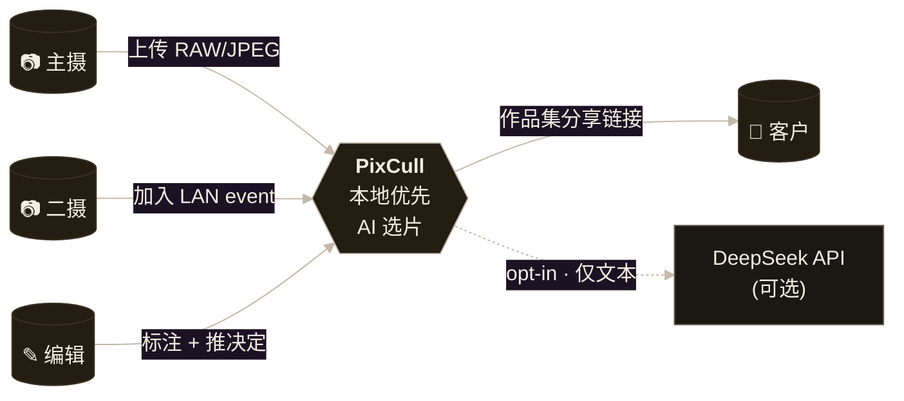

---
language:
- zh
- en
license: mit
library_name: pixcull
tags:
- photography
- photo-culling
- ai
- computer-vision
- image-classification
- rubric-scoring
- lightroom
- xmp
- local-first
- on-device-ai
- image-quality-assessment
- raw-photography
- wedding-photography
- apple-silicon
domain:
- cv
frameworks:
- pytorch
- onnx
tasks:
- image-classification
- image-quality-assessment
---

<!-- v0.9-MARKETING — brand kit hero from scripts/brand/gen_brand_svg.py.
     Absolute raw.githubusercontent.com URLs so the image still resolves
     once this README is copied into the ModelScope-side repo (which
     doesn't carry docs/brand/). -->


<!-- Animated SVG hero-reveal demo — same source path strategy. -->


[](https://github.com/ChrisChen667788/pixcull)
[](https://github.com/ChrisChen667788/pixcull/blob/main/LICENSE)


[](https://github.com/ChrisChen667788/pixcull/releases/latest)

# PixCull · 摄影师专用的本地 AI 选片工具

> **本地优先 · 6 维评分 · 风格 clone · LAN 协作 · 客户分享 QR · Lr/C1 直通**
>
> 一场 1,500 张的婚礼,人工选片要花一个晚上;PixCull 把它压缩到一杯咖啡的时间,
> 而且 *给你解释每一张为什么入选*。

完整源码 + iOS 伴侣 App + Lightroom 插件,均在 GitHub:
**[github.com/ChrisChen667788/pixcull](https://github.com/ChrisChen667788/pixcull)**

## v0.7 → v2.45 主要更新
- **v2.45**:**视频链路补进端到端冒烟**。17 条 CLI 命令里只有 4 条有链路测试,
  而 v2.42–v2.44.3 加的整块视频能力一条都没有 —— 正是审计点名的"宣传了但到不了",
  这次缺口由完成审计建议的工作自己开出。四条新测试驱动 `video → cut --render`,
  断言**成片比源片短**(等长意味着编辑被忽略、整片重编码)、删光时**拒绝出片**
  而不是产出零长文件。两次变异都精确重现了历史故障症状。CI 补装 ffmpeg,否则
  这四条会静默 skip、报绿但什么也没测。
- **v2.44.3**:**说话人分离:验证、修好,并且不许它撒谎**。适配器里那条
  `sentence_info`/`spk` 分支写了三个版本、一次没跑过。它确实能出标签,但所有段
  都是 0 号 —— 换声学差异极大的素材、显式告知人数都没用。根因在 FunASR 的聚类器:
  **少于 20 个嵌入就硬返回"所有人都是 0 号"**,在看嵌入之前。59s 对话越过门槛后
  两人分离、18/18 条标对。由于"只有一个人"和"太短分不出"输出完全相同,PixCull
  现在两种情况都报 `speaker=None`,**不报告模型从未做出的结论**。
- **v2.44.2**:**一键出片** —— `pixcull cut --render`,审片页也有"出片"按钮。
  **默认硬切,不用 reel 那半秒溶解**:按文字剪保留的常是同一句话的两半,溶解会
  从两侧吃掉时间,正好吃掉你选择保留的字。验收方式是把成片重新过 ASR:被删的字
  在音轨里确实没了,保留的完好。
- **v2.44.1**:**按文字剪进了浏览器**(见下方截图)。划掉一行,或选中行内几个字
  —— 画面跟着一起没。**按词选只在引擎给了每字真实时间时才提供**,否则插值会把
  切点放到错误的帧上。同时修好 `video_review.html` 里 32 处从未生效的 CSS 变量:
  这个页面用自己的调色板,而 v2.43 的转录面板照抄了共享 token,hover 背景一直是空的。
- **v2.44**:**中文领域词表 + 按文字剪的编辑状态模型**。通用模型把「长焦」听成
  「掌交」、「备选」听成「被选」,一个字错整条字幕就废。**88 条词表按领域知识
  先验写死**(不是照着测试集的错误补),在**从未见过的 10 句留出集**上把 CER 从
  2.59% 降到 1.11%(错误数 −57%)。编辑是叠在不可变转录上的删除区间,所以撤销
  不可能让文字和时间轴对不上。
- **v2.43.4**:**已发布的每个 wheel 里都没有 Python 代码**。sdist 白名单漏了
  `*.py`,而 `python -m build` 是**从 sdist 建 wheel**,于是九个 Release 只装了
  35 个数据文件;冒烟测试之所以绿,是因为它在仓库根目录 `import pixcull`,命中的
  是源码树。当时尚未发布 PyPI,受影响的只有直接下载 Release 的人。现在
  `tests/test_packaging.py` 会真的构建并拆开检查两个产物。
- **v2.43**:**语音转录**(`pixcull transcribe`)—— Paraformer / Whisper 走可选
  依赖,产出 `transcript.json` + SRT,审片页可点台词跳时间轴。
- **v2.42**:**镜头切分**(`pixcull[shots]`,PySceneDetect,BSD-3),reel 候选
  不再横跨硬切。
- **v2.41**:审计列为首位的**端到端冒烟**:`run → serve → export` 走真实 CLI 和
  真实 HTTP 服务;审计点名的四次故障对它全部重现为红。
- **v2.40.2**:**清掉死存根 + 新一轮设计审计**(`docs/DESIGN-AUDIT-2031Q1.md`)。
  v2.40 的守卫只看 `typer.Exit`,于是三个 V0.3 时代的 `NotImplementedError` 存根活了下来
  —— 其中 `pixcull.report.export_html` 还挂在 `__all__` 里,是**保证会崩的公开 API**。
  三个都**删掉而非实现**:各自早已被真东西取代(HTML 报告就是审片工作台;
  `scripts/bench.py` 已被 `pixcull bench` 取代)。守卫现在两种形态都盖。审计总评
  **3.9/5**(2030Q4 为 3.4),并点名了本仓库最主要的缺陷类型:**宣传了但到不了** ——
  全库检索一张没入库、视频 run 打不开、浅色主题从未生效、export 静默退出。四次都是
  "功能存在、但某条真实用户路径到不了它",而**四次都能被一条端到端冒烟提前抓到**,
  这也成了本轮首要工程建议。审计还调研了 AI 剪辑开源生态,并**以许可证为第一道闸**:
  **OpenChatCut 是 AGPL-3.0,不能并入 MIT 项目**;而 **FunClip(MIT)与
  PySceneDetect(BSD-3)可以** —— 且它们补的是已核实的缺口:`SceneDetector` 是 CLIP
  场景分类而非镜头切变检测,全栈也没有任何 ASR。
- **v2.40.1**:**入库的最后一个线性项,不靠新增文件解决**。v2.39 把这条记成"要再引入
  一个 key 索引文件,不划算"。一剖析发现那个判断把方案和问题绑死了:30 万行 manifest 上
  真正的成本不是"没有索引",而是 **`json.loads` 占了 0.720s 中的 0.525s** —— 解析了大量
  永远不可能匹配的行。去重键以 `run_id` 开头,而 `append_run` 一次只处理一个 run,所以
  别的 run 的行**在构造上就无关**;用原始字符串预筛(30 万行仅 0.013s)把它们挡在解析器
  之外。一次 2000 张入库:5 万张库 **0.159s → 0.062s**、30 万张库 **0.697s → 0.068s**,
  且**不再随库存量增长** —— 比 v2.38 在该规模快约 48×。预筛刻意做成**超集**筛,解析后
  仍复核 `run_id`,所以文件名里恰好含有该文本只会多解析一行、绝不会给出错误答案(有测试
  专门植入这样一个文件名)。退化情形(重索引一个占满全库的 run)仍是 0.708s,如实写明
  而非掩盖。详见 `docs/ROADMAP-v2.40.1-charter.md`。
- **v2.40**:**门禁不再说谎 + CLI 兑现包装上印的东西**。真模型测试原先用
  `except Exception: skip` 兜底,把"模型不在这台机器上"和"模型就在本地、加载却失败了"
  混为一谈。v2.39 那轮门禁里,这让 HF 限流悄悄停掉了三条测试 —— **其中包括 v2.34 用来
  钉住 `image_embeds ≡ get_image_features` 的那条**,而那是流水线写出的每个缓存向量唯一
  的正确性保障。现在:权重在盘上,测试就**必须跑**,并用 `HF_HUB_OFFLINE=1` 加载(网络
  因此不可能把已缓存的模型变成失败),此后任何异常都是失败而非 skip。顺着同一个问题
  ——**"绿"到底覆盖了什么** —— 新加的"任何命令都不许是无输出的 `typer.Exit(1)`"守卫,
  当场抓出两个从 V0.5 就在的静默 stub。`pixcull export` 是其一:无输出、退出 1,而包
  描述印着 "XMP/IPTC export, Lightroom & Capture One ready"。导出**是存在的**,但只在
  Web 工作台里,于是 v2.31 为 pip 用户打通的 CLI 路径走到这里就断了。现在它跑和服务端
  同一套代码 —— 用真 JPEG 实跑并**逐张回读**验证:keep→5★/Green、maybe→3★/Yellow、
  cull→1★/Red 全部往返一致。`pixcull bench` 是其二,现在报真实吞吐并换算成拍摄规模;
  而一实跑就发现它把临时样本写进了用户的跨 run 全库索引(临时目录跑完即删,那些行会
  永久变成 stale 命中)。详见 `docs/ROADMAP-v2.40-charter.md`。
- **v2.39**:**主题能就地切了 + 入库不再重写整个库**。v2.35 让独立页面**遵守**主题,
  但没有改的办法 —— 直接打开 `/library` 得先回审片工作台才能切换。控件在
  `_read_template` 一处注入成固定定位胶囊,而不是往每个页面 header 里加(其中三个
  **根本没有 header**,而"每页各自接线"正是当初十一个页面漏掉十个的原因)。循环顺序与
  存储键与工作台 toggle **逐条对齐**,并有测试钉住这两份独立实现不许漂移。一个刻意的
  例外:`/share/<run>/<token>` 仍遵守主题但**不放任何应用控件** —— 那是摄影师给客户的
  交付页,不是应用本身。后半场:`append_run` 原先要 `np.vstack` 整个索引并重写
  `vectors.npy`,实测随库存量增长 0.37s → 1.08s → **3.30s**(5 万 → 15 万 → 30 万张),
  而 v2.34 起自动入库**每挑完一次片就触发一次**,30 万张时每次重写 614MB。现在向量放在
  无头 float32 文件里、追加是 O(新增);行数记在 `meta.json`,这也正是崩溃安全的来源
  (先 fsync 向量与 manifest,最后原子替换 meta,于是残尾是惰性的而非损坏的)。同样三个
  规模:**0.159s / 0.380s / 0.697s**。剩下的线性项是 manifest 去重扫描(0.697s 里的
  0.556s),不是向量写入(0.005s)—— 如实记录,不假装已经 O(1)。详见
  `docs/ROADMAP-v2.39-charter.md`。
- **v2.38**:**给自己刚铺开的浅色主题做对比度体检**。v2.35/v2.37 把浅色铺到十几个此前
  从未渲染过浅色的页面,却没人验过这对可读性做了什么。按真实 token 现算:调色板整体
  健康 —— 两个主题下每个文字层级都过 WCAG AA —— 只有一个例外。`--muted-soft` 浅色
  **3.01:1**、深色 3.65:1,却在给 **9.5–11px 的正文**上色(时间戳、提示、输入框
  placeholder、快捷键标签);WCAG 的"大字"从 18.66px 粗体起算,所以这些字要的是完整的
  4.5:1。解方程发现:要在更深的表面上也达标,它必须几乎等于 `--muted` —— **"比 muted
  更弱的一档"在浅色下没有合规空间**。于是这成了设计判断而非调色:`--muted-soft` 从此
  只用于装饰(分隔符/chevron/圆点/边框/SVG 描边,走 3:1 非文本门槛),16 处正文改用
  `--muted`。静态分析差点漏掉关键一步:审片工作台的表面是 **OKLCH 推导**而非十六进制,
  所以又在真实浏览器里把颜色画到 canvas 上读像素复验了一遍 —— 两者一致,但这只有量过
  才知道。这一版还**回退了自己的一个优化**:把逐行 XMP 边车探测批成一次 `scandir`,
  实测两种场景都**慢 3–5%**,于是丢弃,而不是靠"在网络盘上应该会赢"这种没验过的理由
  硬留。详见 `docs/ROADMAP-v2.38-charter.md`。
- **v2.37**:**大拍摄首屏快 3 倍 + 客户看到的那张脸终于是自家的**。v2.33 的缓存只救第 2
  次起的请求,**首次打开 2 万张的拍摄仍要 8.5 秒**。剖析发现循环体每行要碰 ~58 个单元格,
  而在 pandas Series 上每次都是一趟 `Index.get_loc` 哈希查找 —— **120 万次 `Series.get()`
  占了构建的 43%**,真正干活的只占 9%。改用 `df.to_dict("records")` 后构建
  **6.59s → 1.66s**、冷开 **8.55s → 2.85s**;因为 `iterrows()` 会把 int 列悄悄升成
  float 而 `to_dict` 不会,验收标准是 20000 行 × 52 字段**逐字段 diff 完全一致**,不是秒表。
  另外,`/share/<run>/<token>` —— 摄影师**发给客户**的交付页 —— 一直跑在**第三套配色**上
  (`#0a0a1e`/`#1a1230` 紫藏青)且 `color-scheme: dark` 硬锁,主题永远进不去,看起来不像
  同一个软件;偏差审计页和副屏还停在 v2.21 之前的旧金。三个页面现已全部接入共享 tokens。
  最后一处是靠真实浏览器才揪出来的:顶部品牌栏是 `rgba(10,10,30,0.85)`,十六进制 grep
  看不见 —— 与 v2.3.1 泄漏调色板同一个失效模式,所以新的 lint 两种记法都扫。详见
  `docs/ROADMAP-v2.37-charter.md`。
- **v2.36**:**真实视频素材上台 + 挖出"CLI 挑完视频就没法看"**。原任务只是关掉 owner
  动作第 4 条(可公开视频素材):owner 授权自有 GoPro 素材,发布前逐项核过 —— GPMF
  **无 GPS 采样**、抽 38 帧过自家 `FaceDetector` 检出的 14 帧**目视全为误检**(毛领/针织
  纹样,主体全程背对镜头)、弃用有车牌+路人的婚礼车队片段、工作副本 `-map_metadata -1`
  且改中性文件名(页面只显示 `winter-sled.mp4`,不含盘名/原路径)。换掉库存素材的意义:
  旧 18/19 的 reel 候选缩略图**必须模糊成一团**才能对外,恰好把这功能最该展示的东西糊掉了。
  **而拍图时撞出一个真 bug**:`/timeline` 的 50 个缩略图全是碎图、50 个 `/thumb` 全 404 ——
  `_reload_run_from_disk` 要求 `manifest.json` 或 `input/` 至少有一个,而 `pixcull video`
  两个都不产出(帧在 `video_frames/` 里),于是**视频 run 根本没被 reload**;叠加
  `_resolve_image_source` 同样不查 scores.csv 的 `path` 列(与 v2.34 那个 bug **同一根因**)。
  现在用 scores.csv 作为"这是一个 run"的标志、兼容两种输出布局,并按 mtime 缓存路径表
  (该函数是**每张缩略图调一次**的)。复验缩略图 **50/50 加载、4xx/5xx = 0**;9 条新测试
  做了变异验证。详见 `docs/ROADMAP-v2.36-charter.md`。
- **v2.35**:**近重复分组不再每点一次重算 + 浅色主题第一次真的全站可用**。两项都带着
  方案上路,**两个方案都被测量推翻**。近重复原计划"按时间窗剪枝"——错的:这个分组存在
  的全部理由就是抓 `cluster_bursts` 因为**时间不相邻**而漏掉的近重复;而真实成本也不在
  流水线,而在一个**逐请求**处理器上,`threshold` 还能被用户拖动 —— 滑杆每动一次整个
  O(N²) 重付。剖析出的意外:`np.nonzero` 几乎和 matmul 一样贵(20k 时 1.15s vs 1.35s,
  因为要走完全部 N² 个布尔值),而人人都会怀疑的 Python 循环只占 0.01s。改成只算上三角
  (旧代码每对算两遍、**付过钱之后**才丢一半):20k **2.69s → 1.50s**、50k
  **14.7s → 7.7s**,且分组逐组完全一致;再按向量文件 mtime 缓存,重复请求直接免费。
  主题这边,真实浏览器逐页量下来问题比"没人设 data-theme"更大:有 5 个页面**从未注入
  共享 tokens**,因为它们的模块常量在 `_DESIGN_TOKENS_CSS` 定义**之前**就构建了,
  `.replace` 会 NameError、于是当年根本没写 —— 它们整个错过了 v2.21 改版,浅色规则在
  那些页面上压根不存在。现在两个注入都收进 `_read_template` 一处,9 条路由 × 2 种偏好
  全绿。详见 `docs/ROADMAP-v2.35-charter.md`。
- **v2.34**:**全库检索终于"开箱即用"**。原任务是"跑完自动入库",查下去发现 v2.32 的
  全库检索**对真实 CLI 用户怎么跑都是空的**:流水线从不写 `embeddings.npz`(只在你对
  某次拍摄搜过一次时才懒生成),而路径解析只查 `manifest.json` 和 `input/` 目录,
  **从不查 scores.csv 自己的 `path` 列** —— 偏偏那是 `pixcull run` 唯一会产出的来源。
  于是 `pixcull library index` 报 "nothing resolvable",一张都没入库。两个都修了,
  而且第一个修起来是**免费的**:scene 检测本来就对每张照片跑完整 CLIP 前向,而这个
  前向要算出 `logits_per_image`,必须先把图像塔投影并 L2 归一化 —— `out.image_embeds`
  **就是**语义搜索原本要重编码整批才能拿到的那个 512 维向量(与 `get_image_features`
  实测 cos = **1.000000**,并用真模型测试钉住)。现在流水线**零额外推理成本**把它落盘,
  连带让某次拍摄的首次语义搜索不再重编码。挑完片自动把这次拍摄归入全库 —— 默认开启,
  因为"搜所有拍摄"就是这个页面的全部意义;索引只落 `~/.pixcull/library/`、从不同步,
  `PIXCULL_NO_AUTO_INDEX=1` 可关。详见 `docs/ROADMAP-v2.34-charter.md`。
- **v2.33**:**大拍摄不再每次请求都重渲染一遍**。这一版先**推翻了自己的路线图**:设计
  审计预判大 run 的瓶颈在 DOM,但 20,000 行实测只有 700 个占位符节点 / 7,362 总节点 /
  30MB 堆 —— v2.18 的分片水合早就兜住了。真瓶颈在服务端:`_build_results()`
  **每个请求**都重新解析整个 CSV、重新合并标注、重新推导 6 轴 rubric,而一次页面加载
  要调它 5 次以上。按它仅读的两个输入文件的 mtime 做缓存后,页面 **6.2s → 0.055s**、
  每个水合分片 **6.3s → 0.045s**(~140 倍);冷启动不变,因为 CSV 总得解析一次。失效
  沿用 `_JSONL_CACHE` 已有的纪律 —— 重新打分或存一条标注会改 mtime,**写入方不需要
  知道缓存存在**。功夫花在正确性上:缓存对象是按引用交出的,因此 18 个调用点和所有
  下游函数都用 AST 核过是只读(契约已写进注释);9 条回归测试做了**变异验证** ——
  把标注 mtime 从键里抹掉,恰好且仅有两条失效测试变红。详见
  `docs/ROADMAP-v2.33-charter.md`。
- **v2.32**:**跨 run 全库检索** —— 单 run 语义搜索回答"这次拍摄里那张逆光的在哪",
  新的 `/library` 页面 + `pixcull library` 命令回答"**我所有拍摄里**那张在哪"。架构由
  实测驱动:**不用 ANN**(brute-force 10 万张 8ms、百万张 34.5ms,仍只是每次必付的
  CLIP 编码 17.4ms 的 ~2 倍;先撞的墙是内存不是速度,未来优化方向是压缩,纯 numpy 也
  守住零编译依赖的 pip install)· 单一 vectors.npy + mmap 打开 18ms(逐 npz 堆叠要
  174ms)· 建索引**复用各 run 已有的向量缓存**(搬运而非重编码),按
  `(run_id, filename, mtime)` 幂等 · **存活性一等公民**:文件不在盘上的命中标记 stale
  而非静默丢弃(外置盘拔了,该说"找到了但不可达")· 结果按拍摄分组并可跳回原 run ·
  索引含真实路径,只落 `~/.pixcull/library/`。详见 `docs/ROADMAP-v2.32-charter.md`。
- **v2.31**:**打包 `pixcull serve`** —— pip 用户终于能开审片工作台(此前只能 git clone)。

- **v2.29**:**毛玻璃系统落地(按审计判定:范围采纳)** —— 散布全 UI 的 ~30 处
  ad-hoc `backdrop-filter`(blur 2/4/6/8/10/12/20px、saturate 140/180% 各写各的)收敛成
  **一种 token 化材质**:`--glass-filter`(blur 16px · saturate 130%——从会"霓虹震动"的
  180% 回撤,与 Apple 2026 收敛 Liquid Glass 同向)做磨砂面板、`--glass-scrim-filter`
  (blur 4px)做模态幕布、`--glass-edge` 顶部 1px 高光做玻璃边(暗色 8% 白/亮色 65%)。
  7 面板 + 7 幕布收敛;其中 3 个面板(比较头/RGB 读数/键位表)**原底色不透明、旧模糊
  一直是静默 no-op**——改半透明 chrome 膜后玻璃才真实生效。3 处照片上的微玻璃刻意保留
  不 token 化(已复核 keeps)。全系统接 `prefers-reduced-transparency`(此前全仓为零
  兜底),新 lint 禁止任何裸 `backdrop-filter:` 声明防材质再碎片化。照片判读面零改动
  ——Studio Neutral 判色纪律不破。详见 `docs/ROADMAP-v2.29-charter.md`。
- **DESIGN-AUDIT 2030Q4**:**v2.21–v2.28 收口复检 + 毛玻璃方向定案** —— 总评
  **3.4/5(Q3 3.1)**,五维度全上移(UX 3.9、智能 3.6、触达+发布 2.4→2.9、架构+性能
  3.2→3.6),触达仍被 owner 动作卡住。对 owner 亲点的毛玻璃(glassmorphism)方向给出
  **范围采纳**判定:代码已有 ~30 处 ad-hoc `backdrop-filter`(值零散)+ 零
  `prefers-reduced-transparency` 兜底,所以应把玻璃**系统化**成 token 化、可访问的层,
  只用在 chrome/面板/浮层/模态,**绝不用在照片周围/缩略图垫层**(否则破坏 v2.21 Studio
  Neutral 判色纪律;连 Apple 2026 都为可读性回收了 Liquid Glass 透明度)。v2.29 候选:
  毛玻璃系统 · results.js 模块化 · 打包 `pixcull serve` · 近重复 CLIP 折叠。详见
  `docs/DESIGN-AUDIT-2030Q4.md`。
- **v2.28**:**serve_demo 内联 HTML 抽取(v2.27 暂缓项,做对)** —— v2.27 评估后暂缓,
  本轮在**字节级路由验证网**下落地:抓取每条路由抽取前的渲染字节 → 抽取 → 重启 →
  抓取后字节 → `diff` 必须空。3 个干净静态壳型处理器抽到 `templates/pages/*.html`:
  `_serve_tether_page`(纯静态 219 行)、`_serve_history_page`、`_serve_disagreement_page`
  (静态壳 + 少数占位符注入)。模板用**源码块 eval 法**机械生成(动态操作数换占位符
  字面量再求值,零手抄)。**serve_demo.py 12,909→12,518 行**,3 条路由抽取后字节完全一致。
  另 3 个处理器(`_render_share_html`/`_serve_bias_audit_page`/`_serve_companion_page`)
  **刻意留 inline**——重 f-string 交织(多达 ~40 处插值),抽成模板反而更难读,且其动态
  路径(如 bias 内联 annotator-chip 生成器)从空态路由无法字节验证。理由已写进 CLAUDE.md。
  详见 `docs/ROADMAP-v2.28-charter.md`。
- **v2.27**:**results.css 继续模块化** —— 承接 v2.22 的 `@@CSS:` 拼接基建,再抽 5 个
  内聚块出巨石:card(557 行)· modal(283)· chips(1398,统一 chip 系统+legacy)·
  marquee(183)· library-panel(142)。**results.css 4,812→2,268 行**(原始 5,797;
  累计 7 个 CSS 模块),产物字节级一致(hash 不变)、标记纪律+括号平衡受 lint。
  serve_demo 剩余 6 个内联 HTML 方法(`_render_share_html` 等)经评估暂缓:不同于
  v2.16 抽的静态页,这些是重 f-string 插值的动态处理器(每个 15-55 处插值),安全
  抽取需动态模板化 + 真实数据夹具做路由字节验证,是独立高风险切片,不宜混入低风险
  CSS 重构未验证硬做。详见 `docs/ROADMAP-v2.27-charter.md`。
- **v2.26**:**真去物化:卡片 DOM 与 run 大小解耦** —— v2.24 限住了已解码图片内存,
  这一刀再限住**卡片 DOM 节点数**,补齐窗口化虚拟滚动。P-UX-18 只物化不回收——滚一遍
  10k 婚礼会攒出 ~10k 张卡的 DOM。现在卡片远离视口 >5 屏(相对 ~200% 物化边距有 300%
  迟滞防抖动)就拆回占位符,回到附近再重物化。正确性关键:重物化**从当前 row 重建**
  (`renderCard(segRows[idx])` 而非冻结字符串),所以去物化期间做的判定改动不丢——
  rows[] 是判定的真相源。600 行实测:滚遍全部 600 行卡数仍只 **172**(不是 600),回顶
  恢复 100,顺序/文件名正确、零 JS 错误;culling 一张滚走再回来仍是 cull。v2.24 + v2.26
  一起:图片内存和 DOM 节点数都与 run 大小解耦。详见 `docs/ROADMAP-v2.26-charter.md`。
- **v2.25**:**n 路 A/B 比较:一次比 3-5 张近似片,不止两两** —— compare modal
  本已是 n 格,但自由配对入口选到第 2 张就立即开图,一个 pro 要比 4-5 张跨连拍组
  的近似片得做多轮两两(Q3 审计 UX 缺口)。现在选片**累积成集**:每次点选 toggle
  进/出,托盘显示计数 + **比较 (N)** 按钮,回车/点按钮把整集在一个 n 格比较里打开
  (Esc 清空);lightbox `c` 键保留快速 1:1-核对-配对流。8 个新 locale 键把托盘/
  toast 接进 `_t()`,顺手把 compare modal 标题/说明也接了(之前硬编码中文)。实测:
  点 3 张 → "Compare 3" → 3 格 modal;再点一张 toggle 移除。详见 `docs/ROADMAP-v2.25-charter.md`。
- **v2.24**:**图片内存虚拟化:已解码缩略图恒定** —— P-UX-18 只限住大 run 的
  首屏卡片 DOM,但卡片一旦物化,它的缩略图就永久驻留——把 10k 婚礼滚到底就把
  10k 张 JPEG 解码进内存(`loading="lazy"` 只延迟首次加载、从不回收)。第二个
  IntersectionObserver 现在把已解码缩略图限制在视口窗口内:卡片远离 >3 屏就
  **停靠**其 ``(src→data-parked-src、清空 src,浏览器回收解码),回到附近
  再恢复。卡片元素、决策徽章、键盘索引、焦点全不动——只切 ``,
  `.thumb-wrap` 的 aspect-ratio 撑住布局、滚动条不跳。600 行实测:物化卡片从
  100 涨到 352 时,**已加载缩略图恒定在 ~48-76**(已停靠涨到 276)——图片内存
  与 run 大小解耦,且刻意不碰脆弱的决策/渲染路径。详见 `docs/ROADMAP-v2.24-charter.md`。
- **v2.23**:**`pip install pixcull` 铺轨 + 审计队列收尾** —— 三线并进:
  **PyPI 发行轨**(元数据 PyPI 就绪 + 专用 README-PYPI;13 个 locale JSON 补进
  wheel——运行时加载,缺了 `_t()` 回退键名;`twine check` wheel+sdist 双过;
  release.yml 加 token-gated PyPI 发布步骤,配好 `PYPI_API_TOKEN` 后 v* tag
  自动上 PyPI,未配则干净跳过)· **英文首跑**(非中文浏览器首访不再被强制中文:
  `navigator.language` 探测 + 与服务端一致的归一化,语言循环 3→13 + 阿语 RTL,
  onboarding 首卡走 `_t()` 全语言;实测 en-US 启动即英文)· **Shadow-queue 解锁**
  (shadow rescorer 的模型↔规则分歧——每 run 算出却从未接入——现在有「⚖ 异议复核」
  按钮,进队列按最有把握分歧优先排序,判定直接写纠正集;翻 adjudicate 仍
  owner-gated,本轮先把收集分歧标注的流打通)。详见 `docs/ROADMAP-v2.23-charter.md`。
- **v2.22**:**审计队列三连落地 + gallery 换新皮肤** —— 2030Q3 审计排的三个主题
  一轮做完:**i18n 收口**(v2.15 收尾闭环 9 条文案终于会说 13 种语言,9 新键 ×
  13 locale 母语级翻译;顺手修掉一个会让整个修复失效的启动时序 bug——动态串在
  locale 异步拉取前渲染、事后无人重建;删除出生即惰性的 20-undo-stack 死模块)·
  **发布轨道**(tag 触发 release.yml:build wheel + 干净 venv 烟测 + GitHub
  Release,零外部 secret;sync-modelscope 缺 secret 改安静跳过不再每推必红;
  pixcull.spec 版本从 pyproject 单源读取;版本推进 2.22.0)· **CSS 拆分**
  (`_assemble_css()` 与 JS 侧同契约,tokens.css 370 行 + lightbox.css 651 行
  首批出仓,产物字节级一致)· **gallery 用 Studio Neutral 新皮肤重摄**(从
  源盘重建真实博物馆文物 run,01–17/20–22 全部换新;18/19 视频两张待 owner
  批准的素材后补)。详见 `docs/ROADMAP-v2.22-charter.md`。
- **v2.21**:**「Studio Neutral 中性影室」调研驱动的设计全面翻新** —— 先做 6 视角
  全网调研(Narrative Select / Aftershoot / Imagen / FilterPixel / Lightroom /
  Capture One + Linear/Raycast 级工具设计 + 暗色 UI 色彩科学),拿到一个硬结论:
  **暖色环境会系统性扭曲照片判色**(ISO 3664 观片环境标准;头部工具全部用中性灰,
  旧浓缩咖啡棕是业内孤例)。整个 UI 迁移到无彩影室灰梯(#161616→#1d1d1d→#242424,
  OKLCH c=0),品牌暖意收缩为**一道香槟金**(#d5b584,彩度 3× 旧黄铜)专用于
  选中/焦点/CTA;v2.3 双 bezel 装饰卡退役,照片占满卡面 + 发丝线;每卡琥珀
  「待审」环降为耳语级;分数改等宽数字;运动回归扁平 ease(弹簧只留签名时刻);
  半径收紧到 pro 档。全仓色板迁移 ~430 处、24 个文件(含视频页潜伏的蓝灰小色板
  与 3 个顺手捡出的潜伏 bug)。亮暗双主题保留,亮色变中性纸。gallery 截图仍是
  旧皮肤,重摄已排队。详见 `docs/ROADMAP-v2.21-design-charter.md`。
- **DESIGN-AUDIT 2030Q3**:**七版收口后的全局复检** —— 5 视角真读代码重新打分:
  **总评 3.1/5(Q2:3.0)**——核心 UX 3.5→3.8、智能 3.1→3.5、架构 2.5→3.2、触达
  2.5→2.8,新增「发布与 CI 卫生」视角 2.0(v0.7.0 之后无 tag、无 Release、无已
  发布产物)。最扎心的纯代码发现:v2.15 收尾闭环(Q2 钦点短板的修复)9 条文案
  硬编码中文、绕过 13 语言 `_t()` 基建,对非中文用户不可见。产出 4 个排序过的
  v2.21 候选主题(i18n 收口 / 发布轨道 / 英文首跑 / CSS 模块化)+ owner 专属
  解锁清单。详见 `docs/DESIGN-AUDIT-2030Q3.md`。
- **v2.20**:**视频主题闭环收官 + 三尾巴** —— reel 的 why 会提重叠的音频事件(现场
  笑声/掌声/配乐律动);审片页 Keep/Cull 从 localStorage-only 升级为**服务端持久化 +
  学习口味档案**(keep−cull 信号对比、≥20 条真实决议激活、排名倾斜 cap ±15%),
  `pixcull reel` 下次运行即按你的口味排——视频侧终于像照片侧一样会学。尾巴:逐轴
  why-low 接真信号(闭眼/连拍非峰值/微笑强度/CLIP-IQA·LAION 分)、Lr 同步刷新恢复
  滚动+聚焦、⌘K 面板成为第 29 个受边界 lint 的模块。详见 `docs/ROADMAP-v2.20-charter.md`。
- **v2.19**:**音频事件上时间线 + 首个可发行产物** —— v2.1 就学出的笑声/掌声/音乐事件
  终于画出来:/video 审片页与 lightbox scrubber 双时间线底部事件车道(按类着色 + emoji
  标签 + 区间/置信 tooltip),数据随 /video/data 与 PAYLOAD.video 附带、缺失优雅隐藏;
  发行主题落第一步:**`make wheel`** 一条命令出经过验证的 pixcull-2.19.0 wheel(模板/
  校准数据全打包、entry point 完好、干净 venv 烟测通过、版本单源化+一致性守卫)——
  发 PyPI/GitHub Release 只剩 owner 一条命令。详见 `docs/ROADMAP-v2.19-charter.md`。
- **v2.18**:**5k 性能债还清:渐进水合** —— v0.13.5 建好的 /rows 分页端点终于接上前端:
  大 run 只内联首片(默认 800 行),页面后台分片水合进同一个 rows 数组,进度 chip 实时
  显示、完成后全量重建侧栏+网格、失败诚实降级;summary/聚类仍按全量算,首屏计数即正确。
  实测 2500 行 run **HTML 6.45MB→2.53MB(−60%)**、终态全卡渲染零 JS 错误。顺手捡出一个
  潜伏路由遮蔽(iOS 瘦身 rows 别名把全字段端点挡了两个大版本)——水合走新的
  `/results_rows/`(路由表加一行),别名原样保留。详见 `docs/ROADMAP-v2.18-charter.md`。
- **v2.17**:**玻璃盒到达视频侧** —— 照片自 v2.9 起有逐轴「为什么低」,reel 候选却只有
  一个分数。现在每个候选带**逐窗子信号分解**(运镜/稳定=窗口均值、峰值=窗口 max)+
  确定性 **why-low 话术**(「运镜平稳度拖分:0.32,低于全片中位 0.78」)——生成时从窗口
  自身信号算出、零新模型;审片面板渲染三条 mini-bar + 琥珀 why-low,旧 run JSON 优雅
  降级。与照片侧 `_axisWhyLow` 同一契约。详见 `docs/ROADMAP-v2.17-charter.md`。

- **v2.16**:**偿还巨石债·第一刀** —— 审计首推主题(v2.4 承诺、拖了 11 个版本):
  serve_demo.py 里 7 个内联 HTML 页面巨块(~5,300 行 Python 字符串)抽成
  `templates/pages/*.html` 真文件(AST 求值抽取、共享 design-tokens CSS 占位符回注),
  **18,225 → 12,884 行(−29%)**;重构唯一验收标准:**7 条路由响应前后字节级一致**
  (curl-diff)+ 模板守卫测试 · **第二刀:results.js 模块化**——尾部 8 个自洽子系统
  (undo 栈/Selects/收藏/书签/框选/WebRTC/onboarding,802 行)抽到 `src/modules/*.js`,
  构建时 `@@MODULE:` 标记原位回拼、**产物 hash 不变**,并加**机器化边界 lint**(模块=
  单条自包含 IIFE、模块间只准走 `window.PixCull*`)——把 v2.13「一处破九处炸」的传播
  路径截断一段 · **第三/四刀**:中部 20 个子系统(多 tab 同步/confidence modal/EXIF overlay/tour 等)同法抽完——共 **28 模块/2,160 行**出闭包,主体降到 9.6k;do_GET 的 258 行 if/elif(65 路径)改**声明式路由表**(31 精确+30 有序前缀+5 手写特例),31 条路由 sweep 验证 28 条字节级一致、3 条动态同型——加端点从此是加一行表项。详见 `docs/ROADMAP-v2.16-charter.md`。
- **v2.15**:**culling 终于有了「审完」的终点线** —— 工作条新增实时**「待审 N」**计数
  (还没人工确认判定的照片数;重按确认也计入),归零翻成**「全部已审 ✓ · 导出 XMP」**
  完成 chip,一键触发此前埋在 ⌘K 里的 XMP 导出,刷新不丢;新增**「◐ 决议 maybe」**
  一键进入决议队列(只看 maybe、按 |P(keep)−0.5| **最拿不准优先**排序、焦点直接落在
  最难那张),maybe 清零自动退出并还原你的筛选;这条队列产出的 keep↔maybe 人工改判
  正是 v2.14 门③缺的纠正标签——UX 与训练回路闭环。顺手修掉批量框选只改 DOM 不改
  状态的潜伏 bug。详见 `docs/ROADMAP-v2.15-charter.md`。
- **v2.14**:**真实标注 + 激活智能栈:把 moment 轴去 stub,让它真能被学到** —— 审计
  (`docs/DESIGN-AUDIT-2030Q2.md`,3/5)发现产品最响亮的「决定性瞬间」轴在融合里对**每张
  照片恒等于 0.5**、rubric 三个 check 有两个永远返回 None。常数特征零信息 → rescorer
  **永远学不动这条轴**。现在有真信号时写真值(wedding moment 置信度 / 人脸微笑·睁眼),
  无信号时保留中性(风光不变);`emotion_present` 用 wedding 置信度+人脸微笑 blendshape 评估、
  `action_at_peak` 接连拍峰值排名器(真连拍加冕的那帧=捕捉到的动作峰值,单张诚实不评)——
  曾经恒定的 moment 轴终于是可学习的非退化特征。端到端 A/B
  回归**揪出一个 NaN→1.0 的真 bug**(pandas 把 None 转成 NaN、绕过 `is None` 检查,把
  score_final clamp 成 1.0 = 每张无信号照片恒 keep)——已修 + 加守卫测试。400 样本真实
  标注训练 + 翻到 adjudicate 由 owner 把关(伪造标注会毒化模型——RESCORER-V3 的教训)。
  · 并接入**轴级个性化**:累计 ≥50 条纠正后,融合的逐轴权重会**倾斜**到你真正看重的轴
  (重视构图的人,构图强的片子提分、弱的降级),而非只是全局阈值微移——夹紧在温和的
  ±2× 内、无 profile 时完全不变(默认用户字节级一致,A/B 回归已验)· 新增**航拍主题**:
  DJI/无人机素材按相机**机型码**(DJI `FC####`;Mavic 2 Pro/3 的哈苏 `L1D-20c`/`L2D-20c`)
  确定性识别——只匹配机型不匹配 Make,避开真·哈苏中画幅——并兜底认 `DJI_` 文件名;非无人机
  照零扰动(16 张实拍航拍→aerial、10 张佳能字节级不变)。详见 `docs/ROADMAP-v2.14-charter.md`。
- **v2.13**:**「抓图卡死」根因推翻 + 侧栏控件重建一致性** —— v2.12 那套「body 不
  送达无头 chromium」诊断**是错的**:真因是相似度**滑块从不挂载**(`render()` 只重绘
  网格、不重建侧栏 `#viewToggles`,折叠开启后没人调 `buildViewToggles()`;真浏览器也
  复现)· 修掉后一轮对抗式 review 把**同类 bug** 一网打尽:预设恢复 / ⌘K 重置 /
  「重置所有筛选」/ 收藏恢复 都让侧栏药丸 active 错乱(「重置所有筛选」更是**没清
  face/location/burst,网格被静默继续过滤**;收藏恢复的 `window.render()` 是死 no-op、
  根本没重渲染)· **Selects 模式(⌘1)同款死 no-op,且 keep+maybe 过滤从未接进
  render(),整个失效**(此前只弹 toast、网格纹丝不动),现真过滤 + brass 提示条 ·
  另修防抖闭包写脏 + 脱离节点守卫,抽出 `_rebuildFilterControls()` 统一同步(详见
  `docs/ROADMAP-v2.13-charter.md`)
- **v2.12**:**解释再深一层 + 本地发现率埋点** —— 判定 glass box 不止点名最弱轴,
  还说**它为什么低**(从该行自身信号映射:「光线偏低 · 高光过曝 12%」「构图偏低 ·
  地平线倾斜 5°」「主体偏低 · 无明确主体」)· 透明度功能加**纯本地**使用计数
  (`localStorage.pixcull_metrics`,零外发),看这些功能到底有没有被用到
- **v2.11**:**透明度的可发现性 + 解释深化** —— 近重复折叠 + 🎬 时序场景 原来埋在
  默认隐藏的「连拍」侧栏组里(无连拍的 run 整组消失、入口找不到),现迁到**常显的
  「整理 · 折叠」组**,每个 run 都看得到(顺带修好自 v2.9 起作用域写错、一直没样式
  的相似度滑块)· 首次进入用一次性 **coachmark** 介绍透明度三件套 · 判定 glass box
  的一句话理由升级为**逐轴驱动**(「构图 4.8★ 撑分,光线 2.5★ 拖后腿」,取自 rubric)
- **v2.10**:v2.9 透明切片的打磨 —— **Scenes 网格内联分段 header**(时序、每段
  一个 header,不止顶部导航条;小批量 ≤200 张走内联,更大保留导航条)· **人脸
  Close-up 点击在主图上定位**(脉冲框把裁切映射回全幅画面)
- **v2.9**:**智能透明 + 内容优先观看**(承接 v2.8 反思搁置的竞品模式) —
  **相似度滑块**把近重复折叠从固定阈值黑箱变玻璃箱(拖 0.80–0.99 实时重组,
  对标 Peakto)· lightbox **人脸 Close-ups 轨**显示每张脸的放大裁切,无需手动
  放大就看清表情/闭眼(对标 Narrative Select)· **Scenes** 按拍摄时间自适应
  切段(median+MAD)成时序叙事 · **判定 glass box** 让 inspector 默认只显一行
  「为什么是这个判定」,逐轴细节折进一键展开(渐进披露)
- **v2.8**:UI/UX **减法重构 + 配色系统** — 网格去徽章墙 · 决策徽章**描边化**
  · lightbox **可发现的 zen 切换**(`i` 键 / 按钮全宽看图)· 顶栏 + 工具栏渐进
  披露 / 分组 · 调色板升级为 **OKLCH 三变量系统**(base/accent/contrast →
  relative-color 派生层级 + 旧浏览器 hex fallback)· 两处 lightbox **卡死**根因
  修复(对标 Linear / Narrative Select 克制美学)
- **v2.7**:四个智能切片 — **双语 reel 字幕**(中英,按 locale 显示)·
  **跨拍摄去重**(`pixcull dedup-across`,跨场次复现的同一帧)· **视频重复帧
  裁剪**(`pixcull trim-dupes`,dHash 近静止段)· **自托管 VLM ONNX**(BLIP →
  onnxruntime,真机导出字幕与 transformers 一致,推理不需 transformers)
- **v2.6**:CLIP **视觉近重复折叠**(跨连拍时间的"重拍同构图"也能折成一张代表
  + ≈N 并排比较)· lightbox 卡死 + 缩略图饥饿冻结修复
- **v2.5**:单文件前端拆为**构建产物** · **联系表 / 客户样片 PDF 导出**
- **v2.4**:从纠正中学习的**个性化阈值** · 键盘优先选片闭环 · **自然语言语义
  搜索**(CLIP)· 音频阈值校准(笑声召回 0.25→0.85)· 连拍**折叠成堆** + ⧉N ·
  真 **VLM 最佳帧字幕**(opt-in BLIP)
- **v2.0–v2.3**:**视频审片 + reel 选段流水线**(时序评分 / shake-blur / 音频
  事件标注 / GoPro·DJI GPMF / reel 自动拼装 + 导出预置)· editorial-warm 重塑
- **v1.0**:学习**重打分器** · **偏见审计 dashboard** · 每轴**归因热力图**
- **v0.9**:全产品 signature soft-bounce 动效 · `/results` 2 秒
  hero reveal · brand identity 重做(渐变 + 新 logo + Charter serif accent)
  · ⌘K 命令面板(27 actions + fuzzy match)
- **v0.8**:i18n 中 / EN / 日 · LAN 协作(token + 5s 增量同步 + 冲突标记)
  · 风格 clone V2(CLIP 嵌入中心)· 短链 + 二维码 · 结构化 CSV/JSON 导出
- **v0.7**:A/B 比较窗 / Annotation modal 重设计 · 5k+ 稳定性
  · Loupe RGB 像素读数 · Inspector mobile bottom-sheet · 视图预设 v2
  · `/share/<run>/<token>` 客户分享页 · 风格 clone V1 · tethered live ·
  `/history` 时间线

## 实机截图(2022 Canon EOS 卡 200 张连续帧)

> **真机数据**: `/Volumes/<drive>/100CANON/3J0A8133.JPG`–`3J0A8332.JPG`
> 连续 200 张(海岸 / 风光 / 建筑 / 纪实混合)。完整 pipeline 跑完:
> keep 104 · maybe 1 · cull 95 · 178 个连拍组。下面所有截图都是
> 这一个真机 run(`/tmp/pixcull_demo/realdemo01/`)的实时页面,
> 不是 mockup 或空模板。
>
> **新手 0→1 操作指南** (20 分钟跟着步骤跑完): 见 GitHub repo 下
> [`docs/USER-GUIDE.md`](https://github.com/ChrisChen667788/pixcull/blob/main/docs/USER-GUIDE.md)
> — 每个核心功能都配真机截图 + 键鼠快捷键。

### 主界面 · 选片网格


每张照片显示决策标签(keep / maybe / cull)、综合分、6 维星级、检测到的场景
+ 风格 chips、AI 建议要点。左侧色条表示决策(绿=keep / 黄=maybe / 红=cull)。
"标注" 按钮悬停可见,直接进入 rubric 详细打分。

### 🗣 转录 + 按文字剪(v2.43 – v2.44.2)


台词排在画面旁边,**点一行跳到那一秒**;点 ✂ 划掉整行,或选中行内几个字
只删这几个字 —— 画面跟着文字一起没,读数实时显示还剩多少。撤销/重做重放
操作日志,文字与时间轴不可能对不上。可导出 CMX-3600 EDL 进 Premiere /
Resolve,或按**出片**直接得到剪好的 mp4。

中文识别带 88 条领域词表(机位 / 曝光 / 备选 / 长焦 / 接亲 / 证婚人 …),
`--hotword` 还能加场地名、新人姓名;`--speakers` 可标注谁在说话。

> 上图为合成素材(ffmpeg 测试图 + macOS TTS 念现场指令),不涉及真实拍摄素材。

### 大图窗 · V20 建议信封 + 1:1 焦点检查


点任意缩略图打开大图窗。右侧信息面板显示:每维星级 + 自动/模型/VLM/人工 4 路对比、
DeepSeek meta-judge 推理、V5.2 摄影正典引用的优点 / 缺点 / 改进建议、类似照片快速跳转、
sticky 决策工具栏(keep / maybe / cull / 撤销)、cull 原因分类选择器。

### A/B 自选对比 · 同步 1:1 缩放


在两张照片上点 ⇆ 按钮(或 Shift+点击 缩略图)进入并排比较;
点任一图同步 1:1 放大,拖动同步平移,滚轮同步细调缩放。
专为 "近似帧二选一" 设计 —— 婚礼连拍、野生动物相邻帧、
风光素材的稳定 vs 动感选择,都是这个场景的高频需求。

### 批量上传 · 30 秒得到全 batch verdict


拖一个文件夹进来 → 选 vertical(婚礼/野生/风光/...)→ AI 自动跑完 →
verdict + XMP sidecar + 独立 HTML 相册 + iOS 同步可选。

### Cmd+K 命令面板 · 27 actions × fuzzy match(v0.9-P0-4)


Linear / Raycast 风格。⌘K 任何地方都能召出;7 个 group / 27 个
action;fuzzy 匹配 < 50ms;最近使用 chunk 置顶。

### 客户作品集分享(v0.9-P0-5)


`/share/<run>/<token>` 不再是"软件交付页",像摄影师的作品集:
brand mark · serif 渐变主标题 · 3 块 keynum(提交/入选/入选率)·
章节式 grid。响应式从 iPhone 竖屏到 iPad 横屏一套布局。

### 历史时间线(v0.7-P2-4)


每场拍摄是一张卡。决策分布条 + 最高分 keep 缩略图。点击 →
回到 grid 接着选片。

### Tether 实时(v0.7-P2-2)


监控 Lr / C1 tether 目录,新 RAW 落盘 → ~2 秒得到 verdict。
婚礼现场 in-camera 工作流。

### 管理面板 perf 数据表(v0.9-P2-2)


`/admin/perf` 是 first-class 数据表:点表头排序 · 拖拽重排列 ·
toggle 可见性 · 粘性表头 · zebra rows · 缓存列按大小着色 chip。
布局偏好 localStorage 持久化。

### Light theme V2 · 暖色 sand-cream 调色板(v0.9-P2-1)


Sand-cream 调色 + 暖 burnt-sienna 阴影 + display weight 加重
(700 / 600 / 450)。Light 不是"反转暗主题"的副产品,而是
editorial-paper 质感。

### iPad 大图窗 · Apple Photos 手势(v0.9-P1-5)


Apple Photos 风格全套手势:1 指水平 swipe 切上一张/下一张,1 指
向下 swipe 关闭,2 指 pinch 缩放,tap 切 fit↔1:1。Vanilla
TouchEvent 实现,无第三方手势库。

### 10 个 empty-state SVG(v0.9-P2-3)


横跨 v0.4 + v0.9 + v0.10 所有空界面统一治理。Editorial line
线稿 + 每张唯一一处 brand-gradient 强调。后续 Phase B 将由真人
插画师重画(详见 design-system/briefs/02-illustration-brief.md)。

### 响应式移动端(v0.6,P-UX-17)


### Marquee 框选 + 批量工具栏(v0.11-P1-2)


网格空白处拖矩形 → 框选所有相交的卡;松手底部弹出
Keep/Maybe/Cull/入桶/取消 工具栏。`⌘A` 全选,`Esc` 取消。
Lightroom Library 标杆体验。

### 偏差审计 dashboard(v0.13-P0-4)


`/admin/bias` 汇总所有 run 的标注,按 scene / time-of-day /
aperture 分桶。红色高亮偏离均值 > 1.5σ 的桶,提示
"rescorer 在 *XXX* 上 cull rate 过严"。24h 缓存;
`/admin/bias.md` 导出 markdown 给客户做透明审计交付。
真机 demo run 还没积累标注,故显示 empty-state。

### 置信度弹窗(v0.13-P0-3)


`score_final ∈ [0.45, 0.55]` 临界卡,鼠标悬停弹出小 popover:
"62% sure · 同组邻居高 0.04 · 最弱轴 · light 2.5★"。
可"不再显示"per-run 关闭。

### 像素级 attribution heatmap(v0.13-P0-1)


Lightbox 按 `A` 弹 6 轴选择条 → 点轴名 → 该轴的 Integrated
Gradients 显著度图叠在原图(0.5 alpha,espresso→brass 暖色渐变)。
Heatmap PNG 缓存到 `output/attribution/<axis>/<sha>.png`。

### 🎬 视频审片 · 时间线 scrubber V2(v2.0-P0-4)


`pixcull video <片子.mp4>` 抽关键帧 → 跑 6 轴评分 → 加时间维评分
(`score_temporal` = 动作连续性 + 时间稳定性 + 突发峰值)→ 找 reel
候选,然后 `/video/<run_id>` 视频原生审片:时间轴画每帧
`score_temporal` 山峰 + 候选暖色带,拖动播放头实时切帧,`J/K/L`
倒退/暂停/前进(DaVinci 式),右栏候选像照片一样 Keep / Cull。
(上图为真机跑一段 99s 实拍样片、聚焦 lightbox + 时间轴的实页。)
头部 🎨 调色下拉(v2.0-P2-2)一键套用胶片预置(Fuji Eterna / Kodak
Vision3 / Arri 709A / Teal-Orange / B&W),主画面 + 每个候选缩略图实时
参数化预览(仅预览,不改原片)。


**照片 + 视频同一条时间线(`/timeline/<run_id>`)** —— 一次拍摄里的照片与视频片段
按拍摄时间排在一起,视频卡片显示时长 · 帧数 · 候选数 · 卖点标签,一键跳进审片台。


### v2.9 · 智能透明 + 内容优先观看

**🎬 Scenes 时序导航** — 按拍摄时间(median+MAD 自适应间隙)把一次拍摄切成时序
场景,每段显示时间范围 · 张数 · keep;点 chip 跳到那一段。


**🔍 判定 glass box** — lightbox inspector 顶部默认只显「为什么是这个判定」一行,
展开看逐轴评分 + 信号 + AI 判读(渐进披露)。


### v2.11 · 透明度的可发现性

**整理 · 折叠 组常显 + 首次 coachmark** —— 近重复折叠 / 时序场景 不再藏在连拍组里,
每个 run 都看得到入口;首次进入一次性引导透明度三件套。


---

## 为什么是 PixCull

主流的 AI 选片产品对职业摄影师有三个不该接受的妥协:

| 妥协 | 主流 SaaS | PixCull |
|---|---|---|
| 照片去向 | 必须上传,且常常进训练池 | **默认送 MiniMax M3 判图,不进训练池;`--vlm-mode off` 全程不出网** |
| 只给一个总分 | 0..1 黑盒数字 | **6 维评分 + 摄影正典引用** |
| 工作流割裂 | Web App 独立运行 | **XMP sidecar + Lr 插件 + iOS App + Tether 模式** |

PixCull 把这三件事全翻过来:本机实测指标作为证据送进云端判官、可解释评分、原生融入 Lr / C1 工作流。

## 适合谁

- **婚礼 / 活动摄影师** —— 每场 1,000+ 张明早就要交,而且要能对客户解释
- **体育 / 动作摄影师** —— Tether 模式实时给出 verdict,~2 秒每张快门
- **新闻摄影师** —— NDA / embargo 下根本不能上传到 SaaS
- **摄影工作室** —— 二摄、跨相机、跨卡的覆盖需要合并 + 同步人脸 ID
- **野生 / 风光摄影师** —— 连拍峰值自动选,起跑帧不丢失
- **自学摄影爱好者** —— 想要工具 *解释* 评判,不只是排序

## 能力清单

1. **6 维评分** —— 技术 / 主体 / 构图 / 光线 / 瞬间 / 美感,每维 1-5 星,带理由
2. **9 种细分领域 (verticals)** —— 婚礼 · 野生 · 体育 · 风光 · 人像 · 活动 · 新闻 · 商业 · 静物
3. **V20 建议信封** —— 简短 verdict + 摄影正典引用的优点 + 缺点 + 改进建议
4. **本地人脸聚类** —— InsightFace ArcFace + DBSCAN + 跨 run 人脸库
5. **GPS 位置聚类** —— Haversine DBSCAN,~100 m 半径,"每地点选一张"
6. **连拍峰值排序** —— 亚秒级连拍组自动选峰值帧
7. **Cull 原因分类** —— 焦点不准 / 闭眼 / 模糊抖动 / 构图差 / 重复 / 曝光 / 其他
8. **类似照片查找** —— 复合特征 (连拍组 + 场景 + 人脸 + GPS + 评分) Top-5
9. **自选 A/B 对比** —— 同步 1:1 缩放跨越两图;专为 "近似帧二选一" 设计
10. **1:1 焦点检查** —— 大图窗点任意处放大,拖动平移,滚轮细调
11. **XMP / IPTC / 相册导出** —— XMP 进 Lr/C1;IPTC 自动合成;独立 HTML 相册打包发客户
12. **iOS 滑动伴侣 App** —— SwiftUI 写,后台跑笔记本上的重活
13. **Lr / C1 Tether 模式** —— 实时监控 tether 目录,~2 秒 verdict
14. **跨机同步 (INFRA-2)** —— 符号链接镜像,人脸库 + 细分领域跟着你跨工作室
15. **主动学习队列** —— 下一张最值得标的照片,按 rescorer 分歧度排序
16. **多用户 profile** —— 工作室里多个二摄各有自己的 vertical + 人脸库

## 架构速览

三张 editorial-warm 配色的图,**在页面里会动** —— 数据沿连线流动、各阶段依次点亮
(尊重 reduced-motion,静态也清晰好读)。可编辑的 draw.io 源文件见 GitHub 仓库
[docs/diagrams/](https://github.com/ChrisChen667788/pixcull/tree/main/docs/diagrams)。

**系统架构** · input → CLI → run_pipeline → 端侧评分引擎 → 产物 → Web 审片


**视频审片时序** · `pixcull video` → 抽帧 → 评分 → temporal/reel 选帧 → 装配成片 + 打开审片页


**数据流程** · 像素 → rubric.jsonl → scores.csv → manifest.json → 审片页(含视频成片分支)


10 秒版,PixCull 在团队工作流中的位置:


```mermaid
%%{init: {'theme':'base','themeVariables':{'primaryColor':'#241d12','primaryTextColor':'#f3ede1','lineColor':'#c4b9a9','primaryBorderColor':'#3a3122','tertiaryColor':'#161310'}}}%%
flowchart LR
    P[("📷 主摄")]
    S[("📷 二摄")]
    E[("✎ 编辑")]
    C[("👤 客户")]
    PIX{{"<b>PixCull</b><br/>本地优先<br/>AI 选片"}}
    DS["DeepSeek API<br/>(可选)"]

    P -->|"上传 RAW/JPEG"| PIX
    S -->|"加入 LAN event"| PIX
    E -->|"标注 + 推决定"| PIX
    PIX -->|"作品集分享链接"| C
    PIX -.->|"opt-in · 仅文本"| DS

    style PIX fill:#241d12,color:#f3ede1,stroke:#c4b9a9
    style DS  fill:#1b1712,stroke:#6a6052
```

工程承诺:**无 Web 框架** · **无数据库** · **多模型融合**
(8 个 ONNX:U²-Net / ArcFace / 场景 CNN / 婚礼瞬间 CNN /
CLIP ViT-L/14 / GBM 评分 V2 / Llava VLM / DeepSeek meta-judge) ·
**LAN 同步本地优先**(token + 5s HTTP polling + mDNS auto-discovery)

完整架构图(C4 系统上下文 + 容器图 + 拍摄 pipeline 时序 + LAN 同步
时序 + **16 行 ML 模型表** + 存储布局 + 技术决策表)见 GitHub 仓库
[docs/ARCHITECTURE.md](https://github.com/ChrisChen667788/pixcull/blob/main/docs/ARCHITECTURE.md)

> **设计质感坦白:** 工程层已经成熟,但视觉设计层仍是"开发者 + AI",
> 而不是"设计师介入"。这是我们公开承认的差距。设计系统升级路线图
> 见 GitHub
> [docs/DESIGN-SYSTEM-ROADMAP.md](https://github.com/ChrisChen667788/pixcull/blob/main/docs/DESIGN-SYSTEM-ROADMAP.md) ——
> 工具链选型(Figma + Penpot + Tokens Studio + Rive)、自定义插画委
> 托清单、未来 6 个月分三阶段升级。**v1.0 前从"功能 iconic"升级到
> "工艺 iconic"**。

## 快速开始

```bash
git clone https://github.com/ChrisChen667788/pixcull.git
cd pixcull
python3.12 -m venv .venv
source .venv/bin/activate
pip install -e ".[dev]"
python scripts/serve_demo.py
# 浏览器开 http://127.0.0.1:8770
```

把一个 JPG / RAW / HEIC 的文件夹拖到上传页;
首次约 30 秒预热模型 (Apple Silicon),之后每张 ~1 秒 (M2 Pro 实测)。

## 在线体验

ModelScope Studio 在线 demo(v2.8 · 编辑暖 OKLCH 配色),不必先安装即可:

- **单张评分** — 上传 1 张照片,得到 6 维评分 + 建议
- **双语镜头字幕 (VLM)** — BLIP 描述这一帧,中英双语输出
  - EN = BLIP(自托管 ONNX 优先,否则 transformers)
  - ZH = 本地 GGUF LLM 改写 → opus-mt-en-zh 机器翻译 → 英文原文(三级兜底,
    页面如实标注当前后端;免费 CPU Studio 通常落在 opus-mt 这一级)
- 整页采用 v2.8 **OKLCH 三变量配色**(base/accent/contrast 派生全部表面),
  旧浏览器自动 hex 兜底

完整版本(批量 + 视频选片 / reel 剪辑 + Lr 同步 + iOS 伴侣)请到 GitHub 部署。

## 协议

[MIT](https://github.com/ChrisChen667788/pixcull/blob/main/LICENSE)。可商用、自由 fork、欢迎 PR。

## 作者

PixCull 始于一个简单想法:不要再花一个晚上在 Lightroom catalog 里挑片。
MIT 开源,让下一个摄影师不用再从头造一遍。

- GitHub: [@ChrisChen667788](https://github.com/ChrisChen667788)
- ModelScope: [@haozi667788](https://www.modelscope.cn/profile/haozi667788)
- 联系: hello@pixcull.dev

---

> *如果 PixCull 帮到你,在 GitHub 点个 ⭐ —— 它是单人项目持续打磨下去的最大动力*

## 分歧复核 —— 怎么知道模型到底对不对

模型和你的规则不一致时,它要么比规则聪明,要么比规则差,**测试套件永远
分辨不了是哪一种。** 只有你看图才能。

`pixcull m3 review` 把「这个问题还悬着」的那些帧单独做成一页。它之所以
存在,是因为另一条路失败了:这个项目有一份 608 行标注集,审阅过、认可过
—— 因此**和规则栈自己的输出逐字相同**。规则拿自己的答案给自己打分得了
满分 1.000,任何与它不同的模型必然更差,整个对比毫无意义。**在 18 张
照片上花十分钟**,才产生了第一批能分辨两个系统的标注。

```bash
# 建页并起在 http://127.0.0.1:8731/,逐张判,点「保存结果」→ review.json
pixcull m3 review --labels labels.csv --scores run/scores.csv --out ~/review.html
pixcull m3 open ~/review.html          # 重开之前建好的页
# --review 可重复,一轮复核给一个,自动合并
pixcull m3 eval --labels labels.csv --scores run/scores.csv \
                --review ~/pass-1.json --review ~/pass-2.json
```

这页是**起在本地回环上、而不是双击打开文件**的。在 `file://` 源下,浏览器
会拦掉保存按钮用的 blob 下载、并限制 `localStorage` —— 两者都不报错,页面
看着能用,实际什么都没存下。端口固定是因为 `localStorage` 按源隔离:临时
端口会让判到一半的复核者下次打开看到一张空表。

每张卡片给出原图、两边各自的判决、**被推翻的是哪个硬性剔除标记**、模型
自己的理由,以及六轴星级。两个按钮,没有需要校准的量表 —— 一个在琢磨
1–5 分怎么打的复核者,已经不在看照片了。

三条不是顺带的性质:

- **照片不出本机。** 缩略图内嵌在本地 HTML 里。复核你自己的客户作品,
  不该要求你把它上传到任何地方,包括我们。
- **判断落盘**,且每次点击都写入 `localStorage`。关掉标签页不会让你
  白判一遍。
- **生成这一页永远不花钱** —— 只读缓存判决,没判过的帧跳过而不是计费。

**首轮结果:** owner 复核了 18 张被规则栈硬性剔除、被 M3 保留的照片,
**17 张同意 M3**。这是关于一个具体能力的可靠结论 —— M3 很擅长救回
检测器误杀的帧,因为它拿到了闭眼计数和清晰度方差,仍然选择推翻它们。

但这**不是**关于「综合判断力」的结论:在整个测量集上 M3 仍显著低于
规则栈。所以证据只买到一项权力,`--vlm-authority rescue` 给的就是这一项:
**可以推翻硬性剔除,其余一概无权干涉。**

